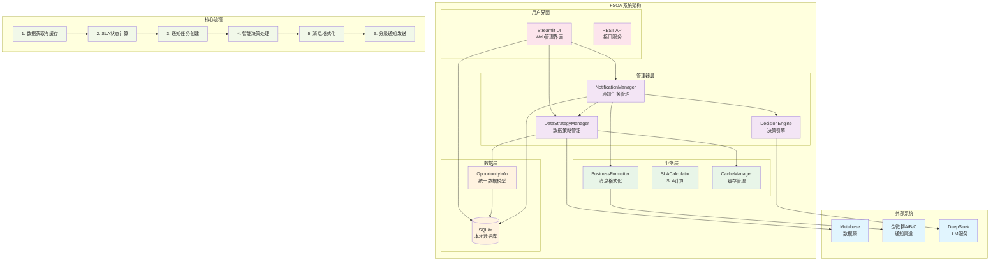
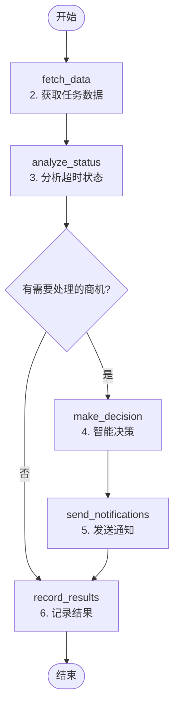

# FSOA 系统架构

Field Service Operations Assistant - 现场服务运营助手

## 1. 架构目标

### 业务目标
- **智能监控**：自动检测商机处理时效，实现两级SLA管理
- **分级通知**：4小时提醒 + 8小时升级的渐进式通知机制
- **自动化运营**：减少人工干预，提升运营效率和响应速度
- **数据驱动**：基于真实业务数据的智能决策和分析

### 技术目标
- **统一数据模型**：基于OpportunityInfo的一致性架构
- **管理器模式**：清晰的分层管理和职责分离
- **非侵入式集成**：通过Metabase API获取数据，不影响现有系统
- **企业级设计**：支持多组织、多群组的复杂业务场景

## 2. 总体架构

### 2.1 系统架构图



### 2.2 架构说明

```
┌─────────────────┐    ┌──────────────────────────────┐
│   Metabase      │    │        FSOA 系统             │
│  (数据源)        │◄───┤  ┌─────────────────────────┐  │
└─────────────────┘    │  │ DataStrategyManager     │  │
                       │  │   (数据策略管理)         │  │
┌─────────────────┐    │  └─────────────────────────┘  │
│  企微群 A/B/C    │◄───┤  ┌─────────────────────────┐  │
│  (通知渠道)      │    │  │ NotificationManager     │  │
└─────────────────┘    │  │   (通知任务管理)         │  │
                       │  │ • DecisionEngine        │  │
┌─────────────────┐    │  │ • BusinessFormatter     │  │
│   SQLite        │◄───┤  └─────────────────────────┘  │
│  (本地存储)      │    │  ┌─────────────────────────┐  │
└─────────────────┘    │  │    Streamlit UI         │  │
                       │  │   (Web管理界面)          │  │
┌─────────────────┐    │  │ • 运营仪表板             │  │
│   DeepSeek      │◄───┤  │ • 通知管理               │  │
│  (LLM服务)      │    │  │ • 系统配置               │  │
└─────────────────┘    │  └─────────────────────────┘  │
                       └──────────────────────────────┘
```

## 3. 核心组件

### 3.1 DataStrategyManager (数据策略管理)
- **数据获取**：从Metabase获取商机数据
- **智能缓存**：多级缓存提升性能
- **SLA计算**：动态计算商机时效状态
- **数据转换**：统一的OpportunityInfo模型

### 3.2 NotificationManager (通知任务管理)
- **两级SLA**：4小时提醒 + 8小时升级机制
- **任务调度**：智能的通知任务创建和执行
- **消息路由**：组织群 vs 运营群的智能路由
- **状态追踪**：完整的通知任务生命周期管理

### 3.3 DecisionEngine (决策引擎)
- **规则决策**：基于SLA阈值的规则引擎
- **LLM增强**：可选的DeepSeek AI决策优化
- **混合模式**：规则+LLM的智能决策机制
- **降级处理**：LLM失败时的规则降级

# 管理器组件
- BusinessDataStrategy            # 业务数据处理策略
  ├── get_opportunities()         # 获取商机数据
  ├── get_overdue_opportunities() # 获取逾期商机
  ├── refresh_cache()            # 刷新缓存
  └── validate_data_consistency() # 数据一致性验证

- NotificationTaskManager         # 通知任务管理器
  ├── create_tasks()             # 创建通知任务
  ├── execute_pending_tasks()    # 执行待处理任务
  └── get_task_statistics()      # 获取任务统计

- AgentExecutionTracker          # Agent执行追踪器
  ├── start_run()                # 开始运行
  ├── complete_run()             # 完成运行
  └── get_run_statistics()       # 获取运行统计
```

#### 重构说明
- **✅ 已完成**: 管理器模式架构重构，数据与Agent逻辑分离
- **✅ 已移除**: `fetch_overdue_tasks()`、`TaskInfo`等概念混淆的代码
- **✅ 已新增**: 完整的通知任务管理和Agent执行追踪功能
- **✅ 已优化**: 业务数据与Agent数据的清晰分离和统一接口

### 3.3 Decision Engine
- **规则引擎**：基于SLA时间的硬规则判断
- **LLM推理**：可选的智能决策和内容生成
- **混合决策**：规则触发 + LLM优化的决策模式

### 3.4 Data Layer

#### 数据架构设计原则
- **业务数据与Agent数据分离**: Metabase作为只读业务数据源，本地数据库存储Agent执行和通知管理
- **最小化持久化**: PoC阶段只持久化必要的执行记录和通知任务
- **可选缓存策略**: 根据性能需求决定是否启用业务数据缓存

#### 数据库表结构
```sql
-- 1. Agent运行记录 (Agent执行周期)
CREATE TABLE agent_runs (
    id INTEGER PRIMARY KEY AUTOINCREMENT,
    trigger_time TIMESTAMP NOT NULL,
    end_time TIMESTAMP,
    status TEXT NOT NULL,  -- 'running', 'completed', 'failed'
    context JSON,          -- 执行上下文和结果统计
    opportunities_processed INTEGER DEFAULT 0,
    notifications_sent INTEGER DEFAULT 0,
    errors JSON
);

-- 2. Agent执行明细 (Agent内部步骤追踪)
CREATE TABLE agent_history (
    id INTEGER PRIMARY KEY AUTOINCREMENT,
    run_id INTEGER NOT NULL,
    step_name TEXT NOT NULL,  -- 'fetch_data', 'analyze', 'send_notifications'
    input_data JSON,
    output_data JSON,
    timestamp TIMESTAMP NOT NULL,
    duration_seconds FLOAT,
    error_message TEXT,
    FOREIGN KEY (run_id) REFERENCES agent_runs(id)
);

-- 3. 通知任务记录 (业务通知管理)
CREATE TABLE notification_tasks (
    id INTEGER PRIMARY KEY AUTOINCREMENT,
    order_num TEXT NOT NULL,           -- 关联的工单号
    org_name TEXT NOT NULL,            -- 组织名称
    notification_type TEXT NOT NULL,   -- 'standard', 'escalation'
    due_time TIMESTAMP NOT NULL,       -- 应该通知的时间
    status TEXT DEFAULT 'pending',     -- 'pending', 'sent', 'failed', 'confirmed'
    message TEXT,                      -- 通知内容
    sent_at TIMESTAMP,                 -- 实际发送时间
    created_run_id INTEGER,            -- 创建此任务的Agent运行ID
    sent_run_id INTEGER,               -- 发送此通知的Agent运行ID
    retry_count INTEGER DEFAULT 0,
    FOREIGN KEY (created_run_id) REFERENCES agent_runs(id),
    FOREIGN KEY (sent_run_id) REFERENCES agent_runs(id)
);

-- 4. 业务数据缓存 (可选，用于性能优化)
CREATE TABLE opportunity_cache (
    order_num TEXT PRIMARY KEY,
    customer_name TEXT,
    address TEXT,
    supervisor_name TEXT,
    create_time TIMESTAMP,
    org_name TEXT,
    status TEXT,

    -- 计算字段
    elapsed_hours FLOAT,
    is_overdue BOOLEAN,
    escalation_level INTEGER,

    -- 缓存管理
    last_updated TIMESTAMP,
    source_hash TEXT  -- 用于检测数据变化
);
```

#### 数据流设计
```
Metabase (只读) → Agent Engine → 本地数据库 (Agent记录 + 通知任务)
     ↓                ↓                    ↓
  业务数据源    →    Agent处理逻辑    →    执行记录存储
```

## 4. Agentic特性实现

### 4.1 主动性 (Proactive)
- **定时扫描**：每小时自动检查任务状态
- **事件驱动**：基于业务规则主动触发行动
- **持续监控**：7x24小时无人值守运行

### 4.2 自主决策 (Autonomous)
- **智能判断**：结合规则和LLM的决策机制
- **上下文感知**：基于历史记录和当前状态决策
- **自适应**：根据反馈调整决策策略

### 4.3 目标导向 (Goal-Oriented)
- **明确目标**：提升现场服务时效合规率
- **结果导向**：以业务KPI为驱动
- **持续优化**：基于效果反馈优化策略

## 5. 技术栈

### 5.1 核心技术
- **Python 3.9+**：主要开发语言
- **LangGraph**：Agent编排框架，实现状态图工作流
- **DeepSeek**：LLM推理引擎
- **SQLite**：本地数据存储
- **Streamlit**：Web UI框架

### 5.2 集成技术
- **Metabase API**：数据源集成
- **企微Webhook**：消息通知
- **APScheduler**：定时任务调度
- **Pydantic**：数据验证和序列化

## 6. 部署架构

### 6.1 单机部署（POC阶段）
```
┌─────────────────────────────────┐
│         FSOA Server             │
│  ┌─────────────────────────────┐│
│  │    Streamlit Frontend       ││
│  └─────────────────────────────┘│
│  ┌─────────────────────────────┐│
│  │    Agent Engine             ││
│  └─────────────────────────────┘│
│  ┌─────────────────────────────┐│
│  │    SQLite Database          ││
│  └─────────────────────────────┘│
└─────────────────────────────────┘
```

### 6.2 扩展部署（生产阶段）
- **容器化**：Docker部署
- **数据库**：PostgreSQL替换SQLite
- **消息队列**：Redis/RabbitMQ
- **监控**：Prometheus + Grafana

## 7. v0.2.0 新增架构组件

### 7.1 工作时间计算模块
```python
# 新增模块: src/fsoa/utils/business_time.py
class BusinessTimeCalculator:
    WORK_START_HOUR = 9   # 早上9点
    WORK_END_HOUR = 19    # 晚上7点

    @classmethod
    def calculate_business_hours_between(cls, start_dt, end_dt):
        """计算两个时间点之间的工作时长"""

    @classmethod
    def is_business_hours(cls, dt):
        """判断是否为工作时间"""
```

**架构集成**:
- 与OpportunityInfo模型深度集成
- 所有SLA计算均基于工作时间
- 支持跨日、跨周末的精确计算

### 7.2 增强的通知任务管理
```sql
-- notification_tasks表新增字段 (v0.2.0)
ALTER TABLE notification_tasks ADD COLUMN max_retry_count INTEGER DEFAULT 5;
ALTER TABLE notification_tasks ADD COLUMN cooldown_hours REAL DEFAULT 2.0;
ALTER TABLE notification_tasks ADD COLUMN last_sent_at DATETIME;
```

**新增通知类型**:
- `VIOLATION`: 违规通知（12小时工作时间）
- `STANDARD`: 标准通知（24/48小时工作时间）
- `ESCALATION`: 升级通知（运营介入）

### 7.3 分级SLA架构
```
工作时间计算 → SLA阈值判断 → 分级通知
     ↓              ↓            ↓
  精确时长    →   违规/逾期/升级  →  不同通知类型
```

**SLA规则矩阵**:
| 状态 | 违规阈值 | 标准阈值 | 升级阈值 | 通知对象 |
|------|----------|----------|----------|----------|
| 待预约 | 12h | 24h | 24h | 销售群→运营群 |
| 暂不上门 | 12h | 48h | 48h | 销售群→运营群 |

### 7.4 Web界面架构增强
```python
# 新增UI组件
- 工作时间配置界面 (tab3)
- 违规状态显示 (商机列表)
- 冷静时间控制 (通知管理)
- SLA进度显示 (业务分析)
```

**界面数据流**:
```
业务数据 → 工作时间计算 → SLA状态 → UI显示
    ↓           ↓           ↓        ↓
Metabase → BusinessTime → OpportunityInfo → Streamlit
```

## 6. LangGraph工作流实现

### 6.1 状态图设计

Agent Orchestrator使用LangGraph实现状态图工作流，严格按照6步核心流程执行：



### 6.2 节点实现

| 节点名称 | 对应流程 | 主要功能 | 实现方法 |
|---------|---------|---------|---------|
| `fetch_data` | 2. 获取任务数据 | 从Metabase获取商机数据 | `_fetch_data_node()` |
| `analyze_status` | 3. 分析超时状态 | 分析商机超时状态和优先级 | `_analyze_status_node()` |
| `make_decision` | 4. 智能决策 | 基于规则+LLM的混合决策 | `_make_decision_node()` |
| `send_notifications` | 5. 发送通知 | 执行通知发送 | `_send_notification_node()` |
| `record_results` | 6. 记录结果 | 记录执行结果和统计 | `_record_results_node()` |

### 6.3 状态管理

```python
class AgentState(TypedDict):
    # 执行上下文
    run_id: str
    context: Dict[str, Any]

    # 业务数据
    opportunities: List[OpportunityInfo]
    processed_opportunities: List[OpportunityInfo]
    notification_tasks: List[NotificationTask]

    # 执行结果
    notifications_sent: int
    errors: List[str]

    # 向后兼容
    tasks: List[Task]
    processed_tasks: List[Task]
```

### 6.4 条件分支

- **`_should_continue_processing()`**: 判断是否有商机需要处理
  - 有超时商机 → 继续执行决策
  - 有商机但无超时 → 继续执行（可能有其他通知需求）
  - 无商机 → 跳过处理，直接记录结果

### 6.5 错误处理

- **节点级错误处理**: 每个节点内部捕获异常，记录到 `state["errors"]`
- **优雅降级**: 数据获取失败时使用缓存数据
- **执行追踪**: 所有步骤都有详细的执行日志和性能监控

---
> 架构设计遵循KISS原则，优先实现核心功能，保持扩展性
> v0.2.0 重点增强了时间计算精度和通知控制能力
> v0.3.0 修复了LangGraph递归循环问题，优化了工作流设计