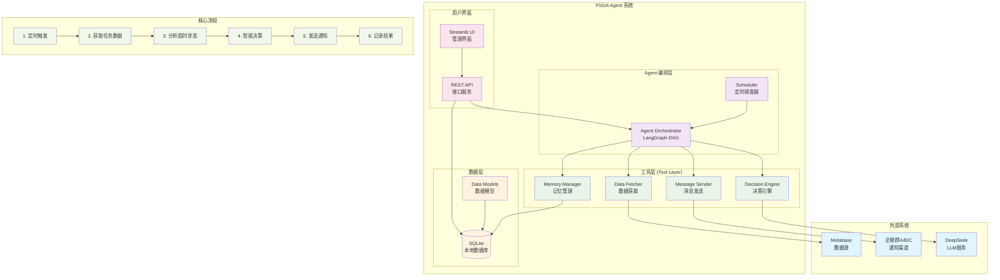

# FSOA 系统架构

Field Service Operations Assistant - 现场服务运营助手

## 1. 架构目标

### 业务目标
- **主动监控**：自动检测现场服务时效超标
- **智能决策**：基于规则+LLM的混合决策机制
- **自动化运营**：减少人工干预，提升运营效率
- **可扩展性**：支持未来功能扩展和业务场景增加

### 技术目标
- **非侵入式**：通过Metabase获取数据，不影响现有业务系统
- **Agentic特性**：体现主动性、自主决策、目标导向
- **企业级**：稳定可靠，支持多租户（多企微群）

## 2. 总体架构

### 2.1 系统架构图



### 2.2 架构说明

```
┌─────────────────┐    ┌──────────────────────────────┐
│   Metabase      │    │        FSOA Agent            │
│  (数据源)        │◄───┤  ┌─────────────────────────┐  │
└─────────────────┘    │  │   Agent Orchestrator    │  │
                       │  │    (LangGraph DAG)      │  │
┌─────────────────┐    │  └─────────────────────────┘  │
│  企微群 A/B/C    │◄───┤  ┌─────────────────────────┐  │
│  (通知渠道)      │    │  │     Tool Layer          │  │
└─────────────────┘    │  │ • Data Fetcher          │  │
                       │  │ • Message Sender        │  │
┌─────────────────┐    │  │ • Decision Engine       │  │
│   SQLite        │◄───┤  │ • Memory Manager        │  │
│  (本地存储)      │    │  └─────────────────────────┘  │
└─────────────────┘    └──────────────────────────────┘
                                      ▲
┌─────────────────┐                   │
│  Streamlit UI   │───────────────────┘
│  (管理界面)      │
└─────────────────┘
```

## 3. 核心组件

### 3.1 Agent Orchestrator (LangGraph)
- **定时触发**：基于Cron的定时任务调度
- **状态管理**：维护Agent执行状态和上下文
- **流程控制**：DAG节点控制执行流程
- **错误处理**：异常捕获和恢复机制

### 3.2 Tool Layer
```python
# 核心工具集 (重构后)
- fetch_overdue_opportunities()    # 从Metabase获取逾期商机
- send_business_notifications()    # 发送分级业务通知
- NotificationTaskManager         # 通知任务管理器
- AgentExecutionTracker          # Agent执行追踪器
- BusinessDataStrategy           # 业务数据处理策略
```

#### 重构说明
- **移除**: `fetch_overdue_tasks()` - 概念混淆，已用`fetch_overdue_opportunities()`替代
- **移除**: `TaskInfo`相关代码 - 与业务数据模型重复
- **新增**: 通知任务管理和Agent执行追踪功能
- **优化**: 业务数据与Agent数据的清晰分离

### 3.3 Decision Engine
- **规则引擎**：基于SLA时间的硬规则判断
- **LLM推理**：可选的智能决策和内容生成
- **混合决策**：规则触发 + LLM优化的决策模式

### 3.4 Data Layer

#### 数据架构设计原则
- **业务数据与Agent数据分离**: Metabase作为只读业务数据源，本地数据库存储Agent执行和通知管理
- **最小化持久化**: PoC阶段只持久化必要的执行记录和通知任务
- **可选缓存策略**: 根据性能需求决定是否启用业务数据缓存

#### 数据库表结构
```sql
-- 1. Agent运行记录 (Agent执行周期)
CREATE TABLE agent_runs (
    id INTEGER PRIMARY KEY AUTOINCREMENT,
    trigger_time TIMESTAMP NOT NULL,
    end_time TIMESTAMP,
    status TEXT NOT NULL,  -- 'running', 'completed', 'failed'
    context JSON,          -- 执行上下文和结果统计
    opportunities_processed INTEGER DEFAULT 0,
    notifications_sent INTEGER DEFAULT 0,
    errors JSON
);

-- 2. Agent执行明细 (Agent内部步骤追踪)
CREATE TABLE agent_history (
    id INTEGER PRIMARY KEY AUTOINCREMENT,
    run_id INTEGER NOT NULL,
    step_name TEXT NOT NULL,  -- 'fetch_data', 'analyze', 'send_notifications'
    input_data JSON,
    output_data JSON,
    timestamp TIMESTAMP NOT NULL,
    duration_seconds FLOAT,
    error_message TEXT,
    FOREIGN KEY (run_id) REFERENCES agent_runs(id)
);

-- 3. 通知任务记录 (业务通知管理)
CREATE TABLE notification_tasks (
    id INTEGER PRIMARY KEY AUTOINCREMENT,
    order_num TEXT NOT NULL,           -- 关联的工单号
    org_name TEXT NOT NULL,            -- 组织名称
    notification_type TEXT NOT NULL,   -- 'standard', 'escalation'
    due_time TIMESTAMP NOT NULL,       -- 应该通知的时间
    status TEXT DEFAULT 'pending',     -- 'pending', 'sent', 'failed', 'confirmed'
    message TEXT,                      -- 通知内容
    sent_at TIMESTAMP,                 -- 实际发送时间
    created_run_id INTEGER,            -- 创建此任务的Agent运行ID
    sent_run_id INTEGER,               -- 发送此通知的Agent运行ID
    retry_count INTEGER DEFAULT 0,
    FOREIGN KEY (created_run_id) REFERENCES agent_runs(id),
    FOREIGN KEY (sent_run_id) REFERENCES agent_runs(id)
);

-- 4. 业务数据缓存 (可选，用于性能优化)
CREATE TABLE opportunity_cache (
    order_num TEXT PRIMARY KEY,
    customer_name TEXT,
    address TEXT,
    supervisor_name TEXT,
    create_time TIMESTAMP,
    org_name TEXT,
    status TEXT,

    -- 计算字段
    elapsed_hours FLOAT,
    is_overdue BOOLEAN,
    escalation_level INTEGER,

    -- 缓存管理
    last_updated TIMESTAMP,
    source_hash TEXT  -- 用于检测数据变化
);
```

#### 数据流设计
```
Metabase (只读) → Agent Engine → 本地数据库 (Agent记录 + 通知任务)
     ↓                ↓                    ↓
  业务数据源    →    Agent处理逻辑    →    执行记录存储
```

## 4. Agentic特性实现

### 4.1 主动性 (Proactive)
- **定时扫描**：每小时自动检查任务状态
- **事件驱动**：基于业务规则主动触发行动
- **持续监控**：7x24小时无人值守运行

### 4.2 自主决策 (Autonomous)
- **智能判断**：结合规则和LLM的决策机制
- **上下文感知**：基于历史记录和当前状态决策
- **自适应**：根据反馈调整决策策略

### 4.3 目标导向 (Goal-Oriented)
- **明确目标**：提升现场服务时效合规率
- **结果导向**：以业务KPI为驱动
- **持续优化**：基于效果反馈优化策略

## 5. 技术栈

### 5.1 核心技术
- **Python 3.9+**：主要开发语言
- **LangGraph**：Agent编排框架
- **DeepSeek**：LLM推理引擎
- **SQLite**：本地数据存储
- **Streamlit**：Web UI框架

### 5.2 集成技术
- **Metabase API**：数据源集成
- **企微Webhook**：消息通知
- **APScheduler**：定时任务调度
- **Pydantic**：数据验证和序列化

## 6. 部署架构

### 6.1 单机部署（POC阶段）
```
┌─────────────────────────────────┐
│         FSOA Server             │
│  ┌─────────────────────────────┐│
│  │    Streamlit Frontend       ││
│  └─────────────────────────────┘│
│  ┌─────────────────────────────┐│
│  │    Agent Engine             ││
│  └─────────────────────────────┘│
│  ┌─────────────────────────────┐│
│  │    SQLite Database          ││
│  └─────────────────────────────┘│
└─────────────────────────────────┘
```

### 6.2 扩展部署（生产阶段）
- **容器化**：Docker部署
- **数据库**：PostgreSQL替换SQLite
- **消息队列**：Redis/RabbitMQ
- **监控**：Prometheus + Grafana

---
> 架构设计遵循KISS原则，优先实现核心功能，保持扩展性