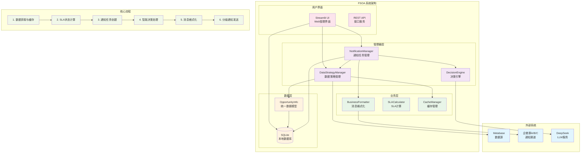
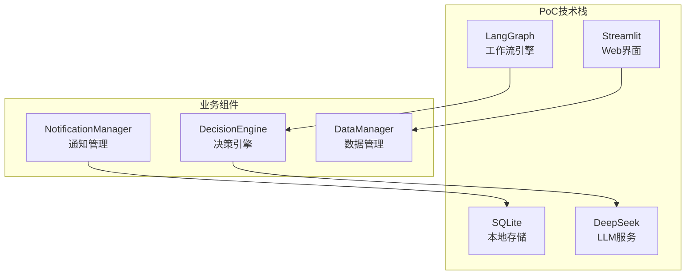
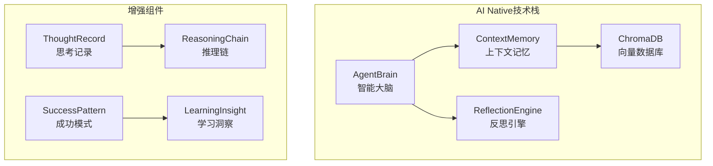
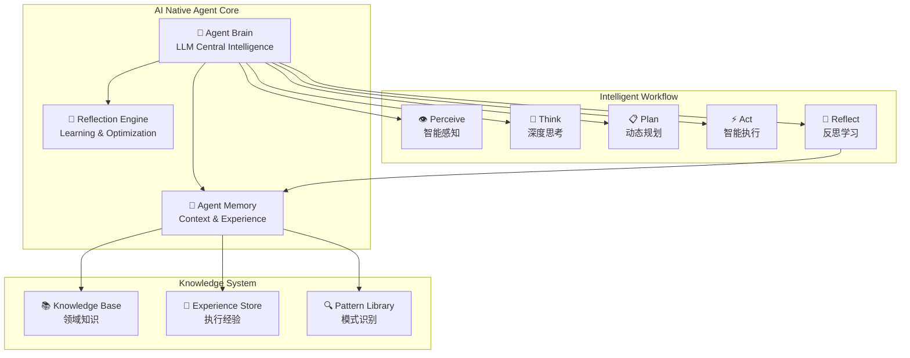
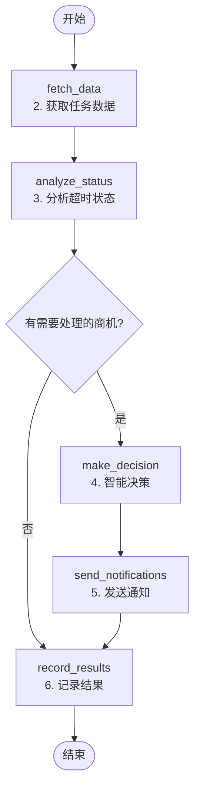

# FSOA 系统架构

Field Service Operations Assistant - 现场服务运营助手

## 1. 架构目标

### 业务目标
- **智能监控**：自动检测商机处理时效，实现两级SLA管理
- **分级通知**：4小时提醒 + 8小时升级的渐进式通知机制
- **自动化运营**：减少人工干预，提升运营效率和响应速度
- **数据驱动**：基于真实业务数据的智能决策和分析

### 技术目标
- **统一数据模型**：基于OpportunityInfo的一致性架构
- **管理器模式**：清晰的分层管理和职责分离
- **非侵入式集成**：通过Metabase API获取数据，不影响现有系统
- **企业级设计**：支持多组织、多群组的复杂业务场景

## 2. 总体架构

### 2.1 系统架构图


```mermaid
graph TB
    subgraph "外部系统"
        MB[Metabase<br/>数据源]
        WX[企微群A/B/C<br/>通知渠道]
        DS[DeepSeek<br/>LLM服务]
    end

    subgraph "FSOA 系统架构"
        subgraph "管理器层"
            DSM[DataStrategyManager<br/>数据策略管理]
            NM[NotificationManager<br/>通知任务管理]
            DM[DecisionEngine<br/>决策引擎]
        end

        subgraph "业务层"
            BF[BusinessFormatter<br/>消息格式化]
            SC[SLACalculator<br/>SLA计算]
            CC[CacheManager<br/>缓存管理]
        end

        subgraph "数据层"
            DB[(SQLite<br/>本地数据库)]
            OM[OpportunityInfo<br/>统一数据模型]
        end

        subgraph "用户界面"
            UI[Streamlit UI<br/>Web管理界面]
            API[REST API<br/>接口服务]
        end
    end

    subgraph "核心流程"
        P1[1. 数据获取与缓存]
        P2[2. SLA状态计算]
        P3[3. 通知任务创建]
        P4[4. 智能决策处理]
        P5[5. 消息格式化]
        P6[6. 分级通知发送]
    end

    %% 数据流连接
    DSM --> MB
    DSM --> CC
    DSM --> OM
    NM --> DSM
    NM --> DM
    DM --> DS
    NM --> BF
    BF --> WX
    NM --> DB
    OM --> DB

    %% UI连接
    UI --> DSM
    UI --> NM
    UI --> DB

    %% 流程连接
    P1 --> P2
    P2 --> P3
    P3 --> P4
    P4 --> P5
    P5 --> P6

    %% 样式
    classDef external fill:#e1f5fe
    classDef manager fill:#f3e5f5
    classDef business fill:#e8f5e8
    classDef data fill:#fff3e0
    classDef ui fill:#fce4ec
    classDef process fill:#f1f8e9

    class MB,WX,DS external
    class DSM,NM,DM manager
    class BF,SC,CC business
    class DB,OM data
    class UI,API ui
    class P1,P2,P3,P4,P5,P6 process
```

### 2.2 架构说明

```
┌─────────────────┐    ┌──────────────────────────────┐
│   Metabase      │    │        FSOA 系统             │
│  (数据源)        │◄───┤  ┌─────────────────────────┐  │
└─────────────────┘    │  │ DataStrategyManager     │  │
                       │  │   (数据策略管理)         │  │
┌─────────────────┐    │  └─────────────────────────┘  │
│  企微群 A/B/C    │◄───┤  ┌─────────────────────────┐  │
│  (通知渠道)      │    │  │ NotificationManager     │  │
└─────────────────┘    │  │   (通知任务管理)         │  │
                       │  │ • DecisionEngine        │  │
┌─────────────────┐    │  │ • BusinessFormatter     │  │
│   SQLite        │◄───┤  └─────────────────────────┘  │
│  (本地存储)      │    │  ┌─────────────────────────┐  │
└─────────────────┘    │  │    Streamlit UI         │  │
                       │  │   (Web管理界面)          │  │
┌─────────────────┐    │  │ • 运营仪表板             │  │
│   DeepSeek      │◄───┤  │ • 通知管理               │  │
│  (LLM服务)      │    │  │ • 系统配置               │  │
└─────────────────┘    │  └─────────────────────────┘  │
                       └──────────────────────────────┘
```

## 3. 核心组件

### 3.1 DataStrategyManager (数据策略管理)
- **数据获取**：从Metabase获取商机数据
- **智能缓存**：多级缓存提升性能
- **SLA计算**：动态计算商机时效状态
- **数据转换**：统一的OpportunityInfo模型

### 3.2 NotificationManager (通知任务管理)
- **两级SLA**：4小时提醒 + 8小时升级机制
- **任务调度**：智能的通知任务创建和执行
- **消息路由**：组织群 vs 运营群的智能路由
- **状态追踪**：完整的通知任务生命周期管理

### 3.3 DecisionEngine (决策引擎)
- **规则决策**：基于SLA阈值的规则引擎
- **LLM增强**：可选的DeepSeek AI决策优化
- **混合模式**：规则+LLM的智能决策机制
- **降级处理**：LLM失败时的规则降级

# 管理器组件
- BusinessDataStrategy            # 业务数据处理策略
  ├── get_opportunities()         # 获取商机数据
  ├── get_overdue_opportunities() # 获取逾期商机
  ├── refresh_cache()            # 刷新缓存
  └── validate_data_consistency() # 数据一致性验证

- NotificationTaskManager         # 通知任务管理器
  ├── create_tasks()             # 创建通知任务
  ├── execute_pending_tasks()    # 执行待处理任务
  └── get_task_statistics()      # 获取任务统计

- AgentExecutionTracker          # Agent执行追踪器
  ├── start_run()                # 开始运行
  ├── complete_run()             # 完成运行
  └── get_run_statistics()       # 获取运行统计
```

#### 重构说明
- **✅ 已完成**: 管理器模式架构重构，数据与Agent逻辑分离
- **✅ 已移除**: `fetch_overdue_tasks()`、`TaskInfo`等概念混淆的代码
- **✅ 已新增**: 完整的通知任务管理和Agent执行追踪功能
- **✅ 已优化**: 业务数据与Agent数据的清晰分离和统一接口

### 3.3 Decision Engine
- **规则引擎**：基于SLA时间的硬规则判断
- **LLM推理**：可选的智能决策和内容生成
- **混合决策**：规则触发 + LLM优化的决策模式

### 3.4 Data Layer

#### 数据架构设计原则
- **业务数据与Agent数据分离**: Metabase作为只读业务数据源，本地数据库存储Agent执行和通知管理
- **最小化持久化**: PoC阶段只持久化必要的执行记录和通知任务
- **可选缓存策略**: 根据性能需求决定是否启用业务数据缓存

#### 数据库表结构
```sql
-- 1. Agent运行记录 (Agent执行周期)
CREATE TABLE agent_runs (
    id INTEGER PRIMARY KEY AUTOINCREMENT,
    trigger_time TIMESTAMP NOT NULL,
    end_time TIMESTAMP,
    status TEXT NOT NULL,  -- 'running', 'completed', 'failed'
    context JSON,          -- 执行上下文和结果统计
    opportunities_processed INTEGER DEFAULT 0,
    notifications_sent INTEGER DEFAULT 0,
    errors JSON
);

-- 2. Agent执行明细 (Agent内部步骤追踪)
CREATE TABLE agent_history (
    id INTEGER PRIMARY KEY AUTOINCREMENT,
    run_id INTEGER NOT NULL,
    step_name TEXT NOT NULL,  -- 'fetch_data', 'analyze', 'send_notifications'
    input_data JSON,
    output_data JSON,
    timestamp TIMESTAMP NOT NULL,
    duration_seconds FLOAT,
    error_message TEXT,
    FOREIGN KEY (run_id) REFERENCES agent_runs(id)
);

-- 3. 通知任务记录 (业务通知管理)
CREATE TABLE notification_tasks (
    id INTEGER PRIMARY KEY AUTOINCREMENT,
    order_num TEXT NOT NULL,           -- 关联的工单号
    org_name TEXT NOT NULL,            -- 组织名称
    notification_type TEXT NOT NULL,   -- 'standard', 'escalation'
    due_time TIMESTAMP NOT NULL,       -- 应该通知的时间
    status TEXT DEFAULT 'pending',     -- 'pending', 'sent', 'failed', 'confirmed'
    message TEXT,                      -- 通知内容
    sent_at TIMESTAMP,                 -- 实际发送时间
    created_run_id INTEGER,            -- 创建此任务的Agent运行ID
    sent_run_id INTEGER,               -- 发送此通知的Agent运行ID
    retry_count INTEGER DEFAULT 0,
    FOREIGN KEY (created_run_id) REFERENCES agent_runs(id),
    FOREIGN KEY (sent_run_id) REFERENCES agent_runs(id)
);

-- 4. 业务数据缓存 (可选，用于性能优化)
CREATE TABLE opportunity_cache (
    order_num TEXT PRIMARY KEY,
    customer_name TEXT,
    address TEXT,
    supervisor_name TEXT,
    create_time TIMESTAMP,
    org_name TEXT,
    status TEXT,

    -- 计算字段
    elapsed_hours FLOAT,
    is_overdue BOOLEAN,
    escalation_level INTEGER,

    -- 缓存管理
    last_updated TIMESTAMP,
    source_hash TEXT  -- 用于检测数据变化
);
```

#### 数据流设计
```
Metabase (只读) → Agent Engine → 本地数据库 (Agent记录 + 通知任务)
     ↓                ↓                    ↓
  业务数据源    →    Agent处理逻辑    →    执行记录存储
```

## 4. Agentic特性实现

### 4.1 主动性 (Proactive)
- **定时扫描**：每小时自动检查任务状态
- **事件驱动**：基于业务规则主动触发行动
- **持续监控**：7x24小时无人值守运行

### 4.2 自主决策 (Autonomous)
- **智能判断**：结合规则和LLM的决策机制
- **上下文感知**：基于历史记录和当前状态决策
- **自适应**：根据反馈调整决策策略

### 4.3 目标导向 (Goal-Oriented)
- **明确目标**：提升现场服务时效合规率
- **结果导向**：以业务KPI为驱动
- **持续优化**：基于效果反馈优化策略

## 5. 技术栈架构

### 5.1 当前技术栈（PoC阶段）

#### 核心技术栈
```python
# Agent框架
- LangGraph: 0.0.40+         # Agent工作流引擎
- LangChain: 0.1.0+          # Agent框架基础
- OpenAI: 1.0.0+             # LLM API客户端（兼容DeepSeek）

# Web框架
- Streamlit: 1.28.0+         # Web界面
- SQLAlchemy: 2.0.0+         # 数据库ORM
- APScheduler: 3.10.0+       # 任务调度

# 数据处理
- Pandas: 2.0.0+             # 数据分析
- Pydantic: 2.0.0+           # 数据验证
- Requests: 2.31.0+          # HTTP客户端
```

#### 业务组件（自研）
```python
# 决策引擎
- DecisionEngine             # 规则+LLM混合决策
- RuleEngine                 # 业务规则引擎
- DeepSeekClient            # LLM集成客户端

# 管理器模式
- DataStrategyManager        # 数据策略管理
- NotificationManager        # 通知任务管理
- ExecutionTracker          # 执行追踪管理

# 业务逻辑
- BusinessTimeCalculator     # 工作时间计算
- SLACalculator             # SLA状态计算
- BusinessFormatter         # 消息格式化
```

#### 技术栈特点
- **轻量级**：最小化依赖，快速启动
- **自包含**：SQLite本地存储，无外部依赖
- **可扩展**：模块化设计，支持组件替换
- **PoC导向**：专注核心功能验证，避免过度工程化

### 5.2 AI Native技术栈扩展规划

#### 阶段1：智能状态升级（无新技术栈）
```python
# 基于现有技术实现AI Native概念
+ IntelligentAgentState      # 智能状态管理
+ ThoughtRecord             # 思考记录系统
+ ContextMemory             # 上下文记忆
+ ReasoningChain            # 推理链追踪

# 存储：继续使用SQLite
# LLM：继续使用DeepSeek
# 框架：继续使用LangGraph
```

#### 阶段2：记忆和学习能力（轻量级AI增强）
```python
# 最小化技术栈增加
+ sentence-transformers      # 文本嵌入（用于相似性搜索）
+ chromadb                  # 轻量级向量数据库
+ numpy                     # 向量计算
+ scikit-learn              # 简单机器学习

# 用途：
# - 商机模式识别
# - 历史经验检索
# - 成功案例匹配
```

#### 阶段3：高级智能能力（AI Native升级）
```python
# 根据需要选择性添加
+ guidance                  # 结构化LLM输出
+ outlines                  # 约束生成
+ redis                     # 高性能缓存和会话存储
+ celery                    # 分布式任务队列

# 高级Agent框架（可选）
+ autogen                   # 多Agent协作
+ crewai                    # Agent团队协作
+ langgraph-pro            # 商业版LangGraph
```

#### 阶段4：生产级部署（企业级）
```python
# 生产环境技术栈
+ postgresql                # 生产数据库
+ redis-cluster            # 分布式缓存
+ kafka                     # 消息队列
+ prometheus               # 监控指标
+ grafana                  # 监控仪表板
+ jaeger                   # 分布式追踪
+ kubernetes               # 容器编排
+ nginx                    # 负载均衡
```

### 5.3 技术选择原则

#### 渐进式升级策略
1. **价值驱动**：只有在明确业务价值时才引入新技术
2. **向后兼容**：新技术的引入不影响现有功能
3. **可回滚**：每个阶段都可以独立回滚
4. **成本可控**：避免过度工程化和技术债务

#### 技术决策矩阵
| 技术类别 | PoC阶段 | AI Native阶段 | 生产阶段 | 选择原则 |
|---------|---------|---------------|----------|----------|
| **Agent框架** | LangGraph | LangGraph + 智能增强 | LangGraph Pro | 稳定性优先 |
| **数据库** | SQLite | SQLite + 向量DB | PostgreSQL | 性能需求驱动 |
| **LLM集成** | DeepSeek | DeepSeek + 结构化生成 | 多模型支持 | 成本效益平衡 |
| **监控** | 基础日志 | 智能可观测性 | 企业级监控 | 运维需求驱动 |
| **部署** | 单机 | 单机/容器 | 分布式集群 | 规模需求驱动 |

### 5.4 技术架构演进路径

#### 当前架构（PoC）

```mermaid
graph TB
    subgraph "PoC技术栈"
        LG[LangGraph<br/>工作流引擎]
        ST[Streamlit<br/>Web界面]
        SQ[SQLite<br/>本地存储]
        DS[DeepSeek<br/>LLM服务]
    end

    subgraph "业务组件"
        DE[DecisionEngine<br/>决策引擎]
        NM[NotificationManager<br/>通知管理]
        DM[DataManager<br/>数据管理]
    end

    LG --> DE
    DE --> DS
    NM --> SQ
    ST --> DM
```

#### AI Native架构（未来）

```mermaid
graph TB
    subgraph "AI Native技术栈"
        AB[AgentBrain<br/>智能大脑]
        CM[ContextMemory<br/>上下文记忆]
        VDB[ChromaDB<br/>向量数据库]
        RE[ReflectionEngine<br/>反思引擎]
    end

    subgraph "增强组件"
        TR[ThoughtRecord<br/>思考记录]
        RC[ReasoningChain<br/>推理链]
        SP[SuccessPattern<br/>成功模式]
        LI[LearningInsight<br/>学习洞察]
    end

    AB --> CM
    CM --> VDB
    AB --> RE
    TR --> RC
    SP --> LI
```

## 6. 架构扩展和未来可行性

### 6.1 AI Native架构扩展设计

#### 智能Agent大脑架构

```mermaid
graph TB
    subgraph "AI Native Agent Core"
        BRAIN[🧠 Agent Brain<br/>LLM Central Intelligence]
        MEMORY[💾 Agent Memory<br/>Context & Experience]
        REFLECTION[🤔 Reflection Engine<br/>Learning & Optimization]
    end

    subgraph "Intelligent Workflow"
        PERCEIVE[👁️ Perceive<br/>智能感知]
        THINK[💭 Think<br/>深度思考]
        PLAN[📋 Plan<br/>动态规划]
        ACT[⚡ Act<br/>智能执行]
        REFLECT[🔄 Reflect<br/>反思学习]
    end

    subgraph "Knowledge System"
        KB[📚 Knowledge Base<br/>领域知识]
        EXP[🎯 Experience Store<br/>执行经验]
        PATTERN[🔍 Pattern Library<br/>模式识别]
    end

    BRAIN --> MEMORY
    BRAIN --> REFLECTION
    BRAIN --> PERCEIVE
    BRAIN --> THINK
    BRAIN --> PLAN
    BRAIN --> ACT
    BRAIN --> REFLECT

    MEMORY --> KB
    MEMORY --> EXP
    MEMORY --> PATTERN

    REFLECT --> MEMORY
```

#### 从工具调用到智能大脑的转变
```python
# 当前模式（Tool-based）
Agent → 调用LLM → 获取结果 → 继续流程

# AI Native模式（Brain-based）
Agent ← 智能大脑(LLM) → 持续思考、记忆、学习、决策
```

### 6.2 技术可行性分析

#### 核心技术组件可行性
| 组件 | 技术实现 | 可行性 | 复杂度 | 预期效果 |
|------|---------|--------|--------|----------|
| **AgentBrain** | LLM + 状态管理 | ✅ 高 | 中等 | 持续智能决策 |
| **ContextMemory** | 向量DB + 嵌入 | ✅ 高 | 低 | 经验积累和检索 |
| **ThoughtRecord** | 结构化存储 | ✅ 高 | 低 | 决策过程追踪 |
| **ReflectionEngine** | LLM + 模式识别 | ✅ 中 | 中等 | 持续学习优化 |
| **AdaptiveWorkflow** | 动态图构建 | ⚠️ 中 | 高 | 自适应执行流程 |

#### 实施风险评估
```python
# 低风险组件（可立即实施）
- IntelligentAgentState     # 扩展现有状态管理
- ThoughtRecord            # 新增思考记录
- ContextMemory            # 基于SQLite的记忆系统

# 中风险组件（需要验证）
- AgentBrain               # LLM集成复杂度
- ReflectionEngine         # 学习算法设计

# 高风险组件（需要深入研究）
- AdaptiveWorkflow         # 动态工作流构建
- MultiAgentCoordination   # 多Agent协作
```

### 6.3 部署架构演进

#### 阶段1：PoC部署（当前）
```
┌─────────────────────────────────┐
│         FSOA Server             │
│  ┌─────────────────────────────┐│
│  │    Streamlit Frontend       ││
│  └─────────────────────────────┘│
│  ┌─────────────────────────────┐│
│  │    Agent Engine             ││
│  │    (LangGraph + 自研组件)    ││
│  └─────────────────────────────┘│
│  ┌─────────────────────────────┐│
│  │    SQLite Database          ││
│  └─────────────────────────────┘│
└─────────────────────────────────┘
```

#### 阶段2：AI Native部署（智能增强）
```
┌─────────────────────────────────┐
│      AI Native FSOA Server      │
│  ┌─────────────────────────────┐│
│  │    Enhanced Web UI          ││
│  │    (Agent对话界面)           ││
│  └─────────────────────────────┘│
│  ┌─────────────────────────────┐│
│  │    Intelligent Agent        ││
│  │    (Brain + Memory + 反思)   ││
│  └─────────────────────────────┘│
│  ┌─────────────────────────────┐│
│  │  SQLite + ChromaDB          ││
│  │  (结构化 + 向量存储)         ││
│  └─────────────────────────────┘│
└─────────────────────────────────┘
```

#### 阶段3：生产级部署（企业级）
```
┌─────────────────────────────────┐
│         Load Balancer           │
│         (Nginx/HAProxy)         │
└─────────────────────────────────┘
           │
    ┌──────┴──────┐
    │             │
┌───▼───┐     ┌───▼───┐
│Agent  │     │Agent  │
│Node 1 │     │Node 2 │
└───┬───┘     └───┬───┘
    │             │
    └──────┬──────┘
           │
┌─────────▼─────────┐
│   Shared Storage  │
│ PostgreSQL+Redis  │
│   + Vector DB     │
└───────────────────┘
```

### 6.4 扩展能力规划

#### 业务扩展能力
```python
# 多场景适应
- 售后服务监控          # 扩展到其他业务场景
- 质量管控预警          # 质量问题自动识别
- 客户满意度分析        # 情感分析和预测

# 多行业支持
- 制造业现场服务        # 设备维护和故障处理
- 零售业客户服务        # 投诉处理和满意度
- 物流业配送监控        # 配送时效和异常处理
```

#### 技术扩展能力
```python
# 多模态能力
- 图像识别             # 现场照片分析
- 语音处理             # 客户通话分析
- 文档理解             # 合同和报告分析

# 预测分析
- 时间序列预测         # SLA违规预测
- 异常检测             # 业务异常识别
- 趋势分析             # 业务趋势预测
```

### 6.5 投资回报分析

#### 技术投入vs业务价值
| 投入阶段 | 技术成本 | 开发周期 | 业务价值 | ROI预期 |
|---------|---------|---------|---------|---------|
| **PoC验证** | 低 | 2-4周 | 概念验证 | 学习价值 |
| **AI Native** | 中 | 6-8周 | 智能化提升 | 3-6个月回收 |
| **生产部署** | 高 | 12-16周 | 规模化应用 | 6-12个月回收 |

#### 风险缓解策略
1. **技术风险**：分阶段实施，每阶段独立验证
2. **业务风险**：保持向后兼容，支持快速回滚
3. **成本风险**：基于价值驱动，避免过度投资
4. **时间风险**：MVP优先，核心功能先行

## 7. v0.2.0 新增架构组件

### 7.1 工作时间计算模块
```python
# 新增模块: src/fsoa/utils/business_time.py
class BusinessTimeCalculator:
    WORK_START_HOUR = 9   # 早上9点
    WORK_END_HOUR = 19    # 晚上7点

    @classmethod
    def calculate_business_hours_between(cls, start_dt, end_dt):
        """计算两个时间点之间的工作时长"""

    @classmethod
    def is_business_hours(cls, dt):
        """判断是否为工作时间"""
```

**架构集成**:
- 与OpportunityInfo模型深度集成
- 所有SLA计算均基于工作时间
- 支持跨日、跨周末的精确计算

### 7.2 增强的通知任务管理
```sql
-- notification_tasks表新增字段 (v0.2.0)
ALTER TABLE notification_tasks ADD COLUMN max_retry_count INTEGER DEFAULT 5;
ALTER TABLE notification_tasks ADD COLUMN cooldown_hours REAL DEFAULT 2.0;
ALTER TABLE notification_tasks ADD COLUMN last_sent_at DATETIME;
```

**新增通知类型**:
- `VIOLATION`: 违规通知（12小时工作时间）
- `STANDARD`: 标准通知（24/48小时工作时间）
- `ESCALATION`: 升级通知（运营介入）

### 7.3 分级SLA架构
```
工作时间计算 → SLA阈值判断 → 分级通知
     ↓              ↓            ↓
  精确时长    →   违规/逾期/升级  →  不同通知类型
```

**SLA规则矩阵**:
| 状态 | 违规阈值 | 标准阈值 | 升级阈值 | 通知对象 |
|------|----------|----------|----------|----------|
| 待预约 | 12h | 24h | 24h | 销售群→运营群 |
| 暂不上门 | 12h | 48h | 48h | 销售群→运营群 |

### 7.4 Web界面架构增强
```python
# 新增UI组件
- 工作时间配置界面 (tab3)
- 违规状态显示 (商机列表)
- 冷静时间控制 (通知管理)
- SLA进度显示 (业务分析)
```

**界面数据流**:
```
业务数据 → 工作时间计算 → SLA状态 → UI显示
    ↓           ↓           ↓        ↓
Metabase → BusinessTime → OpportunityInfo → Streamlit
```

## 6. LangGraph工作流实现

### 6.1 状态图设计

Agent Orchestrator使用LangGraph实现状态图工作流，严格按照6步核心流程执行：


```mermaid
graph TD
    START([开始]) --> FETCH[fetch_data<br/>2. 获取任务数据]
    FETCH --> ANALYZE[analyze_status<br/>3. 分析超时状态]
    ANALYZE --> DECISION{有需要处理的商机?}
    DECISION -->|是| MAKE[make_decision<br/>4. 智能决策]
    DECISION -->|否| RECORD[record_results<br/>6. 记录结果]
    MAKE --> NOTIFY[send_notifications<br/>5. 发送通知]
    NOTIFY --> RECORD
    RECORD --> END([结束])
```

### 6.2 节点实现

| 节点名称 | 对应流程 | 主要功能 | 实现方法 |
|---------|---------|---------|---------|
| `fetch_data` | 2. 获取任务数据 | 从Metabase获取商机数据 | `_fetch_data_node()` |
| `analyze_status` | 3. 分析超时状态 | 分析商机超时状态和优先级 | `_analyze_status_node()` |
| `make_decision` | 4. 智能决策 | 基于规则+LLM的混合决策 | `_make_decision_node()` |
| `send_notifications` | 5. 发送通知 | 执行通知发送 | `_send_notification_node()` |
| `record_results` | 6. 记录结果 | 记录执行结果和统计 | `_record_results_node()` |

### 6.3 状态管理

```python
class AgentState(TypedDict):
    # 执行上下文
    run_id: str
    context: Dict[str, Any]

    # 业务数据
    opportunities: List[OpportunityInfo]
    processed_opportunities: List[OpportunityInfo]
    notification_tasks: List[NotificationTask]

    # 执行结果
    notifications_sent: int
    errors: List[str]

    # 向后兼容
    tasks: List[Task]
    processed_tasks: List[Task]
```

### 6.4 条件分支

- **`_should_continue_processing()`**: 判断是否有商机需要处理
  - 有超时商机 → 继续执行决策
  - 有商机但无超时 → 继续执行（可能有其他通知需求）
  - 无商机 → 跳过处理，直接记录结果

### 6.5 错误处理

- **节点级错误处理**: 每个节点内部捕获异常，记录到 `state["errors"]`
- **优雅降级**: 数据获取失败时使用缓存数据
- **执行追踪**: 所有步骤都有详细的执行日志和性能监控

## 8. 架构设计总结

### 8.1 设计原则
- **KISS原则**：优先实现核心功能，保持扩展性
- **渐进式演进**：从PoC到AI Native到生产级的平滑升级
- **价值驱动**：技术选择基于明确的业务价值
- **风险可控**：每个阶段都可以独立验证和回滚

### 8.2 版本演进历史
- **v0.1.0**：基础PoC实现，验证Agent概念
- **v0.2.0**：重点增强了时间计算精度和通知控制能力
- **v0.3.0**：修复了LangGraph递归循环问题，优化了工作流设计
- **v0.4.0**：LLM集成和混合决策机制
- **未来版本**：AI Native架构升级

### 8.3 技术债务管理
```python
# 当前技术债务
- 单机SQLite存储限制      # 计划：PostgreSQL迁移
- 同步处理性能瓶颈        # 计划：异步处理优化
- 监控可观测性不足        # 计划：企业级监控

# AI Native技术债务预防
- 模块化设计             # 避免紧耦合
- 接口标准化             # 支持组件替换
- 配置驱动               # 支持灵活调整
```

### 8.4 未来架构愿景

#### 终极目标：自主智能运营助手
```
当前：规则驱动的自动化Agent
  ↓
近期：LLM增强的智能Agent
  ↓
中期：AI Native的自主Agent
  ↓
远期：多Agent协作的智能运营系统
```

#### 核心能力演进路径
1. **自动化** → **智能化** → **自主化** → **协作化**
2. **反应式** → **预测式** → **主动式** → **创新式**
3. **单场景** → **多场景** → **跨领域** → **生态化**

---

> **架构文档版本**: v2.0
> **最后更新**: 2025-06-30
> **维护者**: FSOA架构团队
> **下次评审**: 基于AI Native实施进展