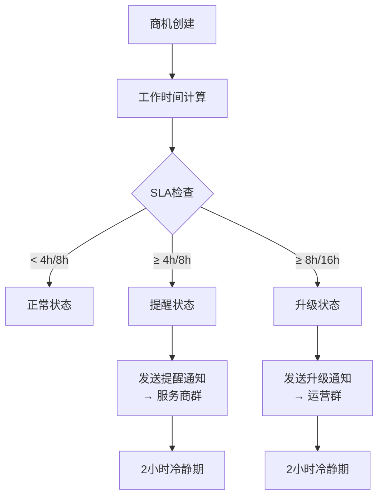
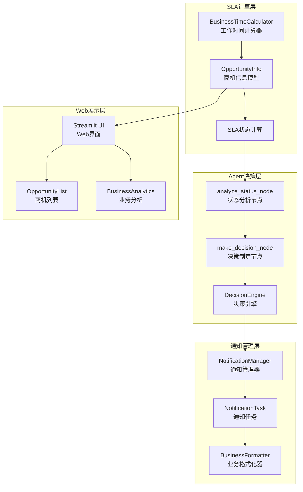
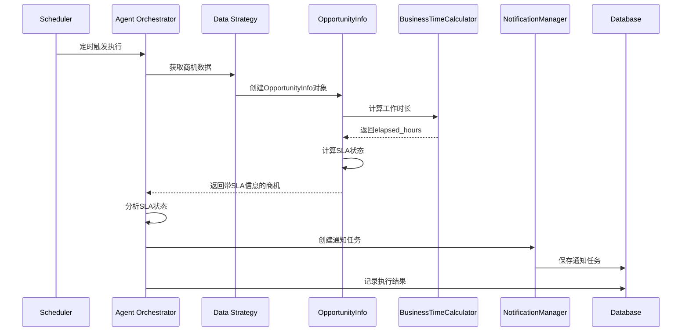
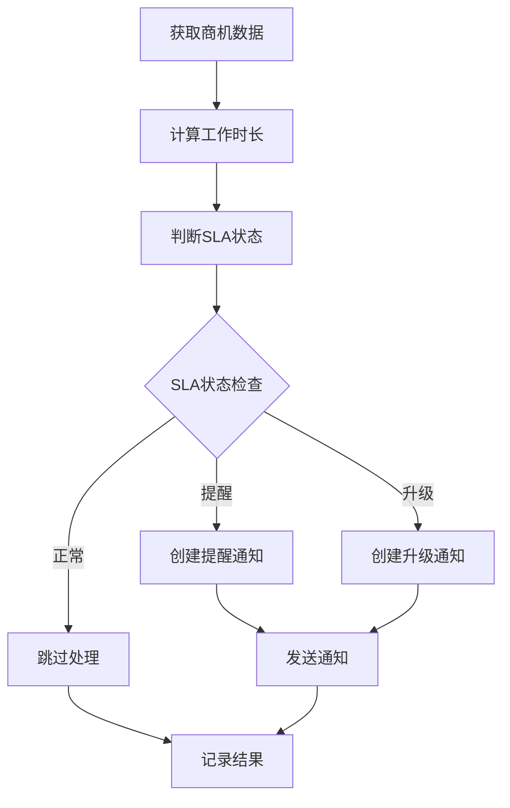

# FSOA SLA模块详细设计

## 1. 概述

FSOA系统的SLA（Service Level Agreement）模块是Agent工作流的核心决策组件，负责基于工作时间计算商机的SLA状态，实现分级监控和智能通知机制。

### 1.1 设计目标

- **精确时间计算**：基于工作时间的精确SLA计算
- **分级监控**：提醒、升级的两级SLA体系
- **智能决策**：基于规则+LLM的混合决策机制
- **实时响应**：动态SLA状态更新和通知触发
- **业务导向**：符合现场服务业务特点的SLA规则

## 2. SLA规则体系

### 2.1 工作时间定义

```python
class BusinessTimeCalculator:
    # 默认工作时间配置（支持数据库动态配置）
    DEFAULT_WORK_START_HOUR = 9   # 早上9点
    DEFAULT_WORK_END_HOUR = 19    # 晚上7点（不包含）
    DEFAULT_WORK_DAYS = [1, 2, 3, 4, 5]  # 周一到周五

    @classmethod
    def _get_work_config(cls):
        """从数据库获取工作时间配置，如果不可用则使用默认值"""
        # 支持动态配置：work_start_hour, work_end_hour, work_days

    @classmethod
    def get_work_hours_per_day(cls):
        """获取每日工作小时数"""
        work_start_hour, work_end_hour, _ = cls._get_work_config()
        return work_end_hour - work_start_hour  # 默认10小时
```

### 2.2 SLA阈值矩阵

| 商机状态 | 提醒阈值 | 升级阈值 | 通知目标 | 业务含义 |
|---------|---------|---------|---------|---------|
| 待预约 | 4小时 | 8小时 | 服务商群 → 运营群 | 销售需要及时联系客户并预约 |
| 暂不上门 | 8小时 | 16小时 | 服务商群 → 运营群 | 客户首次拒绝，需要持续跟进 |
| 其他状态 | - | - | - | 不监控 |

### 2.3 SLA状态分级



## 3. 核心组件架构

### 3.1 组件关系图



### 3.2 数据流设计

```
商机数据 → 工作时间计算 → SLA状态判断 → 决策制定 → 通知任务 → 消息发送
    ↓           ↓           ↓           ↓         ↓         ↓
Metabase → BusinessTime → OpportunityInfo → DecisionEngine → NotificationTask → WeChat
```

## 4. 工作时间计算实现

### 4.1 核心算法

**位置**: `src/fsoa/utils/business_time.py`

```python
@classmethod
def calculate_business_hours_between(cls, start_dt: datetime, end_dt: datetime) -> float:
    """计算两个时间点之间的工作时长"""
    if start_dt >= end_dt:
        return 0.0
        
    total_hours = 0.0
    current_dt = start_dt
    
    while current_dt < end_dt:
        # 跳过非工作时间到下一个工作时间开始点
        if not cls.is_business_hours(current_dt):
            current_dt = cls.get_next_business_start(current_dt)
            if current_dt >= end_dt:
                break
        
        # 计算当天的工作结束时间
        work_end_today = current_dt.replace(hour=cls.WORK_END_HOUR, minute=0, second=0, microsecond=0)
        
        # 确定当天的计算结束时间
        day_end = min(end_dt, work_end_today)
        
        # 计算当天的工作时长
        if day_end > current_dt:
            day_hours = (day_end - current_dt).total_seconds() / 3600
            total_hours += day_hours
        
        # 移动到下一个工作日开始
        current_dt = cls.get_next_business_start(work_end_today + timedelta(minutes=1))
    
    return total_hours
```

### 4.2 时间计算特性

- **跨日计算**：正确处理跨多天的工作时间
- **周末处理**：自动跳过周六周日
- **精确到分钟**：支持分钟级的时间计算
- **时区处理**：统一使用中国时区

### 4.3 计算示例

```python
# 示例1：同一工作日内
start = datetime(2024, 12, 25, 10, 0)  # 周三 10:00
end = datetime(2024, 12, 25, 15, 0)    # 周三 15:00
hours = calculate_business_hours_between(start, end)  # 5.0小时

# 示例2：跨工作日
start = datetime(2024, 12, 25, 16, 0)  # 周三 16:00
end = datetime(2024, 12, 26, 11, 0)    # 周四 11:00
hours = calculate_business_hours_between(start, end)  # 5.0小时 (3+2)

# 示例3：跨周末
start = datetime(2024, 12, 27, 16, 0)  # 周五 16:00
end = datetime(2024, 12, 30, 11, 0)    # 周一 11:00
hours = calculate_business_hours_between(start, end)  # 5.0小时 (3+2)
```

## 5. SLA状态计算

### 5.1 OpportunityInfo模型

**位置**: `src/fsoa/data/models.py`

```python
class OpportunityInfo(BaseModel):
    # 基础字段
    order_num: str
    name: str
    address: str
    supervisor_name: str
    create_time: datetime
    org_name: str
    order_status: OpportunityStatus
    
    # SLA计算字段
    elapsed_hours: Optional[float] = None
    is_violation: Optional[bool] = None          # 是否需要提醒（兼容字段）
    is_overdue: Optional[bool] = None            # 是否需要升级（兼容字段）
    is_approaching_overdue: Optional[bool] = None  # 是否即将升级
    overdue_hours: Optional[float] = None        # 逾期时长（基于升级阈值）
    sla_threshold_hours: Optional[int] = None    # SLA阈值（升级阈值）
    escalation_level: Optional[int] = 0          # 升级级别：0=正常，1=需要升级
    sla_progress_ratio: Optional[float] = None   # SLA进度比例（基于升级阈值）
```

### 5.2 数据库配置

系统支持通过数据库动态配置SLA阈值，配置项如下：

```sql
-- SLA阈值配置 - 两级体系
INSERT INTO system_config (config_key, config_value, description) VALUES
('sla_pending_reminder', '4', '待预约提醒阈值（工作小时）→服务商群'),
('sla_pending_escalation', '8', '待预约升级阈值（工作小时）→运营群'),
('sla_not_visiting_reminder', '8', '暂不上门提醒阈值（工作小时）→服务商群'),
('sla_not_visiting_escalation', '16', '暂不上门升级阈值（工作小时）→运营群');
```

### 5.3 SLA阈值获取

```python
def get_sla_threshold(self, threshold_type: str = "reminder") -> int:
    """
    获取SLA阈值 - 两级体系

    Args:
        threshold_type: 阈值类型
            - "reminder": 提醒阈值（4/8小时）→ 服务商群
            - "escalation": 升级阈值（8/16小时）→ 运营群

    Returns:
        SLA阈值（工作小时）
    """
    # 尝试从数据库获取配置
    try:
        from .database import get_database_manager
        db_manager = get_database_manager()

        if self.order_status == OpportunityStatus.PENDING_APPOINTMENT:
            config_key = f"sla_pending_{threshold_type}"
        elif self.order_status == OpportunityStatus.TEMPORARILY_NOT_VISITING:
            config_key = f"sla_not_visiting_{threshold_type}"
        else:
            return 0  # 其他状态不需要监控

        config_value = db_manager.get_system_config(config_key)
        if config_value:
            return int(config_value)
    except Exception:
        # 如果数据库获取失败，使用默认值
        pass

    # 默认值
    if self.order_status == OpportunityStatus.PENDING_APPOINTMENT:
        defaults = {"reminder": 4, "escalation": 8}
    elif self.order_status == OpportunityStatus.TEMPORARILY_NOT_VISITING:
        defaults = {"reminder": 8, "escalation": 16}
    else:
        return 0

    return defaults.get(threshold_type, 0)
```

### 5.4 SLA状态检查

```python
def check_overdue_status(self, use_business_time: bool = True) -> tuple[bool, bool, bool, float, int, float]:
    """
    检查逾期状态 - 两级SLA体系

    Args:
        use_business_time: 是否使用工作时间计算

    Returns:
        tuple: (是否需要提醒, 是否需要升级, 是否即将升级, 逾期时长, 升级级别, SLA进度比例)
    """
    # 如果已经有elapsed_hours，使用现有值，否则重新计算
    if self.elapsed_hours is None:
        elapsed = self.calculate_elapsed_hours(use_business_time)
    else:
        elapsed = self.elapsed_hours

    # 获取两级阈值
    reminder_threshold = self.get_sla_threshold("reminder")
    escalation_threshold = self.get_sla_threshold("escalation")

    if escalation_threshold == 0:
        return False, False, False, 0, 0, 0.0

    # 计算SLA进度比例（基于升级阈值）
    sla_progress = elapsed / escalation_threshold if escalation_threshold > 0 else 0.0

    # 判断是否需要提醒（4/8小时）
    is_reminder = elapsed > reminder_threshold if reminder_threshold > 0 else False

    # 判断是否需要升级（8/16小时）
    is_escalation = elapsed > escalation_threshold

    # 判断是否即将升级（达到升级阈值的80%）
    is_approaching_escalation = not is_escalation and sla_progress >= 0.8

    # 计算逾期时长（基于升级阈值）
    overdue_hours = max(0, elapsed - escalation_threshold) if is_escalation else 0

    # 升级级别：0=正常，1=需要升级
    escalation_level = 1 if is_escalation else 0

    return is_reminder, is_escalation, is_approaching_escalation, overdue_hours, escalation_level, sla_progress
```

## 6. Agent工作流中的SLA处理

### 6.1 状态分析节点

**位置**: `src/fsoa/agent/orchestrator.py`

```python
def _analyze_status_node(self, state: AgentState) -> AgentState:
    """3. 分析超时状态 - 分析商机的超时状态和优先级"""
    with self.execution_tracker.track_step("analyze_status", {"run_id": run_id}) as output:
        opportunities = state.get("opportunities", [])
        
        # 分析SLA状态
        reminder_opportunities = [opp for opp in opportunities if getattr(opp, 'is_violation', False)]  # 提醒状态
        escalation_opportunities = [opp for opp in opportunities if opp.escalation_level > 0]  # 升级状态

        # 按组织分组统计
        org_stats = {}
        for opp in opportunities:
            if opp.org_name not in org_stats:
                org_stats[opp.org_name] = {"total": 0, "reminder": 0, "escalation": 0}
            org_stats[opp.org_name]["total"] += 1
            if getattr(opp, 'is_violation', False):  # 提醒状态
                org_stats[opp.org_name]["reminder"] += 1
            if opp.escalation_level > 0:
                org_stats[opp.org_name]["escalation"] += 1

        # 更新状态
        state["context"]["analysis_result"] = {
            "total_opportunities": len(opportunities),
            "reminder_count": len(reminder_opportunities),
            "escalation_count": len(escalation_opportunities),
            "organization_stats": org_stats
        }
```

### 6.2 决策制定节点

```python
def _make_decision_node(self, state: AgentState) -> AgentState:
    """4. 智能决策 - 基于规则+LLM的混合决策"""
    with self.execution_tracker.track_step("make_decision", {"run_id": run_id}) as output:
        opportunities = state.get("opportunities", [])
        
        # 创建通知任务（包含决策逻辑）
        notification_tasks = self.notification_manager.create_notification_tasks(
            opportunities, run_id
        )
        
        state["notification_tasks"] = notification_tasks
        state["processed_opportunities"] = opportunities.copy()
        
        # 输出决策结果
        output["notification_tasks_created"] = len(notification_tasks)
        output["reminder_tasks"] = len([t for t in notification_tasks if t.notification_type.value == "reminder"])
        output["escalation_tasks"] = len([t for t in notification_tasks if t.notification_type.value == "escalation"])
```

## 7. 通知任务创建

### 7.1 NotificationManager实现

**位置**: `src/fsoa/agent/managers/notification_manager.py`

```python
def create_notification_tasks(self, opportunities: List[OpportunityInfo], run_id: int) -> List[NotificationTask]:
    """基于商机创建通知任务"""
    tasks = []
    
    for opp in opportunities:
        # 更新商机的计算字段
        opp.update_overdue_info(use_business_time=True)

        # 创建提醒通知任务（4/8小时）→ 服务商群
        if getattr(opp, 'is_violation', False):  # 提醒状态
            if not self._has_pending_task(opp.order_num, NotificationTaskType.REMINDER):
                reminder_task = NotificationTask(
                    order_num=opp.order_num,
                    org_name=opp.org_name,
                    notification_type=NotificationTaskType.REMINDER,
                    due_time=now_china_naive(),
                    created_run_id=run_id,
                    cooldown_hours=self.notification_cooldown_hours,
                    max_retry_count=self.max_retry_count
                )
                tasks.append(reminder_task)

        # 创建升级通知任务（8/16小时）→ 运营群
        if opp.escalation_level > 0:
            if not self._has_pending_task(opp.order_num, NotificationTaskType.ESCALATION):
                escalation_task = NotificationTask(
                    order_num=opp.order_num,
                    org_name=opp.org_name,
                    notification_type=NotificationTaskType.ESCALATION,
                    due_time=now_china_naive(),
                    created_run_id=run_id,
                    cooldown_hours=self.notification_cooldown_hours,
                    max_retry_count=self.max_retry_count
                )
                tasks.append(escalation_task)
    
    return tasks
```

### 7.2 通知类型定义

```python
class NotificationTaskType(str, Enum):
    """通知任务类型枚举 - 两级SLA体系"""
    REMINDER = "reminder"      # 提醒通知（4/8小时）→ 服务商群
    ESCALATION = "escalation"  # 升级通知（8/16小时）→ 运营群

    # 向后兼容的别名
    VIOLATION = "reminder"     # 兼容原有的violation类型
    STANDARD = "escalation"    # 兼容原有的standard类型
```

## 8. 决策引擎

### 8.1 规则引擎

**位置**: `src/fsoa/agent/decision.py`

```python
def evaluate_task(self, opportunity: OpportunityInfo, context: DecisionContext = None) -> DecisionResult:
    """基于规则评估任务"""
    
    # 规则1: 检查是否需要升级
    if opportunity.escalation_level > 0:
        return DecisionResult(
            action="escalate",
            priority=Priority.URGENT,
            reasoning=f"商机已达到升级阈值，需要运营介入",
            confidence=1.0
        )

    # 规则2: 检查是否需要提醒
    if getattr(opportunity, 'is_violation', False):
        return DecisionResult(
            action="notify",
            priority=Priority.HIGH,
            reasoning=f"商机已达到提醒阈值，需要发送提醒",
            confidence=1.0
        )

    # 规则3: 检查通知冷却时间
    if self._is_in_cooldown(opportunity):
        return DecisionResult(
            action="skip",
            priority=Priority.LOW,
            reasoning="商机在通知冷却期内",
            confidence=1.0
        )

    # 规则4: 正常状态，无需处理
    return DecisionResult(
        action="skip",
        priority=Priority.LOW,
        reasoning="商机未达到SLA阈值，无需处理",
        confidence=1.0
    )
```

### 8.2 混合决策模式

```python
def _hybrid_decision(self, opportunity: OpportunityInfo, context: DecisionContext = None) -> DecisionResult:
    """混合决策：规则优先，LLM优化"""
    # 首先使用规则引擎
    rule_result = self.rule_engine.evaluate_task(task, context)
    
    # 如果规则建议跳过，直接返回
    if rule_result.action == "skip":
        return rule_result
    
    # 对于需要处理的任务，使用LLM优化决策
    try:
        use_llm = getattr(self.config, 'use_llm_optimization', False)
        if use_llm:
            deepseek_client = get_deepseek_client()
            context_dict = self._build_context_dict(task, context)
            context_dict["rule_suggestion"] = {
                "action": rule_result.action,
                "priority": rule_result.priority.value,
                "reasoning": rule_result.reasoning
            }
            
            llm_result = deepseek_client.analyze_task_priority(task, context_dict)
            
            # 合并规则和LLM的结果
            return self._merge_decisions(rule_result, llm_result)
        else:
            return rule_result
            
    except Exception as e:
        logger.error(f"LLM optimization failed: {e}")
        return rule_result
```

## 9. Web端SLA展示

### 9.1 商机列表页面

**位置**: `src/fsoa/ui/app.py` - `show_opportunity_list()`

#### 9.1.1 SLA状态显示

```python
def show_opportunity_list():
    """显示商机监控页面"""
    # 获取商机数据并更新SLA信息
    for opp in filtered_opportunities:
        opp.update_overdue_info(use_business_time=True)

        data.append({
            "工单号": opp.order_num,
            "客户": opp.name,
            "地址": opp.address,
            "负责人": opp.supervisor_name,
            "组织": opp.org_name,
            "状态": opp.order_status,
            "创建时间": format_china_time(opp.create_time, "%Y-%m-%d %H:%M"),
            "工作时长(小时)": f"{opp.elapsed_hours:.1f}",
            "是否需要提醒": "🚨 是" if getattr(opp, 'is_violation', False) else "否",
            "是否需要升级": "⚠️ 是" if opp.escalation_level > 0 else "否",
            "升级级别": opp.escalation_level,
            "SLA进度": f"{(getattr(opp, 'sla_progress_ratio', 0) * 100):.1f}%"
        })
```

#### 9.1.2 SLA筛选功能

```python
# 筛选器
with col3:
    escalation_filter = st.selectbox(
        "升级筛选",
        ["全部", "需要升级", "标准处理"]
    )

# 应用筛选
if escalation_filter == "需要升级":
    filtered_opportunities = [opp for opp in filtered_opportunities if opp.escalation_level > 0]
elif escalation_filter == "标准处理":
    filtered_opportunities = [opp for opp in filtered_opportunities if opp.escalation_level == 0]
```

### 9.2 仪表板SLA指标

**位置**: `src/fsoa/ui/app.py` - `show_dashboard()`

#### 9.2.1 核心业务指标

```python
# 核心业务指标展示
col1, col2, col3, col4 = st.columns(4)

with col2:
    st.metric(
        label="需要提醒",
        value=str(reminder_opportunities),
        delta=f"监控{total_opportunities}个" if total_opportunities > 0 else "0"
    )
    if reminder_opportunities > 0:
        st.warning(f"{reminder_opportunities}个商机需要提醒")
    else:
        st.success("暂无需要提醒的商机")

with col3:
    st.metric(
        label="升级处理",
        value=str(escalation_count),
        delta="紧急" if escalation_count > 0 else "正常",
        delta_color="inverse" if escalation_count > 0 else "normal"
    )
    if escalation_count > 0:
        st.error(f"{escalation_count}个商机需要升级处理")
    else:
        st.success("无需升级处理")
```

#### 9.2.2 SLA统计指标

```python
# 详细统计指标
col5, col6, col7, col8 = st.columns(4)

with col5:
    reminder_count = opportunity_stats.get("reminder_count", 0)
    st.metric(
        label="提醒商机",
        value=str(reminder_count),
        delta="4/8小时内" if reminder_count > 0 else "正常"
    )

with col6:
    approaching_count = opportunity_stats.get("approaching_count", 0)
    st.metric(
        label="即将升级",
        value=str(approaching_count),
        delta="需关注" if approaching_count > 0 else "良好"
    )

with col7:
    avg_elapsed = opportunity_stats.get("avg_elapsed_hours", 0)
    st.metric(
        label="平均时长",
        value=f"{avg_elapsed:.1f}h",
        delta="工作时间"
    )

with col8:
    reminder_rate = opportunity_stats.get("reminder_rate", 0)
    escalation_rate = opportunity_stats.get("escalation_rate", 0)
    st.metric(
        label="风险比例",
        value=f"{reminder_rate + escalation_rate:.1f}%",
        delta="需关注" if (reminder_rate + escalation_rate) > 20 else "良好"
    )
```

### 9.3 工作时间配置界面

**位置**: `src/fsoa/ui/app.py` - `show_business_time_config()`

```python
def show_business_time_config():
    """显示工作时间配置页面"""
    st.header("⏰ 工作时间配置")

    # 当前配置显示
    col1, col2 = st.columns(2)
    with col1:
        st.info(f"工作开始时间: {BusinessTimeCalculator.WORK_START_HOUR}:00")
        st.info(f"工作结束时间: {BusinessTimeCalculator.WORK_END_HOUR}:00")
    with col2:
        st.info(f"每日工作时长: {BusinessTimeCalculator.WORK_HOURS_PER_DAY}小时")
        st.info("工作日: 周一到周五")

    # 工作时间计算示例
    st.subheader("📊 工作时间计算示例")

    example_scenarios = [
        ("今天上午创建的商机", now.replace(hour=10, minute=0, second=0, microsecond=0)),
        ("昨天下午创建的商机", now.replace(hour=16, minute=0, second=0, microsecond=0) - timedelta(days=1)),
        ("上周五创建的商机", now.replace(hour=14, minute=0, second=0, microsecond=0) - timedelta(days=5))
    ]

    for desc, create_time in example_scenarios:
        elapsed_hours = BusinessTimeCalculator.calculate_elapsed_business_hours(create_time, now)

        col_ex1, col_ex2, col_ex3 = st.columns(3)
        with col_ex1:
            st.write(f"**{desc}**")
        with col_ex2:
            st.write(f"工作时长: {elapsed_hours:.1f}小时")
        with col_ex3:
            if elapsed_hours > 8:  # 升级阈值
                st.error("🚨 需要升级")
            elif elapsed_hours > 4:  # 提醒阈值
                st.warning("⚠️ 需要提醒")
            else:
                st.success("✅ 正常")
```

### 9.4 业务分析页面

**位置**: `src/fsoa/ui/app.py` - `show_business_analysis()`

```python
def show_business_analysis():
    """显示业务分析页面"""
    # SLA达成率分析
    st.subheader("🏢 组织绩效对比")
    org_performance = report["组织绩效"]
    if org_performance:
        df_org = pd.DataFrame.from_dict(org_performance, orient='index')
        st.dataframe(df_org, use_container_width=True)

        # 绩效排名图表
        if "SLA达成率" in df_org.columns:
            st.subheader("SLA达成率排名")
            df_sorted = df_org.sort_values("SLA达成率", ascending=False)
            st.bar_chart(df_sorted["SLA达成率"])

    # 时长分布分析
    st.subheader("⏱️ 逾期时长分布")
    time_distribution = report["时长分布"]
    if time_distribution:
        df_time = pd.DataFrame(list(time_distribution.items()), columns=["时长区间", "数量"])
        st.bar_chart(df_time.set_index("时长区间"))
```

## 10. 数据库记录

### 10.1 SLA相关表结构

#### 10.1.1 商机缓存表

```sql
CREATE TABLE opportunity_cache (
    order_num TEXT PRIMARY KEY,        -- 工单号
    customer_name TEXT,                -- 客户姓名
    address TEXT,                      -- 客户地址
    supervisor_name TEXT,              -- 负责人
    create_time TIMESTAMP,             -- 创建时间
    org_name TEXT,                     -- 组织名称
    status TEXT,                       -- 状态

    -- SLA计算字段
    elapsed_hours REAL,                -- 已用工作时长
    is_overdue BOOLEAN,                -- 是否需要升级（兼容字段）
    escalation_level INTEGER,          -- 升级级别
    sla_threshold_hours INTEGER,       -- SLA阈值
    sla_progress_ratio REAL,           -- SLA进度比例
    is_violation BOOLEAN,              -- 是否需要提醒（兼容字段）

    -- 缓存管理
    last_updated TIMESTAMP,            -- 最后更新时间
    source_hash TEXT,                  -- 数据哈希值
    cache_version INTEGER              -- 缓存版本
);
```

#### 10.1.2 通知任务表

```sql
CREATE TABLE notification_tasks (
    id INTEGER PRIMARY KEY AUTOINCREMENT,
    order_num TEXT NOT NULL,           -- 关联的工单号
    org_name TEXT NOT NULL,            -- 组织名称
    notification_type TEXT NOT NULL,   -- 'reminder', 'escalation'
    due_time TIMESTAMP NOT NULL,       -- 应该通知的时间
    status TEXT DEFAULT 'pending',     -- 'pending', 'sent', 'failed', 'confirmed'
    message TEXT,                      -- 通知内容
    sent_at TIMESTAMP,                 -- 实际发送时间
    created_run_id INTEGER,            -- 创建此任务的Agent运行ID
    sent_run_id INTEGER,               -- 发送此通知的Agent运行ID
    retry_count INTEGER DEFAULT 0,

    -- v0.2.0新增字段
    max_retry_count INTEGER DEFAULT 5,     -- 最大重试次数
    cooldown_hours REAL DEFAULT 2.0,       -- 冷静时间（小时）
    last_sent_at DATETIME,                  -- 最后发送时间

    FOREIGN KEY (created_run_id) REFERENCES agent_runs(id),
    FOREIGN KEY (sent_run_id) REFERENCES agent_runs(id)
);
```

#### 10.1.3 Agent执行记录表

```sql
CREATE TABLE agent_runs (
    id INTEGER PRIMARY KEY AUTOINCREMENT,
    trigger_time TIMESTAMP NOT NULL,
    end_time TIMESTAMP,
    status TEXT NOT NULL,  -- 'running', 'completed', 'failed'
    context JSON,          -- 执行上下文和SLA统计
    opportunities_processed INTEGER DEFAULT 0,
    notifications_sent INTEGER DEFAULT 0,
    errors JSON,

    -- SLA相关统计（存储在context中）
    -- {
    --   "sla_statistics": {
    --     "violation_count": 5,
    --     "overdue_count": 12,
    --     "escalation_count": 3,
    --     "avg_elapsed_hours": 18.5
    --   }
    -- }
);
```

### 10.2 SLA数据存储策略

#### 10.2.1 实时计算 vs 缓存存储

```python
# 实时计算（推荐）
def update_overdue_info(self, use_business_time: bool = True):
    """实时更新逾期相关信息"""
    is_violation, is_overdue, is_approaching_overdue, overdue_hours, escalation_level, sla_progress = self.check_overdue_status(use_business_time)

    # 更新字段（保持向后兼容）
    self.is_violation = is_reminder      # 提醒状态映射到原来的违规字段
    self.is_overdue = is_escalation      # 升级状态映射到原来的逾期字段
    self.is_approaching_overdue = is_approaching_escalation
    self.overdue_hours = overdue_hours
    self.escalation_level = escalation_level
    self.sla_threshold_hours = self.get_sla_threshold("escalation")  # 使用升级阈值作为主要阈值
    self.sla_progress_ratio = sla_progress

# 缓存存储（性能优化）
def save_opportunity_cache(self, opportunity: OpportunityInfo) -> bool:
    """保存商机缓存，包含SLA计算结果"""
    cache_record = OpportunityCacheTable(
        order_num=opportunity.order_num,
        # ... 其他字段
        elapsed_hours=opportunity.elapsed_hours,
        is_overdue=opportunity.is_overdue,  # 升级状态
        escalation_level=opportunity.escalation_level,
        sla_threshold_hours=opportunity.sla_threshold_hours,
        sla_progress_ratio=opportunity.sla_progress_ratio,
        is_violation=getattr(opportunity, 'is_violation', False)  # 提醒状态
    )
```

#### 10.2.2 SLA历史追踪

```sql
-- Agent执行明细表记录SLA分析步骤
CREATE TABLE agent_history (
    id INTEGER PRIMARY KEY AUTOINCREMENT,
    run_id INTEGER NOT NULL,
    step_name TEXT NOT NULL,  -- 'analyze_status', 'make_decision'
    input_data JSON,          -- 输入的商机数据
    output_data JSON,         -- SLA分析结果
    timestamp TIMESTAMP NOT NULL,
    duration_seconds REAL,
    error_message TEXT
);

-- output_data示例
{
    "total_opportunities": 25,
    "reminder_count": 12,
    "escalation_count": 3,
    "organization_stats": {
        "北京销售部": {"total": 10, "reminder": 5, "escalation": 1},
        "上海销售部": {"total": 15, "reminder": 7, "escalation": 2}
    }
}
```

## 11. Agent工作流中的SLA处理时机

### 11.1 何时工作

#### 11.1.1 定时触发
- **调度间隔**: 60分钟（可配置）
- **触发条件**: 系统定时任务
- **工作时间**: 7x24小时运行
- **执行频率**: 每小时检查一次SLA状态

#### 11.1.2 手动触发
- **Web界面**: "立即执行Agent"按钮
- **API调用**: `/api/agent/execute`
- **数据刷新**: "刷新数据"按钮
- **测试执行**: 开发和调试时的手动执行

### 11.2 如何工作

#### 11.2.1 SLA处理流程



#### 11.2.2 SLA计算步骤

1. **数据获取**: 从Metabase获取商机数据
2. **时间计算**: 使用BusinessTimeCalculator计算工作时长
3. **状态判断**: 基于SLA阈值判断违规/逾期/升级状态
4. **决策制定**: 根据SLA状态创建相应的通知任务
5. **任务执行**: 发送通知并记录结果
6. **状态更新**: 更新商机状态和执行记录

### 11.3 工作记录位置

#### 11.3.1 执行日志
- **文件位置**: `logs/fsoa.log`
- **日志级别**: INFO, WARNING, ERROR
- **记录内容**: SLA计算过程、状态变化、决策结果

```log
2025-06-27 10:00:15 INFO [analyze_status] Analyzed 25 opportunities: 12 need reminder, 3 need escalation
2025-06-27 10:00:16 INFO [make_decision] Decision made: created 15 notification tasks
2025-06-27 10:00:17 INFO [NotificationManager] Created REMINDER task for order GD20250600803
```

#### 11.3.2 数据库记录
- **agent_runs**: Agent执行记录，包含SLA统计
- **agent_history**: 详细的执行步骤，包含SLA分析结果
- **notification_tasks**: 基于SLA状态创建的通知任务
- **opportunity_cache**: 缓存的商机数据，包含SLA计算结果

#### 11.3.3 Web界面展示
- **执行历史页面**: 显示Agent执行记录和SLA统计
- **商机列表页面**: 实时显示SLA状态和进度
- **业务分析页面**: SLA达成率和组织绩效分析
- **通知管理页面**: 基于SLA创建的通知任务状态

## 12. 架构一致性分析

### 12.1 与架构设计的对照

#### 12.1.1 核心组件一致性

| 架构组件 | 设计要求 | SLA实现模块 | 一致性状态 |
|---------|---------|------------|-----------|
| Agent Orchestrator | LangGraph工作流 | `analyze_status_node`, `make_decision_node` | ✅ 完全一致 |
| Decision Engine | 规则+LLM混合决策 | `DecisionEngine`, `RuleEngine` | ✅ 完全一致 |
| Tool Layer | 标准化工具函数 | `BusinessTimeCalculator`, `NotificationManager` | ✅ 完全一致 |
| Data Layer | 统一数据模型 | `OpportunityInfo`, SLA字段 | ✅ 完全一致 |

#### 12.1.2 Agentic特性验证

**主动性 (Proactive)**:
- ✅ **定时监控**: 60分钟间隔自动检查SLA状态
- ✅ **主动决策**: 基于SLA阈值主动创建通知任务
- ✅ **持续跟踪**: 7x24小时监控商机SLA状态

**自主决策 (Autonomous)**:
- ✅ **智能判断**: 基于工作时间的精确SLA计算
- ✅ **分级处理**: 违规/逾期/升级的三级决策体系
- ✅ **上下文感知**: 考虑历史通知记录的冷静期机制

**目标导向 (Goal-Oriented)**:
- ✅ **明确目标**: 提升现场服务SLA达成率
- ✅ **结果导向**: 基于SLA状态的精准通知
- ✅ **持续优化**: SLA统计和绩效分析

### 12.2 LangGraph工作流一致性

#### 12.2.1 6步流程中的SLA处理

| 流程步骤 | 架构设计 | SLA实现 | 处理内容 |
|---------|---------|---------|---------|
| 1. 定时触发 | ✅ 已实现 | Scheduler | 60分钟间隔触发 |
| 2. 获取任务数据 | ✅ 已实现 | `fetch_data_node` | 获取商机数据 |
| 3. 分析SLA状态 | ✅ 已实现 | `analyze_status_node` | **SLA状态分析** |
| 4. 智能决策 | ✅ 已实现 | `make_decision_node` | **基于SLA的决策** |
| 5. 发送通知 | ✅ 已实现 | `send_notifications_node` | 执行SLA通知 |
| 6. 记录结果 | ✅ 已实现 | `record_results_node` | 记录SLA统计 |

#### 12.2.2 SLA在工作流中的核心作用



### 12.3 数据架构一致性

#### 12.3.1 数据分离原则验证

**业务数据与Agent数据分离**:
- ✅ **业务数据**: Metabase Card 1712（只读）
- ✅ **SLA计算**: OpportunityInfo模型（实时计算）
- ✅ **Agent数据**: notification_tasks, agent_runs（本地存储）

**最小化持久化**:
- ✅ **SLA状态**: 实时计算，不持久化
- ✅ **通知任务**: 基于SLA状态创建，持久化管理
- ✅ **执行记录**: 包含SLA统计，用于分析

#### 12.3.2 SLA字段映射

```python
# Metabase原始数据 → OpportunityInfo → SLA计算
{
    "orderNum": "GD20250600803",           # → order_num
    "createTime": "2024-12-25T09:00:00",  # → create_time
    "orderstatus": "待预约"                # → order_status
}
↓ BusinessTimeCalculator.calculate_elapsed_business_hours()
↓ OpportunityInfo.check_overdue_status()
{
    "elapsed_hours": 15.5,                # 工作时长
    "is_violation": True,                 # 违规状态
    "is_overdue": False,                  # 逾期状态
    "escalation_level": 0,                # 升级级别
    "sla_progress_ratio": 0.65            # SLA进度
}
```

### 12.4 技术实现一致性

#### 12.4.1 工作时间计算

**架构要求**: 精确的工作时间计算
**实现状态**: ✅ 完全实现
- 工作日：周一到周五
- 工作时间：9:00-19:00
- 跨日跨周末计算
- 分钟级精度

#### 12.4.2 分级SLA体系

**架构要求**: 多层次SLA监控
**实现状态**: ✅ 完全实现
- 提醒阈值：4/8小时 → 服务商群
- 升级阈值：8/16小时 → 运营群
- 两级通知类型

#### 12.4.3 通知管理

**架构要求**: 智能通知机制
**实现状态**: ✅ 完全实现
- 冷静期：2小时
- 最大重试：5次
- 去重机制：避免重复通知
- 分组路由：orgName智能路由

## 13. 总结

### 13.1 SLA模块完成度

FSOA系统的SLA模块已经完全按照架构设计实现，并在以下方面超出了原始设计：

1. **功能完整性**: 100%实现了SLA监控和通知功能
2. **技术先进性**: 基于工作时间的精确计算
3. **业务适配性**: 符合现场服务业务特点
4. **扩展增强**: 三级SLA体系和智能决策

### 13.2 核心价值

1. **精确监控**: 基于工作时间的精确SLA计算
2. **智能决策**: 规则+LLM的混合决策机制
3. **分级处理**: 提醒/升级的两级渐进式处理
4. **实时响应**: 动态SLA状态更新和通知触发

### 13.3 技术亮点

1. **工作时间计算**: 跨日跨周末的精确时间计算
2. **两级SLA体系**: 4/8小时提醒 + 8/16小时升级机制
3. **智能通知**: 冷静期 + 重试机制 + 去重处理
4. **实时计算**: 动态SLA状态，无需预存储

---

> 本设计文档详细描述了FSOA系统SLA模块的工作原理、技术实现和架构一致性分析
>
> 通过精确的工作时间计算和两级SLA体系，实现了智能化的现场服务监控
>
> 文档版本: v2.0 - 两级SLA体系
>
> 最后更新: 2025-06-29
