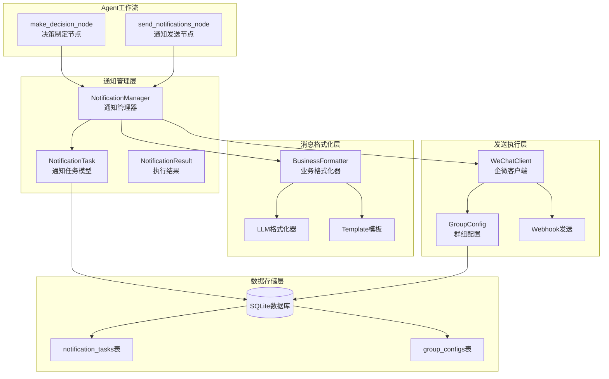
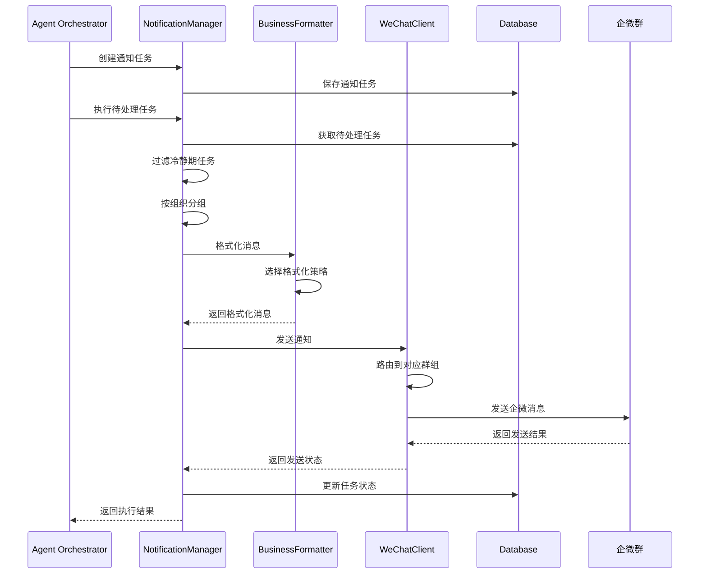
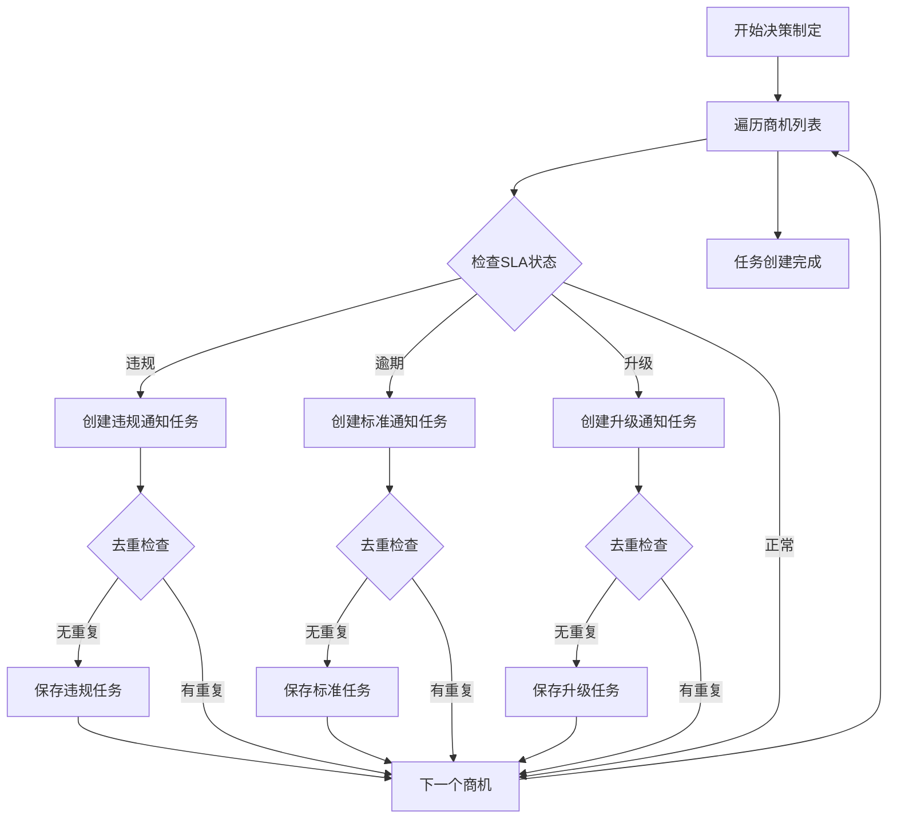
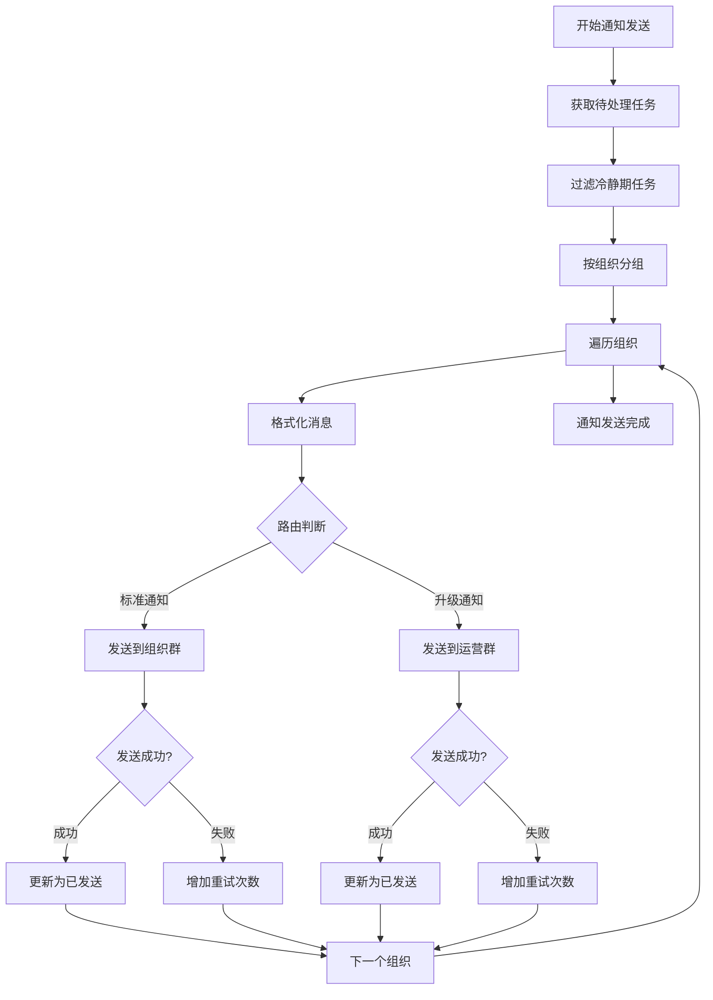
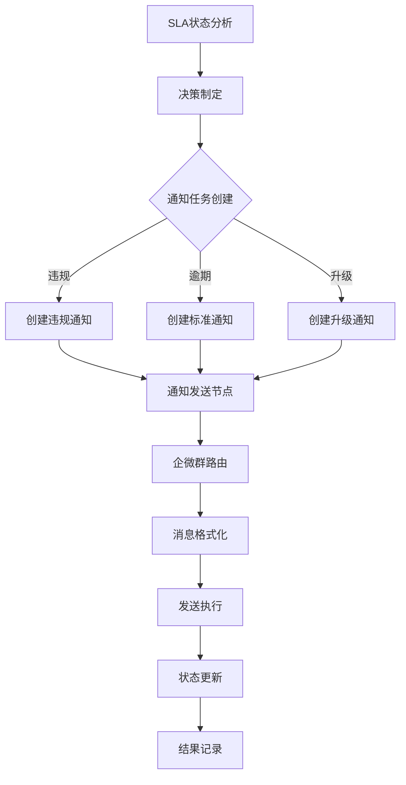

# FSOA 通知模块详细设计

## 1. 概述

FSOA系统的通知模块基于两级SLA机制，负责将商机时效分析结果转化为具体的通知任务，并通过企微群智能发送给相关人员。该模块实现了完整的通知生命周期管理，包括任务创建、消息格式化、发送执行、状态追踪和重试机制。

### 1.1 设计目标

- **两级SLA通知**：4小时提醒 + 8小时升级的分级机制
- **智能路由**：提醒通知到组织群，升级通知到运营群
- **组织级聚合**：升级通知按组织聚合，避免重复和内容不一致 🆕
- **动态配置**：基于数据库配置的SLA阈值和消息模板
- **可靠发送**：冷静期、重试机制确保通知可达
- **统一数据模型**：基于OpportunityInfo的一致性架构

### 1.2 v0.3.1 重要修复 🔧

**问题背景**：v0.3.0中发现通知系统存在以下严重问题：
1. 同一组织收到多个升级通知，工单数量不一致（如：1个工单 vs 6个工单）
2. 数据库中每个工单都创建了独立的升级任务，而不是组织级任务
3. NotificationTaskType.STANDARD被映射为'escalation'，导致每个超期工单都创建升级任务

**根本原因**：
- 通知类型别名混乱：STANDARD → "escalation"，VIOLATION → "reminder"
- 升级任务创建逻辑错误：为每个工单创建任务，而不是按组织聚合
- 缺乏有效的去重机制防止重复创建

**修复方案**：
- **通知类型系统重构**：使用REMINDER和ESCALATION替代VIOLATION和STANDARD
- **组织级升级任务**：每个组织只创建一个升级任务（ESCALATION_组织名格式）
- **增强去重机制**：清理所有旧格式的升级任务，防止新旧任务并存
- **消息显示配置**：支持动态配置各类通知的显示工单数量

## 2. 通知架构设计

### 2.1 组件架构



### 2.2 通知流程设计



## 3. 核心组件实现

### 3.1 NotificationManager（通知管理器）

**位置**: `src/fsoa/agent/managers/notification_manager.py`

**职责**:
- 基于SLA状态创建通知任务
- 执行待处理的通知任务
- 管理冷静期和重试机制
- 统计通知执行结果

**核心方法**:

```python
class NotificationTaskManager:
    def create_notification_tasks(self, opportunities: List[OpportunityInfo], run_id: int) -> List[NotificationTask]:
        """基于商机创建通知任务"""
        
    def execute_pending_tasks(self, run_id: int) -> NotificationResult:
        """执行待处理的通知任务"""
        
    def _send_org_notifications(self, org_name: str, tasks: List[NotificationTask], run_id: int) -> NotificationResult:
        """发送组织通知"""
```

### 3.2 通知任务创建逻辑 - v0.3.1重构版本

```python
def create_notification_tasks(self, opportunities: List[OpportunityInfo], run_id: int) -> List[NotificationTask]:
    """基于商机创建通知任务 - 重构后的逻辑"""
    tasks = []
    created_tasks_tracker = set()  # 防止重复创建

    # 🔧 第一步：按组织分组，创建升级任务
    escalation_orgs = set()
    for opp in opportunities:
        opp.update_overdue_info(use_business_time=True)

        # 收集需要升级的组织
        if opp.escalation_level > 0:
            escalation_orgs.add(opp.org_name)

    # 为每个需要升级的组织创建一个升级任务
    for org_name in escalation_orgs:
        escalation_order_num = f"ESCALATION_{org_name}"
        if not self._has_pending_escalation_task_for_org(org_name):
            # 清理该组织的旧格式升级任务
            self._cleanup_old_escalation_tasks_for_org(org_name)

            escalation_task = NotificationTask(
                order_num=escalation_order_num,  # 组织级任务标识
                org_name=org_name,
                notification_type=NotificationTaskType.ESCALATION,
                due_time=now_china_naive(),
                created_run_id=run_id,
                cooldown_hours=self.notification_cooldown_hours,
                max_retry_count=self.max_retry_count
            )
            tasks.append(escalation_task)

    # 🔧 第二步：为个别工单创建提醒任务
    for opp in opportunities:
        # 创建提醒通知任务（4/8小时）→ 服务商群
        if opp.is_violation:
            task_key = (opp.order_num, NotificationTaskType.REMINDER)
            if (not self._has_pending_task(opp.order_num, NotificationTaskType.REMINDER) and
                task_key not in created_tasks_tracker):
                reminder_task = NotificationTask(
                    order_num=opp.order_num,
                    org_name=opp.org_name,
                    notification_type=NotificationTaskType.REMINDER,
                    due_time=now_china_naive(),
                    created_run_id=run_id,
                    cooldown_hours=self.notification_cooldown_hours,
                    max_retry_count=self.max_retry_count
                )
                tasks.append(reminder_task)
                created_tasks_tracker.add(task_key)

    return tasks
```

**关键改进**：
1. **组织级升级任务**：使用`ESCALATION_组织名`格式，每个组织只创建一个升级任务
2. **旧任务清理**：自动清理该组织的旧格式升级任务，防止重复
3. **去重跟踪**：使用`created_tasks_tracker`防止同一批次重复创建
4. **类型明确**：REMINDER用于个别工单提醒，ESCALATION用于组织级升级

### 3.3 通知任务模型

**位置**: `src/fsoa/data/models.py`

```python
class NotificationTask(BaseModel):
    """通知任务模型"""
    id: Optional[int] = None
    order_num: str = Field(..., description="工单号")
    org_name: str = Field(..., description="组织名称")
    notification_type: NotificationTaskType = Field(..., description="通知类型")
    due_time: datetime = Field(..., description="应该通知的时间")
    status: NotificationTaskStatus = NotificationTaskStatus.PENDING
    message: Optional[str] = None
    sent_at: Optional[datetime] = None
    created_run_id: Optional[int] = None
    sent_run_id: Optional[int] = None
    retry_count: int = 0
    max_retry_count: int = Field(5, description="最大重试次数")
    cooldown_hours: float = Field(2.0, description="冷静时间（小时）")
    last_sent_at: Optional[datetime] = Field(None, description="最后发送时间")
    
    @property
    def is_in_cooldown(self) -> bool:
        """是否在冷静期内"""
        if not self.last_sent_at:
            return False
        cooldown_delta = timedelta(hours=self.cooldown_hours)
        return now_china_naive() - self.last_sent_at < cooldown_delta
    
    @property
    def can_retry(self) -> bool:
        """是否可以重试"""
        return self.retry_count < self.max_retry_count and not self.is_in_cooldown
    
    def should_send_now(self) -> bool:
        """是否应该立即发送"""
        return (
            self.status == NotificationTaskStatus.PENDING and
            not self.is_in_cooldown and
            self.can_retry
        )
```

### 3.4 通知类型定义

```python
class NotificationTaskType(str, Enum):
    """通知任务类型枚举 - v0.3.1重构版本"""
    REMINDER = "reminder"      # 提醒通知（4/8小时）→ 服务商群
    ESCALATION = "escalation"  # 升级通知（8/16小时）→ 运营群

    # 🔧 向后兼容（已废弃，仅用于数据迁移）
    VIOLATION = "reminder"     # 旧类型别名，映射到REMINDER
    STANDARD = "escalation"    # 旧类型别名，映射到ESCALATION
```

**类型说明**：
- **REMINDER**: 4/8小时提醒通知，发送到组织对应的企微群
- **ESCALATION**: 8/16小时升级通知，发送到内部运营群
- **向后兼容**: 保持对旧类型的支持，确保平滑迁移

## 4. 消息格式化系统

### 4.1 BusinessNotificationFormatter

**位置**: `src/fsoa/notification/business_formatter.py`

**功能**: 按照业务需求格式化不同类型的通知消息

```python
class BusinessNotificationFormatter:
    @staticmethod
    def _get_display_config() -> Dict[str, int]:
        """获取消息显示配置 - v0.3.1新增"""
        # 从数据库获取可配置的显示数量限制
        return {
            'notification_max': int(db_manager.get_system_config("notification_max_display_orders") or "5"),
            'escalation_max': int(db_manager.get_system_config("escalation_max_display_orders") or "5"),
            'emergency_max': int(db_manager.get_system_config("emergency_max_display_orders") or "3"),
            'standard_max': int(db_manager.get_system_config("standard_max_display_orders") or "10"),
        }

    @staticmethod
    def format_violation_notification(org_name: str, opportunities: List[OpportunityInfo]) -> str:
        """格式化提醒通知（4/8小时）→ 服务商群"""

    @staticmethod
    def format_org_overdue_notification(org_name: str, opportunities: List[OpportunityInfo]) -> str:
        """格式化标准逾期通知"""

    @staticmethod
    def format_escalation_notification(org_name: str, opportunities: List[OpportunityInfo]) -> str:
        """格式化升级通知 - 支持可配置显示数量"""
        # 获取显示配置
        display_config = BusinessNotificationFormatter._get_display_config()
        max_display = display_config['escalation_max']

        # 只显示前max_display个工单，其余显示"还有X个工单需要处理"
```

**v0.3.1新增特性**：
- **可配置显示数量**：支持通过数据库配置各类通知的最大显示工单数
- **智能截断**：超出限制的工单显示"还有X个工单需要处理"
- **Web界面配置**：可通过系统管理页面动态调整显示数量

### 4.2 双重格式化策略

#### 4.2.1 标准模板格式化

```python
def _format_with_template(self, org_name: str, opportunities: List[OpportunityInfo],
                        notification_type: NotificationTaskType) -> str:
    """使用标准模板格式化消息 - v0.3.1更新版本"""
    if notification_type == NotificationTaskType.REMINDER:
        return self.formatter.format_violation_notification(org_name, opportunities)
    elif notification_type == NotificationTaskType.ESCALATION:
        return self.formatter.format_escalation_notification(org_name, opportunities)
    # 🔧 向后兼容
    elif notification_type == NotificationTaskType.VIOLATION:
        return self.formatter.format_violation_notification(org_name, opportunities)
    elif notification_type == NotificationTaskType.STANDARD:
        return self.formatter.format_escalation_notification(org_name, opportunities)
    else:
        return self.formatter.format_org_overdue_notification(org_name, opportunities)
```

#### 4.2.2 LLM智能格式化

```python
def _format_with_llm(self, org_name: str, opportunities: List[OpportunityInfo],
                    notification_type: NotificationTaskType) -> str:
    """使用LLM格式化消息"""
    try:
        # 构建LLM提示词
        prompt = self._build_llm_formatting_prompt(org_name, opportunities, notification_type)
        
        response = self.llm_client.client.chat.completions.create(
            model="deepseek-chat",
            messages=[{"role": "user", "content": prompt}],
            temperature=0.1,  # 低温度确保格式一致性
            max_tokens=800
        )
        
        message = response.choices[0].message.content.strip()
        return message
        
    except Exception as e:
        logger.error(f"LLM formatting failed: {e}")
        # 降级到标准模板
        return self._format_with_template(org_name, opportunities, notification_type)
```

### 4.3 消息格式示例 - v0.3.1更新版本

#### 4.3.1 提醒通知格式（REMINDER → 服务商群）

```
⚠ SLA违规提醒 (北京虹象防水工程有限公司)

共有 1 个工单违反4小时SLA规范：

01. 工单号：GD2025064176
     违规时长：2天0小时
     客户：付女士
     地址：龙湖滟澜山
     负责人：杜晓兴
     创建时间：06-24 10:30
     状态：待预约

🚨 请销售人员立即处理，确保客户服务质量！
💡 处理后系统将自动停止提醒
```

#### 4.3.2 升级通知格式（ESCALATION → 运营群）

```
🚨 **运营升级通知**

组织：北京虹象防水工程有限公司
需要升级处理的工单数：6

1. 工单号：GD2025064176
   滞留时长：48.5小时
   客户：付女士
   负责人：杜晓兴
   状态：待预约
   创建时间：06-24 10:30

2. 工单号：GD20250600782
   滞留时长：124.5小时
   客户：先生
   负责人：燕伟
   状态：待预约
   创建时间：06-14 14:31

... 还有 4 个工单需要处理

🔧 **请运营人员介入协调处理**
```

**v0.3.1格式改进**：
- **准确的工单数量**：升级通知显示该组织所有需要升级的工单
- **智能截断**：支持配置显示数量，超出部分显示"还有X个工单需要处理"
- **组织级聚合**：一个组织只发送一次升级通知，包含所有相关工单

## 5. 消息显示配置系统 - v0.3.1新增

### 5.1 配置项定义

FSOA v0.3.1引入了可配置的消息显示数量限制，解决了企微消息过长的问题。

```python
# 数据库配置项
DEFAULT_CONFIGS = [
    ("escalation_max_display_orders", "5", "升级通知最多显示工单数"),
    ("emergency_max_display_orders", "3", "紧急通知最多显示工单数"),
    ("standard_max_display_orders", "10", "标准通知最多显示工单数"),
    ("notification_max_display_orders", "5", "一般通知最多显示工单数"),
]
```

### 5.2 Web界面配置

**位置**: 系统管理 → 通知配置 → 消息显示配置

```python
# Web界面配置示例
escalation_max_display = st.number_input(
    "升级通知最多显示工单数",
    min_value=1,
    max_value=20,
    value=int(configs.get("escalation_max_display_orders", "5")),
    help="升级通知中最多显示的工单详情数量"
)
```

### 5.3 动态应用机制

```python
def _get_display_config() -> Dict[str, int]:
    """获取显示配置，支持实时更新"""
    try:
        db_manager = get_database_manager()
        return {
            'escalation_max': int(db_manager.get_system_config("escalation_max_display_orders") or "5"),
            'emergency_max': int(db_manager.get_system_config("emergency_max_display_orders") or "3"),
            'standard_max': int(db_manager.get_system_config("standard_max_display_orders") or "10"),
            'notification_max': int(db_manager.get_system_config("notification_max_display_orders") or "5"),
        }
    except Exception:
        # 降级到默认值
        return {'escalation_max': 5, 'emergency_max': 3, 'standard_max': 10, 'notification_max': 5}
```

**配置优势**：
- **灵活调整**：无需修改代码即可调整显示数量
- **实时生效**：配置更改立即应用到新的通知
- **降级保护**：数据库不可用时使用默认值
- **用户友好**：通过Web界面直观配置

## 6. 企微发送系统

### 5.1 WeChatClient

**位置**: `src/fsoa/notification/wechat.py`

**功能**: 企微群消息发送和群组路由管理

```python
class WeChatClient:
    def __init__(self):
        self.org_webhook_mapping = self._load_org_webhooks()
        self.internal_ops_webhook = config.internal_ops_webhook_url
        self.api_interval_seconds = config.webhook_api_interval
        
    def send_notification_to_org(self, org_name: str, content: str,
                                is_escalation: bool = False,
                                mention_users: List[str] = None) -> bool:
        """发送通知到指定组织的企微群"""
```

### 5.2 智能路由机制

```python
def send_notification_to_org(self, org_name: str, content: str,
                            is_escalation: bool = False,
                            mention_users: List[str] = None) -> bool:
    """发送通知到指定组织的企微群"""
    if is_escalation:
        # 升级通知发送到内部运营群
        webhook_url = self.internal_ops_webhook
        if mention_users:
            # 添加@用户到消息内容
            mentions = " ".join([f"@{user}" for user in mention_users])
            content = f"{content}\n\n{mentions}"
    else:
        # 标准通知发送到对应组织群
        webhook_url = self.org_webhook_mapping.get(org_name)
        if not webhook_url:
            logger.warning(f"No webhook configured for org: {org_name}")
            # 降级到内部运营群
            webhook_url = self.internal_ops_webhook

    if not webhook_url:
        logger.error(f"No webhook URL available for org {org_name}")
        return False

    message_data = {
        "msgtype": "text",
        "text": {
            "content": content
        }
    }

    return self._send_message(webhook_url, message_data)
```

### 5.3 API速率限制控制

```python
def _send_message(self, webhook_url: str, message_data: Dict[str, Any]) -> bool:
    """发送消息到企微群 - 包含API速率限制控制"""
    try:
        # API发送间隔控制 - 避免触发企微Webhook速率限制
        import time
        time.sleep(self.api_interval_seconds)
        logger.debug(f"API interval sleep: {self.api_interval_seconds} seconds")

        response = self.session.post(
            webhook_url,
            json=message_data,
            timeout=10
        )
        response.raise_for_status()

        result = response.json()

        if result.get("errcode") == 0:
            logger.info("WeChat message sent successfully")
            return True
        else:
            error_msg = result.get("errmsg", "Unknown error")
            logger.error(f"WeChat API error: {error_msg}")
            return False
```

## 6. 冷静期和重试机制

### 6.1 冷静期控制

**目的**: 避免短时间内重复发送相同通知

**实现**:
```python
@property
def is_in_cooldown(self) -> bool:
    """是否在冷静期内"""
    if not self.last_sent_at:
        return False

    cooldown_delta = timedelta(hours=self.cooldown_hours)
    return now_china_naive() - self.last_sent_at < cooldown_delta
```

**配置**:
- 默认冷静时间：2小时
- 可通过数据库配置动态调整
- 不同通知类型可设置不同冷静时间

### 6.2 重试机制

**策略**:
```python
@property
def can_retry(self) -> bool:
    """是否可以重试"""
    return self.retry_count < self.max_retry_count and not self.is_in_cooldown

def should_send_now(self) -> bool:
    """是否应该立即发送"""
    return (
        self.status == NotificationTaskStatus.PENDING and
        not self.is_in_cooldown and
        self.can_retry
    )
```

**配置**:
- 最大重试次数：5次
- 重试间隔：遵循冷静期规则
- 失败任务自动标记为failed状态

### 6.3 去重机制

```python
def _has_pending_task(self, order_num: str, notification_type: NotificationTaskType) -> bool:
    """检查是否已存在相同类型的待处理任务或在冷却期内"""
    try:
        existing_tasks = self.db_manager.get_notification_tasks_by_order(
            order_num, notification_type
        )
        
        for task in existing_tasks:
            # 检查是否有待处理的任务
            if task.status == NotificationTaskStatus.PENDING:
                return True
            
            # 检查是否在冷静期内
            if task.is_in_cooldown:
                return True
        
        return False
        
    except Exception as e:
        logger.error(f"Failed to check pending tasks: {e}")
        return False
```

## 7. 数据库设计

### 7.1 通知任务表结构

```sql
CREATE TABLE notification_tasks (
    id INTEGER PRIMARY KEY AUTOINCREMENT,
    order_num TEXT NOT NULL,           -- 关联的工单号
    org_name TEXT NOT NULL,            -- 组织名称
    notification_type TEXT NOT NULL,   -- 'violation', 'standard', 'escalation'
    due_time TIMESTAMP NOT NULL,       -- 应该通知的时间
    status TEXT DEFAULT 'pending',     -- 'pending', 'sent', 'failed', 'confirmed'
    message TEXT,                      -- 通知内容
    sent_at TIMESTAMP,                 -- 实际发送时间
    created_run_id INTEGER,            -- 创建此任务的Agent运行ID
    sent_run_id INTEGER,               -- 发送此通知的Agent运行ID
    retry_count INTEGER DEFAULT 0,
    max_retry_count INTEGER DEFAULT 5,     -- 最大重试次数
    cooldown_hours REAL DEFAULT 2.0,       -- 冷静时间（小时）
    last_sent_at DATETIME,                  -- 最后发送时间
    created_at TIMESTAMP DEFAULT CURRENT_TIMESTAMP,
    updated_at TIMESTAMP DEFAULT CURRENT_TIMESTAMP,

    FOREIGN KEY (created_run_id) REFERENCES agent_runs(id),
    FOREIGN KEY (sent_run_id) REFERENCES agent_runs(id)
);

-- 索引优化
CREATE INDEX idx_notification_tasks_order_num ON notification_tasks(order_num);
CREATE INDEX idx_notification_tasks_org_name ON notification_tasks(org_name);
CREATE INDEX idx_notification_tasks_status ON notification_tasks(status);
CREATE INDEX idx_notification_tasks_type ON notification_tasks(notification_type);
CREATE INDEX idx_notification_tasks_due_time ON notification_tasks(due_time);
```

### 7.2 企微群配置表结构

```sql
CREATE TABLE group_configs (
    id INTEGER PRIMARY KEY AUTOINCREMENT,
    group_id TEXT UNIQUE NOT NULL,     -- 群组ID（对应orgName）
    name TEXT NOT NULL,                -- 群组显示名称
    webhook_url TEXT,                  -- 企微群Webhook URL
    enabled BOOLEAN DEFAULT TRUE,      -- 是否启用
    notification_cooldown_minutes INTEGER DEFAULT 120,  -- 通知冷却时间（分钟）
    max_notifications_per_hour INTEGER DEFAULT 10,      -- 每小时最大通知数
    created_at TIMESTAMP DEFAULT CURRENT_TIMESTAMP,
    updated_at TIMESTAMP DEFAULT CURRENT_TIMESTAMP
);

-- 索引
CREATE INDEX idx_group_configs_group_id ON group_configs(group_id);
CREATE INDEX idx_group_configs_enabled ON group_configs(enabled);
```

### 7.3 通知统计视图

```sql
-- 通知统计视图
CREATE VIEW notification_statistics AS
SELECT
    org_name,
    notification_type,
    COUNT(*) as total_count,
    SUM(CASE WHEN status = 'sent' THEN 1 ELSE 0 END) as sent_count,
    SUM(CASE WHEN status = 'failed' THEN 1 ELSE 0 END) as failed_count,
    SUM(CASE WHEN status = 'pending' THEN 1 ELSE 0 END) as pending_count,
    AVG(retry_count) as avg_retry_count,
    MAX(created_at) as last_notification_time
FROM notification_tasks
GROUP BY org_name, notification_type;
```

### 7.4 数据库操作接口

```python
class DatabaseManager:
    def save_notification_task(self, task: NotificationTask) -> int:
        """保存通知任务"""

    def get_pending_notification_tasks(self) -> List[NotificationTask]:
        """获取待处理的通知任务"""

    def update_notification_task_status(self, task_id: int, status: NotificationTaskStatus,
                                      sent_run_id: Optional[int] = None) -> bool:
        """更新通知任务状态"""

    def get_notification_tasks_by_order(self, order_num: str,
                                      notification_type: NotificationTaskType) -> List[NotificationTask]:
        """根据工单号和类型获取通知任务"""

    def get_group_configs(self) -> List[GroupConfig]:
        """获取所有群组配置"""

    def create_or_update_group_config(self, group_id: str, name: str,
                                    webhook_url: str, enabled: bool = True) -> GroupConfig:
        """创建或更新群组配置"""
```

## 8. Agent工作流中的通知处理

### 8.1 何时工作

#### 8.1.1 通知任务创建时机
- **触发节点**: `make_decision_node`（决策制定节点）
- **触发条件**: SLA分析完成后，基于商机状态创建通知任务
- **创建频率**: 每次Agent执行时检查并创建新任务
- **去重机制**: 避免为同一工单创建重复的相同类型通知

#### 8.1.2 通知任务执行时机
- **触发节点**: `send_notifications_node`（通知发送节点）
- **执行条件**: 存在待处理且不在冷静期的通知任务
- **执行频率**: 每次Agent执行时处理所有符合条件的任务
- **批量处理**: 按组织分组批量发送，提高效率

### 8.2 如何工作

#### 8.2.1 通知任务创建流程



#### 8.2.2 通知发送执行流程



### 8.3 工作记录位置

#### 8.3.1 数据库记录
- **notification_tasks表**: 完整的通知任务生命周期记录
- **agent_runs表**: Agent执行记录，包含通知统计
- **agent_history表**: 详细的执行步骤，包含通知发送结果
- **group_configs表**: 企微群配置和路由信息

#### 8.3.2 执行日志
- **文件位置**: `logs/fsoa.log`
- **记录内容**: 通知创建、发送过程、成功/失败状态、重试信息

```log
2025-06-27 10:00:18 INFO [NotificationManager] Created 3 notification tasks for run 123
2025-06-27 10:00:19 INFO [NotificationManager] Found 5 tasks ready to send out of 8 pending
2025-06-27 10:00:20 INFO [WeChatClient] WeChat message sent successfully to 三河市中豫防水工程有限公司
2025-06-27 10:00:21 INFO [NotificationManager] Sent violation notification to 三河市中豫防水工程有限公司 for 1 tasks
```

#### 8.3.3 执行统计
```python
# Agent执行记录中的通知统计
{
    "context": {
        "notification_statistics": {
            "total_tasks_created": 3,
            "violation_tasks": 1,
            "standard_tasks": 1,
            "escalation_tasks": 1,
            "sent_count": 2,
            "failed_count": 1,
            "organizations_notified": ["三河市中豫防水工程有限公司"]
        }
    }
}
```

## 9. Web端通知展示

### 9.1 通知管理页面

**位置**: `src/fsoa/ui/app.py` - `show_notification_management()`

#### 9.1.1 通知统计指标

```python
def show_notification_management():
    """显示通知管理页面"""
    # 获取通知统计
    stats = manager.get_notification_statistics()

    # 显示统计信息
    col1, col2, col3, col4 = st.columns(4)
    with col1:
        st.metric("总任务数", stats.get("total_tasks", 0))
    with col2:
        st.metric("已发送", stats.get("sent_count", 0))
    with col3:
        st.metric("发送失败", stats.get("failed_count", 0))
    with col4:
        st.metric("待处理", stats.get("pending_count", 0))
```

#### 9.1.2 待处理任务列表

```python
# 待处理任务列表
st.subheader("📋 待处理任务")

pending_tasks = manager.db_manager.get_pending_notification_tasks()

if pending_tasks:
    task_data = []
    for task in pending_tasks:
        task_data.append({
            "工单号": task.order_num,
            "组织": task.org_name,
            "类型": task.notification_type.value,
            "应发送时间": format_china_time(task.due_time),
            "重试次数": task.retry_count,
            "冷静期": "是" if task.is_in_cooldown else "否",
            "可发送": "是" if task.should_send_now() else "否"
        })

    df_tasks = pd.DataFrame(task_data)
    st.dataframe(df_tasks, use_container_width=True)
```

### 9.2 企微群配置页面

**位置**: `src/fsoa/ui/app.py` - `show_wechat_config()`

#### 9.2.1 群组配置管理

```python
def show_wechat_config():
    """显示企微配置页面"""
    # 显示现有配置
    group_configs = db_manager.get_group_configs()

    if group_configs:
        config_data = []
        for gc in group_configs:
            config_data.append({
                "组织名称": gc.name,
                "群组ID": gc.group_id,
                "状态": "✅ 启用" if gc.enabled else "❌ 禁用",
                "Webhook配置": "✅ 已配置" if gc.webhook_url else "❌ 未配置",
                "冷却时间": f"{gc.notification_cooldown_minutes}分钟",
                "最大通知/小时": gc.max_notifications_per_hour
            })

        df_configs = pd.DataFrame(config_data)
        st.dataframe(df_configs, use_container_width=True)
```

#### 9.2.2 新增群组配置

```python
# 新增组织群配置
with st.form("add_org_config"):
    col_form1, col_form2 = st.columns(2)

    with col_form1:
        new_org_name = st.text_input(
            "组织名称 (orgName)",
            placeholder="例如: 北京分公司",
            help="必须与Metabase数据中的orgName完全一致"
        )

    with col_form2:
        new_webhook_url = st.text_input(
            "企微群Webhook地址",
            placeholder="https://qyapi.weixin.qq.com/cgi-bin/webhook/send?key=...",
            help="从企微群机器人获取的Webhook URL"
        )

    submitted = st.form_submit_button("✅ 添加配置", type="primary")

    if submitted:
        if new_org_name and new_webhook_url:
            # 创建新配置
            new_config = db_manager.create_or_update_group_config(
                group_id=new_org_name,
                name=new_org_name,
                webhook_url=new_webhook_url,
                enabled=True
            )
            if new_config:
                st.success(f"✅ 成功添加组织群配置: {new_org_name}")
```

### 9.3 通知测试功能

**位置**: `src/fsoa/ui/app.py` - `show_notification_test()`

```python
def show_notification_test(db_manager, config):
    """显示通知测试界面"""
    st.subheader("🧪 通知测试")

    test_type = st.selectbox(
        "选择测试类型",
        ["组织群通知", "内部运营群通知"]
    )

    if test_type == "组织群通知":
        group_configs = db_manager.get_enabled_group_configs()
        if group_configs:
            org_options = {gc.name: gc for gc in group_configs if gc.webhook_url}
            if org_options:
                org_name = st.selectbox("选择组织", list(org_options.keys()))

                if st.button("发送测试消息"):
                    # 构造测试消息
                    test_message = f"""🧪 FSOA系统测试消息

组织: {org_name}
时间: {format_china_time(now_china_naive())}
状态: 测试通知功能正常

这是一条来自FSOA系统的测试消息，用于验证企微群通知功能是否正常工作。"""

                    # 发送测试消息
                    wechat_client = get_wechat_client()
                    success = wechat_client.send_notification_to_org(
                        org_name=org_name,
                        content=test_message,
                        is_escalation=False
                    )

                    if success:
                        st.success(f"✅ 测试消息发送成功！请检查 {org_name} 的企微群。")
                    else:
                        st.error(f"❌ 测试消息发送失败！请检查webhook配置和网络连接。")
```

### 9.4 执行历史中的通知记录

**位置**: `src/fsoa/ui/app.py` - `show_execution_history()`

```python
# 在执行历史详情中显示通知统计
if run.context and "notification_statistics" in run.context:
    notification_stats = run.context["notification_statistics"]

    st.subheader("📬 通知统计")
    col_n1, col_n2, col_n3, col_n4 = st.columns(4)

    with col_n1:
        st.metric("创建任务", notification_stats.get("total_tasks_created", 0))
    with col_n2:
        st.metric("发送成功", notification_stats.get("sent_count", 0))
    with col_n3:
        st.metric("发送失败", notification_stats.get("failed_count", 0))
    with col_n4:
        st.metric("通知组织", len(notification_stats.get("organizations_notified", [])))
```

## 10. 架构一致性分析

### 10.1 与架构设计的对照

#### 10.1.1 核心组件一致性

| 架构组件 | 设计要求 | 通知实现模块 | 一致性状态 |
|---------|---------|-------------|-----------|
| Agent Orchestrator | LangGraph工作流 | `make_decision_node`, `send_notifications_node` | ✅ 完全一致 |
| NotificationManager | 通知任务管理 | `NotificationTaskManager` | ✅ 完全一致 |
| Tool Layer | 标准化工具函数 | `WeChatClient`, `BusinessFormatter` | ✅ 完全一致 |
| Data Layer | 统一数据模型 | `NotificationTask`, `GroupConfig` | ✅ 完全一致 |
| UI Layer | Streamlit管理界面 | 通知管理、企微配置页面 | ✅ 完全一致 |

#### 10.1.2 Agentic特性验证

**主动性 (Proactive)**:
- ✅ **主动创建**: 基于SLA状态主动创建通知任务
- ✅ **主动发送**: 定时检查并发送待处理通知
- ✅ **主动重试**: 失败任务自动重试机制

**自主决策 (Autonomous)**:
- ✅ **智能路由**: 基于orgName自动路由到对应群组
- ✅ **格式选择**: 标准模板+LLM的智能格式化选择
- ✅ **升级决策**: 自动判断是否需要升级到运营群

**目标导向 (Goal-Oriented)**:
- ✅ **明确目标**: 及时通知相关人员处理逾期商机
- ✅ **结果导向**: 确保通知送达，追踪发送状态
- ✅ **持续优化**: 冷静期和重试机制优化通知效果

### 10.2 LangGraph工作流一致性

#### 10.2.1 6步流程中的通知处理

| 流程步骤 | 架构设计 | 通知实现 | 处理内容 |
|---------|---------|---------|---------|
| 1. 定时触发 | ✅ 已实现 | Scheduler | 60分钟间隔触发 |
| 2. 获取任务数据 | ✅ 已实现 | `fetch_data_node` | 获取商机数据 |
| 3. 分析超时状态 | ✅ 已实现 | `analyze_status_node` | SLA状态分析 |
| 4. 智能决策 | ✅ 已实现 | `make_decision_node` | **创建通知任务** |
| 5. 发送通知 | ✅ 已实现 | `send_notifications_node` | **执行通知发送** |
| 6. 记录结果 | ✅ 已实现 | `record_results_node` | 记录通知统计 |

#### 10.2.2 通知在工作流中的核心作用



### 10.3 数据架构一致性

#### 10.3.1 数据分离原则验证

**业务数据与Agent数据分离**:
- ✅ **业务数据**: Metabase Card 1712（只读）
- ✅ **通知任务**: notification_tasks表（Agent管理）
- ✅ **群组配置**: group_configs表（系统配置）

**最小化持久化**:
- ✅ **通知任务**: 必要的任务状态和重试信息
- ✅ **群组配置**: 企微群路由配置
- ✅ **执行记录**: 通知统计和执行历史

#### 10.3.2 通知数据流映射

```python
# SLA分析结果 → 通知任务创建 → 企微发送
OpportunityInfo.is_violation = True
    ↓
NotificationTask(
    order_num="GD20250600803",
    org_name="三河市中豫防水工程有限公司",
    notification_type=NotificationTaskType.VIOLATION
)
    ↓
WeChatClient.send_notification_to_org(
    org_name="三河市中豫防水工程有限公司",
    content="⚠️ SLA违规提醒...",
    is_escalation=False
)
```

### 10.4 技术实现一致性

#### 10.4.1 通知路由机制

**架构要求**: 基于orgName的智能路由
**实现状态**: ✅ 完全实现
- 组织群路由：orgName → webhook_url
- 升级通知路由：自动路由到内部运营群
- 降级机制：未配置群组自动降级到运营群

#### 10.4.2 消息格式化

**架构要求**: 标准化消息格式
**实现状态**: ✅ 超出设计
- 标准模板：BusinessNotificationFormatter
- LLM优化：DeepSeek智能格式化
- 降级策略：LLM失败自动降级到模板

#### 10.4.3 可靠性保证

**架构要求**: 确保通知可达
**实现状态**: ✅ 完全实现
- 冷静期：避免重复通知
- 重试机制：最多5次重试
- 去重机制：避免重复任务创建
- API限流：企微Webhook速率控制

## 11. 总结

### 11.1 v0.3.1重大修复成果

FSOA v0.3.1成功解决了v0.3.0中发现的严重通知问题，实现了真正可靠的通知系统：

1. **升级通知去重**: 彻底解决同一组织收到多条升级通知的问题
2. **组织级聚合**: 每个组织只创建一个升级任务，包含所有相关工单
3. **类型系统重构**: 使用REMINDER和ESCALATION替代混乱的别名映射
4. **配置化管理**: 支持动态配置消息显示数量，提升用户体验

### 11.2 核心价值

1. **智能路由**: 基于orgName的自动群组路由
2. **分级通知**: 提醒（REMINDER）→ 服务商群，升级（ESCALATION）→ 运营群
3. **可靠发送**: 多重保障机制确保通知可达且不重复
4. **完整追踪**: 从创建到发送的全生命周期管理

### 11.3 技术亮点

1. **组织级升级任务**: 使用`ESCALATION_组织名`格式，确保一个组织一个任务
2. **智能去重**: 基于工单号和类型的重复任务检测 + 旧任务清理
3. **可配置显示**: 支持动态配置各类通知的显示工单数量
4. **向后兼容**: 平滑处理旧通知类型，确保系统稳定性

### 11.4 业务价值

1. **准确通知**: 升级通知准确反映组织的实际工单数量
2. **避免骚扰**: 一个组织只收到一次升级通知，不再重复
3. **精准路由**: 通知直达相关责任人和团队
4. **运营支持**: 升级机制确保严重问题得到及时处理

### 11.5 v0.3.1修复验证

**修复前问题**：
- 北京虹象防水工程有限公司收到1个工单和6个工单的两条不同升级通知
- 数据库中该组织有6个独立的升级任务

**修复后效果**：
- 每个组织只创建一个升级任务（`ESCALATION_北京虹象防水工程有限公司`）
- 升级通知正确聚合该组织所有6个需要升级的工单
- 消息显示"需要升级处理的工单数：6"，显示前5个，"还有1个工单需要处理"

---

> 本设计文档详细描述了FSOA系统通知模块的工作原理、技术实现和架构一致性分析
>
> v0.3.1重大修复：解决升级通知重复发送问题，实现真正可靠的组织级通知聚合
>
> 通过完整的通知生命周期管理和智能企微集成，实现了高效可靠的通知服务
>
> 文档版本: v1.1
>
> 最后更新: 2025-06-30
