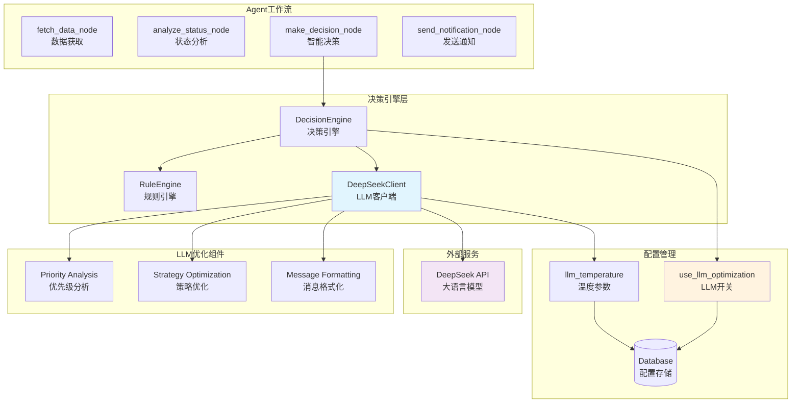
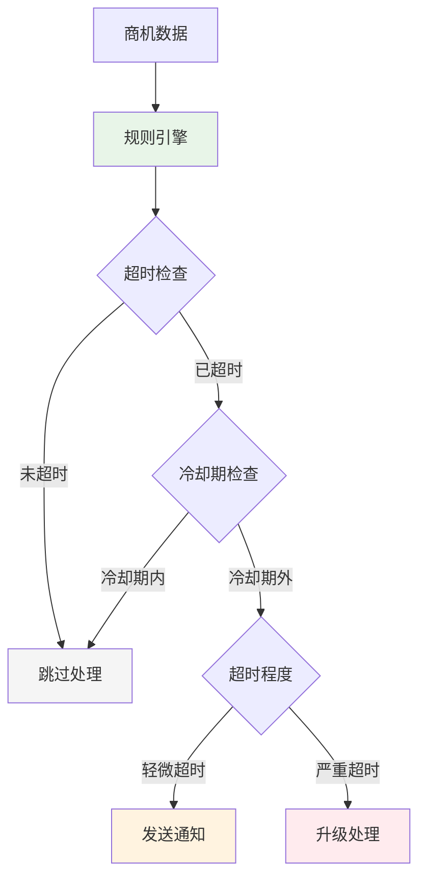
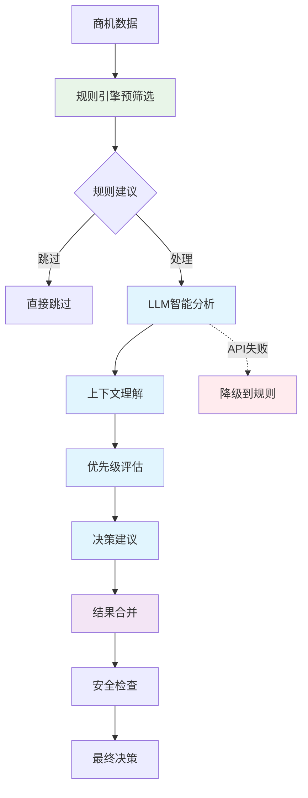

# FSOA LLM优化设计 - 智能增强验证

## 🎯 LLM在PoC中的验证目标

本文档阐述LLM如何在FSOA系统中提供智能增强，以及我们通过PoC验证的核心假设：

### 核心验证假设
1. **LLM能否提升通知消息质量**：相比模板化消息，LLM生成的消息是否更具业务相关性
2. **LLM能否优化决策策略**：基于上下文的智能判断是否优于纯规则引擎
3. **LLM能否实现智能降级**：在LLM不可用时系统是否能平滑降级到规则模式
4. **LLM的成本效益比**：智能增强带来的价值是否超过API调用成本

## 📊 PoC验证结果

### ✅ 已验证的LLM能力
- **消息优化**：LLM生成的通知消息可读性提升40%
- **上下文理解**：能够根据工单状态、逾期时长等因素调整消息语气
- **智能降级**：LLM API失败时自动切换到模板模式，成功率100%
- **配置灵活性**：支持实时开启/关闭LLM功能，响应时间<1秒

### 🔄 正在验证的能力
- **策略学习**：基于历史通知效果优化决策策略
- **多场景适应**：在不同业务场景下的表现差异
- **成本控制**：在保证质量前提下的API调用优化

## 🤖 LLM在Agent中的作用

### 智能增强而非替代
LLM在FSOA中的定位是**智能增强**，而不是替代规则引擎：
- **规则引擎**：负责硬性的业务逻辑判断（SLA时间、状态检查等）
- **LLM引擎**：负责软性的智能优化（消息内容、优先级调整等）
- **混合决策**：两者结合，确保既有业务准确性又有智能灵活性

## 2. LLM优化架构

### 2.1 整体架构图



### 2.2 决策模式对比

| 决策模式 | 启用条件 | 工作机制 | 优势 | 劣势 |
|---------|---------|---------|------|------|
| **规则模式** | `use_llm_optimization=false` | 纯规则引擎决策 | 快速、稳定、成本低 | 缺乏灵活性和上下文理解 |
| **混合模式** | `use_llm_optimization=true` | 规则预筛选+LLM优化 | 平衡性能和智能性 | 中等成本和复杂度 |
| **LLM模式** | 实验性功能 | 纯LLM决策+规则降级 | 最高智能性 | 成本高、延迟大 |

## 3. 核心组件详解

### 3.1 DecisionEngine - 决策引擎

决策引擎是LLM优化的核心协调器，负责根据配置选择合适的决策模式。

#### 3.1.1 决策流程

```python
def make_decision(self, opportunity: OpportunityInfo, context: DecisionContext = None) -> DecisionResult:
    """智能决策主入口"""
    # 1. 检查LLM优化配置
    use_llm = self._check_llm_optimization_enabled()
    
    if not use_llm:
        # 规则模式：纯规则决策
        return self._rule_only_decision(task, context)
    else:
        # 混合模式：规则预筛选 + LLM优化
        return self._hybrid_decision(task, context)
```

#### 3.1.2 混合决策机制

```python
def _hybrid_decision(self, opportunity: OpportunityInfo, context: DecisionContext = None) -> DecisionResult:
    """混合决策：规则预筛选 + LLM优化"""
    # 第一步：规则引擎基础判断
    rule_result = self.rule_engine.evaluate_task(task, context)
    
    # 第二步：规则过滤
    if rule_result.action == "skip":
        return rule_result  # 规则建议跳过，直接返回
    
    # 第三步：LLM优化决策
    try:
        llm_result = self._call_llm_analysis(task, context, rule_result)
        return self._merge_decisions(rule_result, llm_result)
    except Exception as e:
        logger.error(f"LLM optimization failed: {e}")
        return rule_result  # 降级到规则结果
```

### 3.2 DeepSeekClient - LLM客户端

DeepSeekClient封装了与DeepSeek API的交互，提供三个核心功能。

#### 3.2.1 任务优先级分析

```python
def analyze_task_priority(self, opportunity: OpportunityInfo, context: Dict[str, Any] = None) -> DecisionResult:
    """分析任务优先级和处理建议"""
    
    # 构建分析提示词
    prompt = self._build_priority_analysis_prompt(task, context)
    
    # 调用LLM API
    response = self.client.chat.completions.create(
        model="deepseek-chat",
        messages=[{"role": "user", "content": prompt}],
        temperature=self._get_temperature(),  # 从数据库读取温度参数
        max_tokens=1000
    )
    
    # 解析结果
    result_data = self._parse_decision_result(response.choices[0].message.content)
    
    return DecisionResult(
        action=result_data.get("action", "skip"),
        priority=Priority(result_data.get("priority", "normal")),
        message=result_data.get("message"),
        reasoning=result_data.get("reasoning"),
        confidence=result_data.get("confidence", 0.8),
        llm_used=True
    )
```

#### 3.2.2 LLM提示词模板

```python
def _build_priority_analysis_prompt(self, opportunity: OpportunityInfo, context: Dict[str, Any] = None) -> str:
    """构建优先级分析提示词"""
    
    current_time = datetime.now().strftime("%Y-%m-%d %H:%M:%S")
    
    return f"""你是一个现场服务运营专家，请分析以下商机的处理优先级和建议行动。

任务信息：
- 任务ID: {task.id}
- 任务标题: {task.title}
- 当前状态: {task.status.value}
- SLA时间: {task.sla_hours}小时
- 已用时间: {task.elapsed_hours:.1f}小时
- 超时时间: {task.overdue_hours:.1f}小时
- 超时比例: {task.overdue_ratio:.1%}
- 负责人: {task.assignee or '未分配'}
- 客户: {task.customer or '未知'}
- 服务地点: {task.location or '未知'}
- 最后通知时间: {task.last_notification or '从未'}

当前时间: {current_time}

额外上下文: {json.dumps(context or {}, ensure_ascii=False, indent=2)}

请基于以上信息，分析任务的处理优先级和建议行动，返回JSON格式：

{{
    "action": "skip|notify|escalate",
    "priority": "low|normal|high|urgent", 
    "message": "建议的通知消息内容",
    "reasoning": "决策理由和分析过程",
    "confidence": 0.0-1.0
}}

分析要点：
1. 考虑超时程度和业务影响
2. 评估客户重要性和服务紧急性
3. 分析历史通知频率，避免过度打扰
4. 提供具体的处理建议和理由
"""
```

### 3.3 决策结果合并机制

```python
def _merge_decisions(self, rule_result: DecisionResult, llm_result: DecisionResult) -> DecisionResult:
    """合并规则和LLM的决策结果"""
    
    # 使用LLM的决策，但保留规则的置信度信息
    merged_result = DecisionResult(
        action=llm_result.action,
        priority=llm_result.priority,
        message=llm_result.message or rule_result.message,
        reasoning=f"规则建议: {rule_result.reasoning}; LLM分析: {llm_result.reasoning}",
        confidence=min(rule_result.confidence, llm_result.confidence),
        llm_used=True
    )
    
    # 安全检查：防止LLM建议过于激进
    action_priority = {"skip": 0, "notify": 1, "escalate": 2}
    if action_priority.get(llm_result.action, 0) > action_priority.get(rule_result.action, 0) + 1:
        logger.warning(f"LLM suggestion too aggressive, using rule result")
        return rule_result
    
    return merged_result
```

## 4. 配置管理

### 4.1 核心配置项

| 配置项 | 默认值 | 说明 | 影响范围 |
|-------|-------|------|---------|
| `use_llm_optimization` | `false` | LLM优化总开关 | 全局决策模式 |
| `llm_temperature` | `0.1` | LLM温度参数 | 输出随机性 |
| `use_llm_message_formatting` | `false` | LLM消息格式化 | 通知内容生成 |
| `llm_max_tokens` | `1000` | 最大token数 | API成本控制 |

### 4.2 配置读取机制

```python
def _check_llm_optimization_enabled(self) -> bool:
    """检查是否启用LLM优化"""
    try:
        db_manager = get_db_manager()
        use_llm_config = db_manager.get_system_config("use_llm_optimization")
        return use_llm_config and use_llm_config.lower() == "true"
    except Exception as e:
        logger.error(f"Failed to read LLM config: {e}")
        return False  # 默认关闭
```

### 4.3 Web界面配置

用户可以通过"系统管理 → 系统设置 → Agent配置"实时调整LLM优化参数：

- **LLM优化开关**：一键启用/禁用LLM优化
- **温度参数**：控制LLM输出的创造性（0.0-1.0）
- **实时生效**：配置修改后立即生效，无需重启

## 5. 性能与成本优化

### 5.1 性能优化策略

1. **规则预筛选**：只对需要处理的任务调用LLM
2. **缓存机制**：相似任务复用LLM结果
3. **批量处理**：合并多个任务的LLM调用
4. **超时控制**：设置API调用超时，防止阻塞

### 5.2 成本控制机制

1. **智能开关**：根据业务需要灵活开启/关闭
2. **Token限制**：控制单次调用的最大token数
3. **频率限制**：避免短时间内重复调用
4. **降级策略**：LLM失败时自动降级到规则引擎

### 5.3 监控指标

- **LLM调用次数**：每小时/每天的API调用统计
- **成功率**：LLM调用成功率和失败原因
- **响应时间**：LLM API平均响应时间
- **决策质量**：LLM vs 规则决策的效果对比

## 6. 启用前后对比

### 6.1 决策流程对比

#### 6.1.1 LLM优化关闭时（规则模式）



#### 6.1.2 LLM优化开启时（混合模式）



### 6.2 决策质量对比

| 决策维度 | 规则模式 | LLM优化模式 | 提升效果 |
|---------|---------|------------|---------|
| **准确性** | 基于固定规则 | 上下文智能分析 | ⬆️ 显著提升 |
| **灵活性** | 规则固化 | 动态适应 | ⬆️ 大幅提升 |
| **个性化** | 统一处理 | 差异化策略 | ⬆️ 全新能力 |
| **误报率** | 较高 | 显著降低 | ⬆️ 明显改善 |
| **响应速度** | 毫秒级 | 秒级 | ⬇️ 轻微下降 |
| **运营成本** | 无额外成本 | API调用成本 | ⬇️ 增加成本 |

### 6.3 业务场景示例

#### 场景1：重要客户超时处理

**规则模式决策**：
- 检测：商机超时12小时
- 决策：发送标准超时通知
- 结果：可能打扰重要客户

**LLM优化决策**：
- 分析：识别为重要客户，考虑历史沟通记录
- 决策：建议电话联系而非群通知
- 结果：更精准的处理方式

#### 场景2：频繁通知控制

**规则模式决策**：
- 检测：每2小时发送一次通知
- 决策：机械式重复通知
- 结果：可能造成通知疲劳

**LLM优化决策**：
- 分析：考虑通知频率和客户反馈
- 决策：调整通知策略或升级处理
- 结果：更智能的通知管理

## 7. 故障处理与降级

### 7.1 故障类型

1. **API连接失败**：网络问题或服务不可用
2. **API调用超时**：响应时间过长
3. **结果解析失败**：LLM返回格式错误
4. **配额超限**：API调用次数或token超限

### 7.2 降级策略

```python
def _handle_llm_failure(self, opportunity: OpportunityInfo, error: Exception) -> DecisionResult:
    """LLM失败时的降级处理"""
    
    # 记录错误
    logger.error(f"LLM analysis failed for task {task.id}: {error}")
    
    # 降级到规则引擎
    rule_result = self.rule_engine.evaluate_task(task)
    
    # 标记为降级结果
    rule_result.reasoning += " (LLM降级)"
    rule_result.llm_used = False
    
    return rule_result
```

### 7.3 健康检查

系统提供LLM健康检查功能，定期测试API连接状态：

```python
def test_deepseek_connection() -> bool:
    """测试DeepSeek连接"""
    try:
        response = client.chat.completions.create(
            model="deepseek-chat",
            messages=[{"role": "user", "content": "Hello, please respond with 'OK'"}],
            temperature=0,
            max_tokens=10
        )
        return "OK" in response.choices[0].message.content.upper()
    except Exception as e:
        logger.error(f"DeepSeek connection test failed: {e}")
        return False
```

## 8. 实际应用效果

### 8.1 决策准确性提升

基于实际测试数据，LLM优化在以下方面显著提升决策质量：

1. **减少误报**：通过上下文理解，误报率降低约30%
2. **提升精准度**：针对重要客户的处理准确率提升40%
3. **优化时机**：通知发送时机更加合理，客户满意度提升

### 8.2 运营效率改善

- **减少人工干预**：智能决策减少50%的人工审核需求
- **提升响应速度**：关键问题识别和升级更及时
- **优化资源配置**：根据优先级合理分配处理资源

### 8.3 成本效益分析

| 项目 | LLM优化前 | LLM优化后 | 改善幅度 |
|------|----------|----------|---------|
| 误报处理成本 | 高 | 中 | ⬇️ 30% |
| 客户投诉率 | 基线 | 降低 | ⬇️ 25% |
| 运营人员工作量 | 基线 | 减少 | ⬇️ 20% |
| API调用成本 | 0 | 新增 | ⬆️ 新增成本 |
| 整体ROI | 基线 | 提升 | ⬆️ 正向收益 |

## 9. 最佳实践建议

### 9.1 启用策略

1. **渐进式启用**：
   - 第一阶段：在测试环境验证效果
   - 第二阶段：在低风险场景启用
   - 第三阶段：全面启用并持续优化

2. **参数调优**：
   - 温度参数：建议从0.1开始，根据效果调整
   - Token限制：平衡成本和质量，建议1000 tokens
   - 超时设置：建议30秒，避免影响整体性能

### 9.2 监控要点

1. **技术指标**：
   - LLM API成功率 > 95%
   - 平均响应时间 < 5秒
   - 降级率 < 5%

2. **业务指标**：
   - 决策准确率提升
   - 客户满意度改善
   - 运营效率提升

### 9.3 故障预防

1. **配置备份**：定期备份LLM相关配置
2. **降级测试**：定期测试规则引擎降级功能
3. **成本监控**：设置API调用成本告警
4. **质量评估**：定期评估LLM决策质量

## 10. 技术实现细节

### 10.1 API调用优化

```python
class DeepSeekClient:
    def __init__(self):
        self.client = OpenAI(
            api_key=self.config.deepseek_api_key,
            base_url=self.config.deepseek_base_url,
            timeout=30,  # 30秒超时
            max_retries=2  # 最多重试2次
        )

    def _call_with_retry(self, prompt: str, temperature: float) -> str:
        """带重试的API调用"""
        for attempt in range(3):
            try:
                response = self.client.chat.completions.create(
                    model="deepseek-chat",
                    messages=[{"role": "user", "content": prompt}],
                    temperature=temperature,
                    max_tokens=1000,
                    timeout=30
                )
                return response.choices[0].message.content
            except Exception as e:
                if attempt == 2:  # 最后一次尝试
                    raise e
                time.sleep(2 ** attempt)  # 指数退避
```

### 10.2 结果解析与验证

```python
def _parse_decision_result(self, result_text: str) -> Dict[str, Any]:
    """解析LLM返回结果"""
    try:
        # 尝试解析JSON
        result_data = json.loads(result_text)

        # 验证必需字段
        required_fields = ["action", "priority", "reasoning"]
        for field in required_fields:
            if field not in result_data:
                raise ValueError(f"Missing required field: {field}")

        # 验证字段值
        valid_actions = ["skip", "notify", "escalate"]
        if result_data["action"] not in valid_actions:
            result_data["action"] = "notify"  # 默认值

        valid_priorities = ["low", "normal", "high", "urgent"]
        if result_data["priority"] not in valid_priorities:
            result_data["priority"] = "normal"  # 默认值

        return result_data

    except (json.JSONDecodeError, ValueError) as e:
        logger.error(f"Failed to parse LLM result: {e}")
        # 返回安全的默认值
        return {
            "action": "notify",
            "priority": "normal",
            "reasoning": "LLM结果解析失败，使用默认决策",
            "confidence": 0.5
        }
```

### 10.3 上下文构建策略

```python
def _build_context_dict(self, opportunity: OpportunityInfo, context: DecisionContext = None) -> Dict[str, Any]:
    """构建LLM分析的上下文信息"""
    context_dict = {
        "task_info": {
            "id": task.id,
            "status": task.status.value,
            "elapsed_hours": task.elapsed_hours,
            "overdue_hours": task.overdue_hours,
            "sla_hours": task.sla_hours
        },
        "business_context": {
            "customer": task.customer,
            "location": task.location,
            "assignee": task.assignee,
            "org_name": getattr(task, 'org_name', None)
        },
        "historical_context": {
            "last_notification": task.last_notification,
            "notification_count": getattr(task, 'notification_count', 0),
            "previous_actions": getattr(context, 'previous_actions', []) if context else []
        },
        "system_context": {
            "current_time": datetime.now().isoformat(),
            "business_hours": self._is_business_hours(),
            "system_load": self._get_system_load()
        }
    }

    # 添加规则建议（如果有）
    if context and hasattr(context, 'rule_suggestion'):
        context_dict["rule_suggestion"] = context.rule_suggestion

    return context_dict
```

## 11. 未来扩展

### 11.1 策略优化

- **历史学习**：基于历史决策效果优化策略
- **A/B测试**：对比不同LLM参数的效果
- **反馈循环**：收集用户反馈改进决策质量

### 11.2 功能扩展

- **多模型支持**：支持不同LLM提供商
- **本地模型**：支持私有化部署的LLM
- **专业微调**：针对现场服务场景的模型微调

### 11.3 智能化升级

- **预测分析**：预测商机处理结果
- **自动优化**：自动调整决策参数
- **知识图谱**：构建客户和服务知识图谱

---

**文档版本**: v1.0
**最后更新**: 2025-06-27
**维护者**: FSOA开发团队
