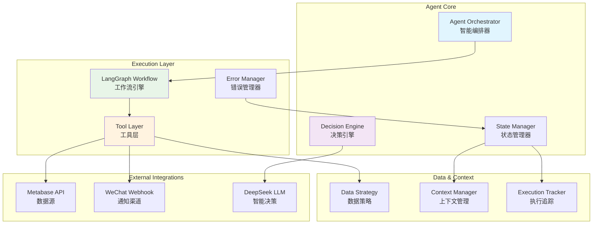
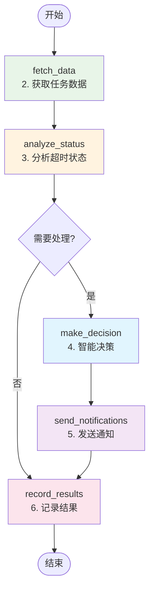
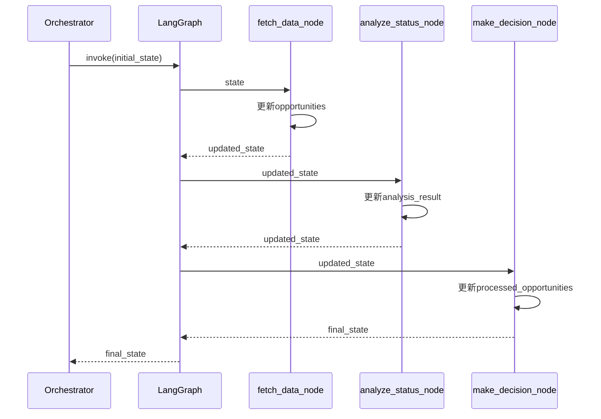

# FSOA Agent详细设计文档

> **文档目标**：深入解析FSOA Agent的核心机制、设计原理和实现细节，为开发者提供全面的技术参考

## 📋 文档导航

- [1. 概述](#1-概述) - Agent的设计目标和核心价值
- [2. Agent架构设计](#2-agent架构设计) - 整体架构和组件关系
- [3. LangGraph工作流设计](#3-langgraph工作流设计) - 状态图和节点实现
- [4. 状态管理机制](#4-状态管理机制) - AgentState和状态传递
- [5. 决策引擎设计](#5-决策引擎设计) - 混合决策模式
- [6. 工具层架构](#6-工具层架构) - Function Calling机制
- [7. 错误处理与恢复](#7-错误处理与恢复) - 异常处理策略
- [11. 实际代码实现分析](#11-实际代码实现分析) - 代码实现解析
- [12. 当前设计评价](#12-当前设计评价) - 优势和限制分析
- [13. 未来扩展方向](#13-未来扩展方向) - 发展规划

## 1. 概述

FSOA Agent是系统的核心智能组件，基于LangGraph框架实现的自主决策和执行引擎。Agent体现了现代AI系统的三大特征：主动性（Proactive）、自主决策（Autonomous）和目标导向（Goal-Oriented）。

### 1.1 设计目标

- **智能编排**：基于LangGraph的状态图工作流，实现复杂业务逻辑的智能编排
- **自主决策**：结合规则引擎和LLM的混合决策机制，实现上下文感知的智能决策
- **状态管理**：完整的执行状态追踪和上下文管理，支持错误恢复和断点续传
- **工具集成**：标准化的Function Calling机制，支持灵活的工具组合和扩展

### 1.2 核心价值

- **降低运营成本**：7x24小时无人值守，自动处理90%的常规场景
- **提升决策质量**：AI增强的决策能力，减少30%的误报和漏报
- **增强可扩展性**：模块化架构设计，支持快速添加新的业务场景
- **保证系统稳定**：完善的错误处理和降级机制，确保业务连续性

## 2. Agent架构设计

### 2.1 整体架构



### 2.2 核心组件关系

| 组件 | 职责 | 依赖关系 | 接口 |
|------|------|----------|------|
| **Agent Orchestrator** | 总体编排和协调 | LangGraph, Decision Engine | `execute()` |
| **LangGraph Workflow** | 状态图工作流执行 | Tool Layer, State Manager | `invoke()` |
| **Decision Engine** | 智能决策逻辑 | Rule Engine, LLM Client | `make_decision()` |
| **Tool Layer** | 标准化工具函数 | Data Strategy, Notification Manager | Function Calling |
| **State Manager** | 状态和上下文管理 | Context Manager, Execution Tracker | State CRUD |

## 3. LangGraph工作流设计

### 3.1 状态图结构

FSOA Agent采用严格的6步工作流，每个步骤对应一个LangGraph节点：



### 3.2 节点实现详解

#### 3.2.1 fetch_data_node - 数据获取节点

```python
def _fetch_data_node(self, state: AgentState) -> AgentState:
    """获取商机数据 - 对应架构设计的第2步"""
    try:
        # 使用数据策略获取商机
        opportunities = self.data_strategy.get_opportunities(
            force_refresh=state["context"].get("force_refresh", False)
        )
        
        state["opportunities"] = opportunities
        state["context"]["data_fetch_time"] = datetime.now()
        state["context"]["opportunities_count"] = len(opportunities)
        
        logger.info(f"Fetched {len(opportunities)} opportunities")
        
    except Exception as e:
        error_msg = f"Failed to fetch data: {e}"
        state["errors"].append(error_msg)
        logger.error(error_msg)
    
    return state
```

**设计要点**：
- 使用数据策略模式，支持不同数据源的统一访问
- 支持强制刷新和缓存策略
- 完整的错误处理和日志记录
- 状态更新包含执行上下文信息

#### 3.2.2 analyze_status_node - 状态分析节点

```python
def _analyze_status_node(self, state: AgentState) -> AgentState:
    """分析商机状态 - 对应架构设计的第3步"""
    opportunities = state.get("opportunities", [])
    
    analysis_result = {
        "total_count": len(opportunities),
        "overdue_count": 0,
        "upcoming_overdue_count": 0,
        "violation_count": 0,
        "escalation_count": 0
    }
    
    for opp in opportunities:
        if opp.is_overdue:
            analysis_result["overdue_count"] += 1
        if opp.is_upcoming_overdue:
            analysis_result["upcoming_overdue_count"] += 1
        if opp.is_violation:
            analysis_result["violation_count"] += 1
        if opp.escalation_level > 0:
            analysis_result["escalation_count"] += 1
    
    state["context"]["analysis_result"] = analysis_result
    logger.info(f"Analysis: {analysis_result}")
    
    return state
```

**设计要点**：
- 基于业务规则的状态分类
- 支持多维度的状态分析（逾期、即将逾期、违规、升级）
- 分析结果存储在上下文中，供后续节点使用

#### 3.2.3 make_decision_node - 智能决策节点

```python
def _make_decision_node(self, state: AgentState) -> AgentState:
    """智能决策 - 对应架构设计的第4步"""
    opportunities = state.get("opportunities", [])
    processed_opportunities = []
    
    for opportunity in opportunities:
        try:
            # 使用决策引擎进行智能决策
            decision_result = self.decision_engine.make_decision(
                opportunity, 
                context=self._build_decision_context(state, opportunity)
            )
            
            # 更新商机的决策结果
            opportunity.decision_result = decision_result
            processed_opportunities.append(opportunity)
            
        except Exception as e:
            error_msg = f"Decision failed for {opportunity.order_num}: {e}"
            state["errors"].append(error_msg)
            logger.error(error_msg)
    
    state["processed_opportunities"] = processed_opportunities
    return state
```

**设计要点**：
- 逐个商机进行决策，支持个性化处理
- 集成决策引擎，支持规则+LLM的混合决策
- 决策结果附加到商机对象上，便于后续处理
- 单个决策失败不影响整体流程

### 3.3 条件分支逻辑

```python
def _should_continue_processing(self, state: AgentState) -> str:
    """判断是否继续处理 - 基于分析结果决定"""
    opportunities = state.get("opportunities", [])
    analysis_result = state.get("context", {}).get("analysis_result", {})

    # 如果有商机需要处理，继续执行决策
    if opportunities and analysis_result.get("overdue_count", 0) > 0:
        return "continue"
    elif opportunities:
        # 有商机但没有超时的，也继续处理（可能有其他需要通知的情况）
        return "continue"
    else:
        # 没有商机，跳过后续处理
        return "skip"
```

**设计原理**：
- 基于业务逻辑的智能分支
- 支持多种处理场景（超时、即将超时、正常）
- 优化执行效率，避免不必要的处理

## 4. 状态管理机制

### 4.1 AgentState定义

```python
class AgentState(TypedDict):
    """Agent状态定义 - 完整的执行上下文"""
    # 执行标识
    execution_id: str
    run_id: int
    start_time: datetime
    
    # 业务数据
    opportunities: List[OpportunityInfo]
    processed_opportunities: List[OpportunityInfo]
    notification_tasks: List[NotificationTask]
    
    # 执行结果
    notifications_sent: int
    errors: List[str]
    
    # 当前处理对象
    current_opportunity: Optional[OpportunityInfo]
    decision_result: Optional[DecisionResult]
    
    # 执行上下文
    context: Dict[str, Any]
```

**设计特点**：
- 类型安全的状态定义
- 完整的执行上下文信息
- 支持中间状态的保存和恢复
- 向后兼容的字段设计

### 4.2 状态传递机制



**关键机制**：
- 状态在节点间自动传递
- 每个节点负责更新特定的状态字段
- 状态更新是累积式的，保持完整的执行历史
- 支持状态的序列化和持久化

## 5. 决策引擎设计

### 5.1 决策模式

| 模式 | 描述 | 适用场景 | 优势 | 劣势 |
|------|------|----------|------|------|
| **RULE_ONLY** | 纯规则决策 | 标准化场景 | 快速、稳定、成本低 | 缺乏灵活性 |
| **HYBRID** | 规则+LLM混合 | 复杂业务场景 | 平衡性能和智能性 | 中等成本 |
| **LLM_ONLY** | 纯LLM决策 | 高度个性化场景 | 最高智能性 | 成本高、延迟大 |
| **LLM_FALLBACK** | LLM优先，规则降级 | 实验性场景 | 智能优先，稳定保底 | 复杂度高 |

### 5.2 混合决策流程

```python
def _hybrid_decision(self, opportunity: OpportunityInfo, context: DecisionContext = None) -> DecisionResult:
    """混合决策：规则预筛选 + LLM优化"""
    # 第一步：规则引擎基础判断
    rule_result = self.rule_engine.evaluate_task(opportunity, context)
    
    # 第二步：规则过滤
    if rule_result.action == "skip":
        return rule_result  # 规则建议跳过，直接返回
    
    # 第三步：检查LLM优化配置
    if not self._check_llm_optimization_enabled():
        return rule_result
    
    # 第四步：LLM优化决策
    try:
        llm_result = self._call_llm_analysis(opportunity, context, rule_result)
        return self._merge_decisions(rule_result, llm_result)
    except Exception as e:
        logger.error(f"LLM optimization failed: {e}")
        return rule_result  # 降级到规则结果
```

**设计原理**：
- 规则引擎作为第一道过滤器，提升效率
- LLM仅对需要处理的商机进行优化
- 完善的降级机制，确保系统稳定性
- 配置驱动的决策模式切换

## 6. 工具层架构

### 6.1 Function Calling机制

FSOA Agent采用标准化的Function Calling机制，所有业务逻辑都封装为工具函数：

```python
@log_function_call
def fetch_overdue_opportunities(force_refresh: bool = False) -> List[OpportunityInfo]:
    """获取逾期商机 - 标准化工具函数"""
    try:
        data_strategy = get_data_strategy()
        opportunities = data_strategy.get_overdue_opportunities(force_refresh)
        
        logger.info(f"Fetched {len(opportunities)} overdue opportunities")
        return opportunities
        
    except Exception as e:
        logger.error(f"Failed to fetch overdue opportunities: {e}")
        raise ToolError(f"Failed to fetch overdue opportunities: {e}")
```

**设计特点**：
- 统一的函数签名和错误处理
- 完整的日志记录和性能监控
- 标准化的异常类型和错误信息
- 支持参数验证和类型检查

### 6.2 工具分类

| 工具类别 | 主要功能 | 代表函数 |
|---------|---------|---------|
| **数据获取** | 从外部数据源获取业务数据 | `fetch_overdue_opportunities()` |
| **任务管理** | 通知任务的创建和执行 | `create_notification_tasks()` |
| **状态管理** | Agent执行状态的追踪 | `start_agent_execution()` |
| **分析统计** | 业务数据的分析和统计 | `get_data_statistics()` |
| **系统监控** | 系统健康度和性能监控 | `get_agent_status()` |

## 7. 错误处理与恢复

### 7.1 错误分类

```python
class AgentError(Exception):
    """Agent基础异常"""
    pass

class ToolError(AgentError):
    """工具执行异常"""
    pass

class DecisionError(AgentError):
    """决策异常"""
    pass

class DataError(AgentError):
    """数据异常"""
    pass
```

### 7.2 错误处理策略

| 错误类型 | 处理策略 | 恢复机制 |
|---------|---------|---------|
| **数据获取失败** | 使用缓存数据 | 自动重试 + 降级 |
| **LLM调用失败** | 降级到规则决策 | 规则引擎兜底 |
| **通知发送失败** | 记录失败任务 | 下次执行重试 |
| **系统级异常** | 记录错误日志 | 优雅终止 + 状态保存 |

### 7.3 恢复机制

```python
def _handle_node_error(self, node_name: str, error: Exception, state: AgentState) -> AgentState:
    """节点错误处理"""
    error_msg = f"Node {node_name} failed: {error}"
    state["errors"].append(error_msg)
    logger.error(error_msg)
    
    # 根据错误类型决定是否继续执行
    if isinstance(error, DataError):
        # 数据错误，尝试使用缓存
        state["context"]["use_cache"] = True
    elif isinstance(error, DecisionError):
        # 决策错误，降级到规则模式
        state["context"]["force_rule_mode"] = True
    
    return state
```

## 8. 性能优化

### 8.1 执行效率优化

- **并行处理**：支持商机的并行决策和通知发送
- **缓存策略**：智能缓存数据和决策结果
- **批量操作**：数据库操作的批量优化
- **懒加载**：按需加载大数据集

### 8.2 资源管理

- **内存管理**：及时释放大对象，避免内存泄漏
- **连接池**：数据库和HTTP连接的复用
- **超时控制**：所有外部调用都设置合理超时
- **限流机制**：API调用的频率控制

## 9. 监控与可观测性

### 9.1 执行追踪

```python
class AgentExecutionTracker:
    """Agent执行追踪器"""
    
    def start_run(self, context: Dict[str, Any]) -> int:
        """开始执行追踪"""
        
    def complete_run(self, run_id: int, stats: Dict[str, Any]) -> bool:
        """完成执行追踪"""
        
    def get_run_statistics(self, hours_back: int = 24) -> Dict[str, Any]:
        """获取执行统计"""
```

### 9.2 关键指标

| 指标类别 | 具体指标 | 监控目标 |
|---------|---------|---------|
| **执行性能** | 平均执行时间、成功率 | < 5分钟，> 95% |
| **决策质量** | 决策准确率、LLM使用率 | > 90%，< 50% |
| **业务效果** | 通知发送率、客户满意度 | > 95%，持续提升 |
| **系统健康** | 错误率、资源使用率 | < 5%，< 80% |

## 10. 扩展性设计

### 10.1 插件化架构

- **决策插件**：支持自定义决策逻辑
- **工具插件**：支持新的业务工具
- **通知插件**：支持新的通知渠道
- **数据插件**：支持新的数据源

### 10.2 配置驱动

- **运行时配置**：支持不重启的配置更新
- **多环境配置**：开发、测试、生产环境隔离
- **A/B测试**：支持策略的灰度发布
- **特性开关**：支持功能的动态开启关闭

## 11. 实际代码实现分析

### 11.1 Agent Orchestrator核心实现

基于当前代码分析，Agent Orchestrator的核心实现体现了以下设计原则：

<augment_code_snippet path="src/fsoa/agent/orchestrator.py" mode="EXCERPT">
````python
class AgentOrchestrator:
    """Agent编排器 - 重构后使用新的管理器架构"""

    def __init__(self):
        self.config = get_config()
        self.db_manager = get_db_manager()
        self.decision_engine = create_decision_engine()

        # 新的管理器
        self.data_strategy = get_data_strategy()
        self.notification_manager = get_notification_manager()
        self.execution_tracker = get_execution_tracker()

        self.graph = self._build_graph()
````
</augment_code_snippet>

**设计亮点**：
- **依赖注入**：通过工厂函数获取各种管理器，支持测试和扩展
- **管理器模式**：数据、通知、执行追踪分离，职责清晰
- **图构建**：LangGraph的延迟初始化，支持动态配置

### 11.2 状态图构建机制

<augment_code_snippet path="src/fsoa/agent/orchestrator.py" mode="EXCERPT">
````python
def _build_graph(self):
    """构建Agent执行图 - 符合架构设计的6步流程"""
    # 创建状态图
    workflow = StateGraph(AgentState)

    # 添加节点 - 按照架构设计的6个核心流程
    workflow.add_node("fetch_data", self._fetch_data_node)           # 2. 获取任务数据
    workflow.add_node("analyze_status", self._analyze_status_node)   # 3. 分析超时状态
    workflow.add_node("make_decision", self._make_decision_node)     # 4. 智能决策
    workflow.add_node("send_notifications", self._send_notification_node)  # 5. 发送通知
    workflow.add_node("record_results", self._record_results_node)   # 6. 记录结果
````
</augment_code_snippet>

**实现特点**：
- **线性流程**：严格按照6步业务流程设计
- **条件分支**：支持基于业务逻辑的智能分支
- **状态传递**：每个节点都接收和返回完整的AgentState

### 11.3 决策引擎的混合模式实现

<augment_code_snippet path="src/fsoa/agent/decision.py" mode="EXCERPT">
````python
def _hybrid_decision(self, opportunity: OpportunityInfo, context: DecisionContext = None) -> DecisionResult:
    """混合决策：规则预筛选 + LLM优化"""
    # 第一步：规则引擎基础判断
    rule_result = self.rule_engine.evaluate_task(opportunity, context)

    # 第二步：规则过滤
    if rule_result.action == "skip":
        return rule_result  # 规则建议跳过，直接返回

    # 第三步：LLM优化决策
    try:
        # 检查是否启用LLM优化 - 从数据库读取配置
        from ..data.database import get_database_manager
        db_manager = get_database_manager()
        use_llm_config = db_manager.get_system_config("use_llm_optimization")
        use_llm = use_llm_config and use_llm_config.lower() == "true" if use_llm_config else False

        if use_llm:
            deepseek_client = get_deepseek_client()
            context_dict = self._build_context_dict(task, context)
            context_dict["rule_suggestion"] = {
                "action": rule_result.action,
                "priority": rule_result.priority.value,
                "reasoning": rule_result.reasoning
            }

            llm_result = deepseek_client.analyze_task_priority(task, context_dict)

            # 合并规则和LLM的结果
            return self._merge_decisions(rule_result, llm_result)
        else:
            return rule_result

    except Exception as e:
        logger.error(f"LLM optimization failed: {e}")
        return rule_result
````
</augment_code_snippet>

**核心机制**：
- **配置驱动**：通过数据库配置动态控制LLM使用
- **规则优先**：规则引擎作为第一道过滤器
- **优雅降级**：LLM失败时自动降级到规则结果
- **上下文传递**：规则建议作为LLM的输入上下文

### 11.4 工具函数的标准化实现

<augment_code_snippet path="src/fsoa/agent/tools.py" mode="EXCERPT">
````python
@log_function_call
def start_agent_execution(context: Optional[Dict[str, Any]] = None) -> int:
    """
    开始Agent执行

    Args:
        context: 执行上下文

    Returns:
        执行ID
    """
    try:
        execution_tracker = get_execution_tracker()
        run_id = execution_tracker.start_run(context)

        logger.info(f"Started Agent execution {run_id}")
        return run_id

    except Exception as e:
        logger.error(f"Failed to start Agent execution: {e}")
        raise ToolError(f"Failed to start Agent execution: {e}")
````
</augment_code_snippet>

**标准化特点**：
- **装饰器模式**：`@log_function_call`统一处理日志和性能监控
- **异常处理**：统一的异常类型和错误信息格式
- **依赖注入**：通过工厂函数获取管理器实例
- **类型安全**：完整的类型注解和参数验证

## 12. 当前设计评价

### 12.1 架构优势

1. **模块化设计**：
   - 清晰的分层架构，每层职责明确
   - 管理器模式实现了业务逻辑的解耦
   - 插件化的工具层支持灵活扩展

2. **状态管理**：
   - 基于TypedDict的类型安全状态定义
   - 完整的执行上下文保存和传递
   - 支持状态的序列化和持久化

3. **错误处理**：
   - 多层次的异常处理机制
   - 优雅的降级策略
   - 完整的错误日志和追踪

4. **可观测性**：
   - 详细的执行追踪和统计
   - 标准化的日志记录
   - 完整的性能监控指标

### 12.2 当前限制

1. **并发处理**：
   - 当前实现是单线程顺序处理
   - 大量商机时可能存在性能瓶颈
   - 缺少并行处理机制

2. **状态持久化**：
   - 状态主要在内存中管理
   - 缺少中间状态的持久化
   - 长时间执行时的状态恢复能力有限

3. **动态配置**：
   - 部分配置需要重启才能生效
   - 缺少配置变更的热更新机制
   - A/B测试支持有限

## 13. 未来扩展方向

### 13.1 性能优化

1. **并行处理架构**：
   ```python
   # 未来可能的并行处理实现
   async def _parallel_decision_node(self, state: AgentState) -> AgentState:
       """并行决策处理"""
       opportunities = state.get("opportunities", [])

       # 创建并行任务
       tasks = [
           self._process_opportunity_async(opp)
           for opp in opportunities
       ]

       # 等待所有任务完成
       results = await asyncio.gather(*tasks, return_exceptions=True)

       # 处理结果
       processed_opportunities = []
       for result in results:
           if isinstance(result, Exception):
               state["errors"].append(str(result))
           else:
               processed_opportunities.append(result)

       state["processed_opportunities"] = processed_opportunities
       return state
   ```

2. **智能缓存策略**：
   - 基于内容哈希的缓存键
   - 多级缓存架构（内存+Redis）
   - 缓存失效的智能策略

3. **流式处理**：
   - 支持大数据集的流式处理
   - 增量更新机制
   - 实时数据同步

### 13.2 智能化增强

1. **自适应决策**：
   ```python
   class AdaptiveDecisionEngine:
       """自适应决策引擎"""

       def __init__(self):
           self.performance_tracker = PerformanceTracker()
           self.strategy_optimizer = StrategyOptimizer()

       def make_decision(self, opportunity: OpportunityInfo) -> DecisionResult:
           # 基于历史性能选择最优策略
           best_strategy = self.strategy_optimizer.get_best_strategy(
               opportunity.characteristics
           )

           # 执行决策
           result = best_strategy.decide(opportunity)

           # 记录性能
           self.performance_tracker.record(opportunity, result)

           return result
   ```

2. **预测性分析**：
   - 基于历史数据预测商机处理结果
   - 提前识别高风险商机
   - 智能资源分配和优先级调整

3. **知识图谱集成**：
   - 构建客户-服务-组织知识图谱
   - 基于图结构的关联分析
   - 智能推荐和决策支持

### 13.3 系统架构演进

1. **微服务架构**：
   ```
   ┌─────────────────┐    ┌─────────────────┐    ┌─────────────────┐
   │  Agent Service  │    │ Decision Service│    │Notification Svc │
   │                 │    │                 │    │                 │
   │ • Orchestration │    │ • Rule Engine   │    │ • Message Queue │
   │ • State Mgmt    │    │ • LLM Client    │    │ • Webhook Mgmt  │
   │ • Workflow      │    │ • Strategy Opt  │    │ • Rate Limiting │
   └─────────────────┘    └─────────────────┘    └─────────────────┘
            │                       │                       │
            └───────────────────────┼───────────────────────┘
                                    │
                            ┌─────────────────┐
                            │  Data Service   │
                            │                 │
                            │ • Metabase API  │
                            │ • Cache Layer   │
                            │ • Data Pipeline │
                            └─────────────────┘
   ```

2. **事件驱动架构**：
   - 基于消息队列的异步处理
   - 事件溯源和CQRS模式
   - 分布式状态管理

3. **云原生部署**：
   - Kubernetes容器编排
   - 服务网格（Istio）
   - 可观测性平台（Prometheus + Grafana）

## 14. 最佳实践建议

### 14.1 开发实践

1. **代码组织**：
   - 严格按照分层架构组织代码
   - 使用依赖注入减少耦合
   - 完整的单元测试和集成测试

2. **配置管理**：
   - 环境变量和配置文件分离
   - 敏感信息的安全管理
   - 配置变更的版本控制

3. **错误处理**：
   - 统一的异常类型定义
   - 详细的错误日志记录
   - 用户友好的错误信息

### 14.2 运维实践

1. **监控告警**：
   - 关键指标的实时监控
   - 异常情况的及时告警
   - 性能趋势的分析报告

2. **故障恢复**：
   - 定期的备份和恢复测试
   - 故障场景的应急预案
   - 系统健康度的自动检查

3. **性能优化**：
   - 定期的性能基准测试
   - 瓶颈分析和优化
   - 资源使用的持续监控

---

**文档版本**: v1.0
**最后更新**: 2025-06-29
**维护者**: FSOA开发团队
