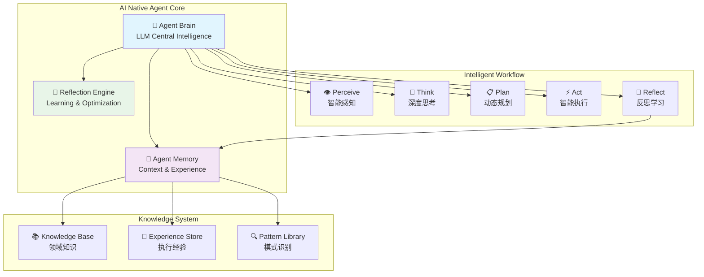

# AI Native Agent设计方案 - 让LLM成为Agent的智能大脑

> **设计目标**：将LLM从"工具调用"升级为"智能大脑"，实现真正的AI Native Agent

## 🧠 核心设计理念

### 从"工具调用"到"智能大脑"

**当前模式（Tool-based）**：
```
Agent → 调用LLM → 获取结果 → 继续流程
```

**AI Native模式（Brain-based）**：
```
Agent ← 智能大脑(LLM) → 持续思考、记忆、学习、决策
```

## 🎯 设计原则

### 1. LLM作为中央智能体（Central Intelligence）
- **持续参与**：LLM在每个步骤都参与思考和决策
- **上下文连续**：维护完整的执行记忆和上下文
- **自主决策**：基于当前状态和历史经验做出智能判断

### 2. 状态即记忆（State as Memory）
- **智能状态**：状态不仅是数据，更是Agent的"记忆"
- **经验积累**：每次执行都丰富Agent的经验库
- **模式识别**：基于历史模式优化决策

### 3. 自适应工作流（Adaptive Workflow）
- **动态调整**：根据情况智能调整执行流程
- **反思优化**：基于结果反思和改进策略
- **学习进化**：持续学习和能力提升

## 🏗️ 新架构设计

### 核心组件重构



### 智能工作流设计

#### 1. Perceive（智能感知）
```python
class IntelligentPerception:
    """智能感知模块 - LLM增强的数据理解"""
    
    async def perceive_business_context(self, raw_data: List[OpportunityInfo]) -> PerceptionResult:
        """智能感知业务上下文"""
        
        # LLM分析业务态势
        context_analysis = await self.brain.analyze_context(
            data=raw_data,
            previous_context=self.memory.get_recent_context(),
            domain_knowledge=self.knowledge_base.get_relevant_knowledge()
        )
        
        return PerceptionResult(
            business_insights=context_analysis.insights,
            risk_assessment=context_analysis.risks,
            opportunity_patterns=context_analysis.patterns,
            recommended_focus=context_analysis.focus_areas
        )
```

#### 2. Think（深度思考）
```python
class DeepThinking:
    """深度思考模块 - LLM驱动的智能分析"""
    
    async def think_strategically(self, perception: PerceptionResult) -> ThinkingResult:
        """战略性思考"""
        
        # 多维度思考
        thinking_result = await self.brain.deep_think(
            current_situation=perception,
            historical_patterns=self.memory.get_similar_situations(),
            business_objectives=self.get_business_objectives(),
            constraints=self.get_current_constraints()
        )
        
        return ThinkingResult(
            situation_assessment=thinking_result.assessment,
            strategic_options=thinking_result.options,
            risk_analysis=thinking_result.risks,
            success_probability=thinking_result.probability
        )
```

#### 3. Plan（动态规划）
```python
class DynamicPlanning:
    """动态规划模块 - 自适应执行计划"""
    
    async def create_adaptive_plan(self, thinking: ThinkingResult) -> ExecutionPlan:
        """创建自适应执行计划"""
        
        # LLM生成执行计划
        plan = await self.brain.generate_plan(
            strategic_thinking=thinking,
            available_resources=self.get_available_resources(),
            execution_constraints=self.get_execution_constraints(),
            success_criteria=self.get_success_criteria()
        )
        
        return ExecutionPlan(
            primary_actions=plan.actions,
            contingency_plans=plan.contingencies,
            success_metrics=plan.metrics,
            adaptation_triggers=plan.triggers
        )
```

#### 4. Act（智能执行）
```python
class IntelligentExecution:
    """智能执行模块 - 自适应行动"""
    
    async def execute_with_adaptation(self, plan: ExecutionPlan) -> ExecutionResult:
        """自适应执行"""
        
        results = []
        for action in plan.primary_actions:
            # 执行前的智能检查
            pre_check = await self.brain.pre_execution_check(
                action=action,
                current_context=self.get_current_context(),
                real_time_feedback=self.get_real_time_feedback()
            )
            
            if pre_check.should_adapt:
                # 动态调整行动
                adapted_action = await self.brain.adapt_action(action, pre_check.recommendations)
                result = await self.execute_action(adapted_action)
            else:
                result = await self.execute_action(action)
            
            results.append(result)
            
            # 实时反馈和调整
            if result.needs_adjustment:
                await self.adjust_remaining_plan(plan, result.feedback)
        
        return ExecutionResult(action_results=results)
```

#### 5. Reflect（反思学习）
```python
class ReflectiveLearning:
    """反思学习模块 - 持续改进"""
    
    async def reflect_and_learn(self, execution_result: ExecutionResult) -> LearningResult:
        """反思和学习"""
        
        # LLM驱动的深度反思
        reflection = await self.brain.deep_reflect(
            execution_result=execution_result,
            original_plan=self.memory.get_original_plan(),
            business_outcomes=self.get_business_outcomes(),
            stakeholder_feedback=self.get_stakeholder_feedback()
        )
        
        # 更新知识库和经验
        await self.knowledge_base.update_patterns(reflection.new_patterns)
        await self.experience_store.add_experience(reflection.lessons_learned)
        
        return LearningResult(
            key_insights=reflection.insights,
            improvement_suggestions=reflection.improvements,
            updated_strategies=reflection.strategies
        )
```

## 🧠 Agent Brain实现

### 中央智能体设计

```python
class AgentBrain:
    """Agent的智能大脑 - LLM驱动的中央智能体"""
    
    def __init__(self):
        self.llm_client = get_deepseek_client()
        self.memory = AgentMemory()
        self.knowledge_base = DomainKnowledgeBase()
        self.conversation_history = []
    
    async def continuous_thinking(self, agent_state: IntelligentAgentState) -> ThinkingStream:
        """持续思考流 - Agent的意识流"""
        
        # 构建完整的思考上下文
        thinking_context = self._build_thinking_context(agent_state)
        
        # 启动持续思考流
        thinking_stream = await self.llm_client.create_thinking_stream(
            context=thinking_context,
            thinking_mode="continuous",
            memory_integration=True
        )
        
        return thinking_stream
    
    async def make_intelligent_decision(self, situation: BusinessSituation) -> IntelligentDecision:
        """智能决策 - 基于完整上下文的深度决策"""
        
        # 多轮对话式决策
        decision_conversation = [
            {"role": "system", "content": self._get_agent_persona()},
            {"role": "user", "content": f"当前业务情况：{situation.to_context()}"},
            {"role": "assistant", "content": "让我深入分析这个情况..."},
        ]
        
        # 添加历史经验
        relevant_experience = self.memory.get_relevant_experience(situation)
        if relevant_experience:
            decision_conversation.append({
                "role": "user", 
                "content": f"相关历史经验：{relevant_experience}"
            })
        
        # 进行多轮深度思考
        for thinking_round in range(3):  # 多轮思考
            response = await self.llm_client.chat_completion(
                messages=decision_conversation,
                temperature=0.1 + thinking_round * 0.1,  # 逐轮增加创造性
                max_tokens=1500
            )
            
            decision_conversation.append({
                "role": "assistant",
                "content": response.content
            })
            
            # 添加反思提示
            if thinking_round < 2:
                decision_conversation.append({
                    "role": "user",
                    "content": "请进一步深入思考，考虑是否有遗漏的重要因素..."
                })
        
        # 最终决策
        final_decision = await self._extract_final_decision(decision_conversation)
        
        # 记录决策过程
        self.memory.record_decision_process(situation, decision_conversation, final_decision)
        
        return final_decision
```

## 💾 智能记忆系统

### Agent Memory设计

```python
class AgentMemory:
    """Agent的智能记忆系统"""
    
    def __init__(self):
        self.short_term_memory = []  # 当前执行的上下文
        self.long_term_memory = {}   # 持久化的经验和知识
        self.episodic_memory = []    # 具体的执行经历
        self.semantic_memory = {}    # 抽象的知识和模式
    
    async def consolidate_memory(self, execution_result: ExecutionResult):
        """记忆整合 - 将短期记忆转化为长期记忆"""
        
        # LLM辅助的记忆整合
        consolidation_result = await self.brain.consolidate_experience(
            short_term_context=self.short_term_memory,
            execution_outcome=execution_result,
            existing_patterns=self.semantic_memory
        )
        
        # 更新长期记忆
        self.long_term_memory.update(consolidation_result.new_knowledge)
        self.semantic_memory.update(consolidation_result.updated_patterns)
        
        # 添加情节记忆
        self.episodic_memory.append({
            "timestamp": datetime.now(),
            "situation": execution_result.situation,
            "actions": execution_result.actions,
            "outcomes": execution_result.outcomes,
            "lessons": consolidation_result.lessons_learned
        })
    
    def get_relevant_context(self, current_situation: BusinessSituation) -> RelevantContext:
        """获取相关上下文 - 智能检索相关记忆"""
        
        # 基于相似性检索相关经验
        similar_episodes = self._find_similar_episodes(current_situation)
        relevant_patterns = self._find_relevant_patterns(current_situation)
        
        return RelevantContext(
            similar_experiences=similar_episodes,
            applicable_patterns=relevant_patterns,
            success_factors=self._extract_success_factors(similar_episodes),
            risk_factors=self._extract_risk_factors(similar_episodes)
        )

## 🔄 实施路径

### 阶段1：智能状态升级（2周）

#### 1.1 增强AgentState
```python
class IntelligentAgentState(TypedDict):
    """智能Agent状态 - 包含思考和记忆"""

    # 基础执行信息
    execution_id: str
    run_id: int
    start_time: datetime

    # 业务数据
    opportunities: List[OpportunityInfo]
    processed_opportunities: List[OpportunityInfo]

    # 智能增强字段
    agent_thoughts: List[ThoughtRecord]  # Agent的思考记录
    decision_reasoning: List[ReasoningChain]  # 决策推理链
    context_memory: ContextMemory  # 上下文记忆
    learning_insights: List[Insight]  # 学习洞察

    # 执行策略
    current_strategy: ExecutionStrategy  # 当前执行策略
    adaptation_history: List[StrategyAdaptation]  # 策略调整历史
```

#### 1.2 思考记录系统
```python
class ThoughtRecord:
    """Agent思考记录"""
    timestamp: datetime
    thinking_type: str  # "analysis", "decision", "reflection"
    situation: str
    thoughts: str
    confidence: float
    reasoning_chain: List[str]

class ReasoningChain:
    """推理链"""
    step_id: int
    premise: str
    reasoning: str
    conclusion: str
    confidence: float
    evidence: List[str]
```

### 阶段2：智能工作流重构（3周）

#### 2.1 新的工作流节点
```python
def _intelligent_perceive_node(self, state: IntelligentAgentState) -> IntelligentAgentState:
    """智能感知节点"""

    # LLM增强的业务感知
    perception_prompt = f"""
    作为FSOA智能运营助手，请深入分析当前业务情况：

    商机数据：{state['opportunities']}
    历史上下文：{state['context_memory'].get_recent_context()}
    业务目标：提升SLA合规率，优化客户满意度

    请从以下维度进行智能感知：
    1. 业务态势分析（整体风险等级、紧急程度分布）
    2. 模式识别（是否存在特殊模式或异常情况）
    3. 资源需求评估（需要什么样的处理策略）
    4. 成功概率预测（基于历史经验的成功率预估）

    请以JSON格式返回分析结果。
    """

    perception_result = await self.brain.analyze_with_context(
        prompt=perception_prompt,
        context=state['context_memory'],
        thinking_mode="analytical"
    )

    # 记录思考过程
    state['agent_thoughts'].append(ThoughtRecord(
        timestamp=datetime.now(),
        thinking_type="perception",
        situation="business_context_analysis",
        thoughts=perception_result.reasoning,
        confidence=perception_result.confidence,
        reasoning_chain=perception_result.reasoning_steps
    ))

    return state

def _intelligent_plan_node(self, state: IntelligentAgentState) -> IntelligentAgentState:
    """智能规划节点"""

    # 基于感知结果进行智能规划
    planning_prompt = f"""
    基于当前业务感知结果，请制定智能执行计划：

    感知结果：{state['agent_thoughts'][-1].thoughts}
    可用策略：{self.get_available_strategies()}
    历史成功模式：{state['context_memory'].get_successful_patterns()}

    请制定包含以下内容的执行计划：
    1. 主要执行策略（优先级排序）
    2. 应急预案（如果主策略失败）
    3. 成功指标定义
    4. 实时调整触发条件
    5. 资源分配建议

    请确保计划具有自适应性和可执行性。
    """

    planning_result = await self.brain.generate_adaptive_plan(
        prompt=planning_prompt,
        context=state['context_memory'],
        constraints=self.get_execution_constraints()
    )

    state['current_strategy'] = planning_result.primary_strategy
    state['agent_thoughts'].append(ThoughtRecord(
        timestamp=datetime.now(),
        thinking_type="planning",
        situation="execution_planning",
        thoughts=planning_result.reasoning,
        confidence=planning_result.confidence,
        reasoning_chain=planning_result.planning_steps
    ))

    return state
```

### 阶段3：持续学习机制（2周）

#### 3.1 反思学习节点
```python
def _reflective_learning_node(self, state: IntelligentAgentState) -> IntelligentAgentState:
    """反思学习节点"""

    # 深度反思执行结果
    reflection_prompt = f"""
    作为FSOA智能运营助手，请对本次执行进行深度反思：

    执行计划：{state['current_strategy']}
    执行结果：{state.get('execution_results', {})}
    业务成果：{self.get_business_outcomes()}

    请从以下角度进行反思：
    1. 决策质量评估（哪些决策是正确的，哪些需要改进）
    2. 执行效果分析（实际效果与预期的差异）
    3. 模式总结（发现的新模式或验证的已知模式）
    4. 改进建议（具体的优化建议）
    5. 知识更新（需要更新的知识和经验）

    请提供具体、可操作的学习洞察。
    """

    reflection_result = await self.brain.deep_reflect(
        prompt=reflection_prompt,
        execution_history=state['agent_thoughts'],
        business_feedback=self.get_stakeholder_feedback()
    )

    # 更新知识库
    new_insights = reflection_result.insights
    state['learning_insights'].extend(new_insights)

    # 更新上下文记忆
    state['context_memory'].consolidate_experience(
        execution_summary=reflection_result.execution_summary,
        lessons_learned=reflection_result.lessons,
        success_patterns=reflection_result.success_patterns
    )

    return state
```

### 阶段4：智能对话界面（1周）

#### 4.1 Agent对话能力
```python
class AgentConversation:
    """Agent对话能力 - 可解释的AI"""

    async def explain_decision(self, decision: IntelligentDecision) -> str:
        """解释决策过程"""

        explanation_prompt = f"""
        请用通俗易懂的语言解释我的决策过程：

        决策情况：{decision.situation}
        我的思考：{decision.reasoning_chain}
        最终决策：{decision.action}
        置信度：{decision.confidence}

        请解释：
        1. 我为什么这样分析情况
        2. 我考虑了哪些因素
        3. 我为什么选择这个行动
        4. 这个决策的风险和收益
        """

        explanation = await self.brain.generate_explanation(explanation_prompt)
        return explanation

    async def answer_question(self, question: str, context: IntelligentAgentState) -> str:
        """回答用户问题"""

        answer_prompt = f"""
        用户问题：{question}

        我的当前状态：
        - 正在处理的商机：{len(context['opportunities'])}个
        - 最近的思考：{context['agent_thoughts'][-3:]}
        - 当前策略：{context['current_strategy']}

        请基于我的实际状态和经验回答用户的问题。
        """

        answer = await self.brain.conversational_response(answer_prompt)
        return answer
```

## 🎯 预期效果

### 用户体验提升
1. **更智能的决策**：基于完整上下文和历史经验的深度决策
2. **可解释性**：用户可以询问Agent的决策理由
3. **自适应能力**：Agent能根据情况动态调整策略
4. **持续改进**：Agent会从每次执行中学习和改进

### 技术能力提升
1. **上下文连续性**：完整的执行记忆和上下文传递
2. **智能程度**：从规则执行升级为智能决策
3. **学习能力**：持续学习和知识积累
4. **可观测性**：完整的思考过程记录和分析

### 业务价值提升
1. **决策质量**：更准确的业务判断和处理建议
2. **效率提升**：自适应的执行策略和资源优化
3. **风险控制**：基于经验的风险识别和预防
4. **持续优化**：基于反馈的策略持续改进

---

**设计版本**: v1.0
**创建时间**: 2025-06-30
**设计者**: AI Native Architecture Team
**实施建议**: 分4个阶段逐步实施，每个阶段都有明确的交付物和验收标准
```
