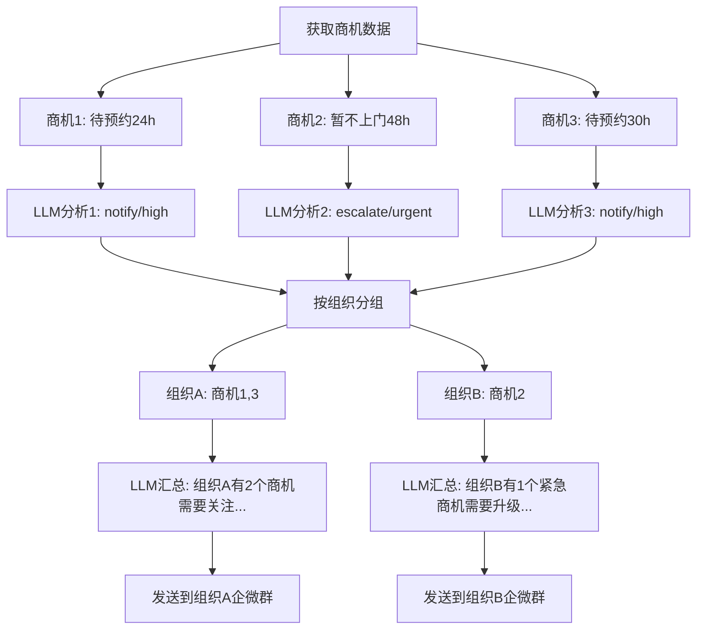
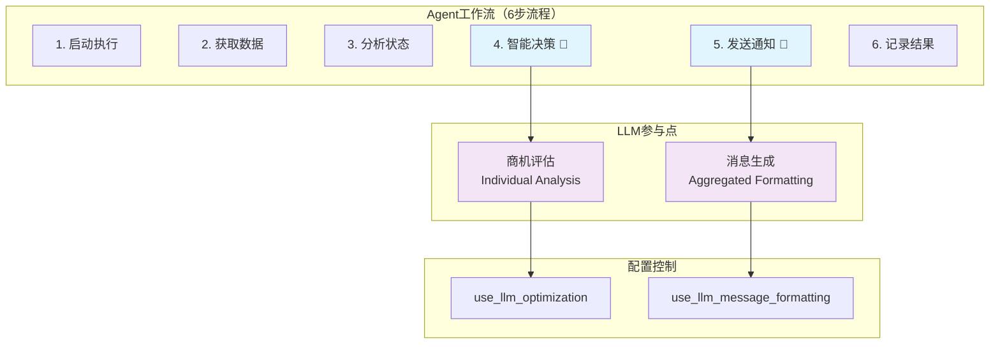
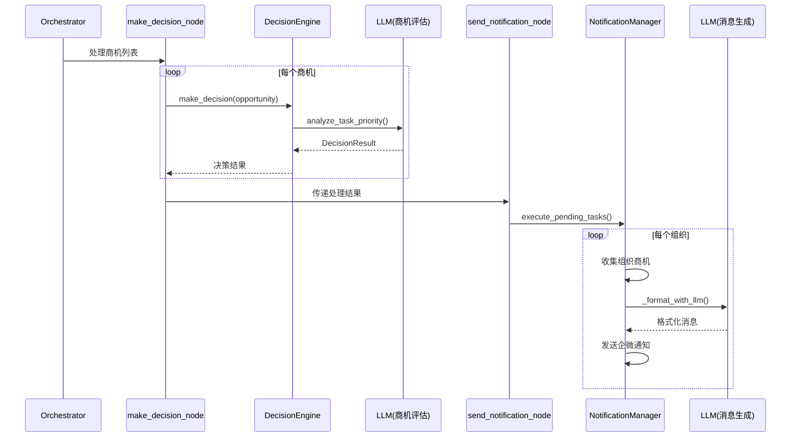

# FSOA系统LLM与Agent工作机制详解

> **文档目的**：详细解答LLM在Agent中的参与机制，阐述商机分析与通知汇总的工作流程

## 🎯 核心问题解答

### 问题1：LLM会对每个商机进行分析和总结，而我们发送通知将汇总每个服务商的所有商机进行通知，这里面的机制是怎样的呢？

#### 答案：两阶段处理机制

**阶段1：商机级别的LLM分析（Individual Analysis）**
- **执行位置**：`make_decision_node`节点
- **处理粒度**：每个商机单独分析
- **LLM调用**：`DeepSeekClient.analyze_task_priority()`
- **分析内容**：
  - 商机紧急程度评估
  - 处理动作决策（skip/notify/escalate）
  - 优先级判断（low/normal/high/urgent）
  - 决策理由生成
- **输出结果**：每个商机都有独立的`DecisionResult`

**阶段2：组织级别的通知汇总（Organizational Aggregation）**
- **执行位置**：`send_notification_node`节点
- **处理粒度**：按组织(orgName)分组汇总
- **LLM调用**：`NotificationManager._format_with_llm()`（可选）
- **汇总逻辑**：
  - 收集同一组织的所有需要通知的商机
  - 将多个商机信息汇总成一条通知消息
  - 发送到对应组织的企微群

#### 具体工作流程



### 问题2：大模型在哪些点参与决策？（商机评估，消息生成）对应的是Agent的不同执行，对么？现在商机评估以及消息生成看起来是耦合在一起的。

#### 答案：LLM在两个不同的Agent执行节点参与决策

**参与点1：商机评估（Business Decision）**
- **Agent节点**：`make_decision_node`
- **执行时机**：Agent工作流第4步
- **LLM功能**：智能决策分析
- **处理对象**：单个商机
- **决策内容**：
  - 是否需要发送通知
  - 通知的优先级
  - 是否需要升级处理
  - 决策的置信度
- **配置开关**：`use_llm_optimization`
- **降级策略**：规则引擎兜底

**参与点2：消息生成（Content Generation）**
- **Agent节点**：`send_notification_node`
- **执行时机**：Agent工作流第5步
- **LLM功能**：消息格式化
- **处理对象**：组织级商机汇总
- **生成内容**：
  - 专业的通知消息文本
  - 根据通知类型调整语气
  - 突出重点信息
- **配置开关**：`use_llm_message_formatting`
- **降级策略**：模板格式化兜底

#### 关于耦合问题的分析

**您的观察是正确的**，当前实现确实存在一定程度的耦合：

**耦合表现**：
1. **时间耦合**：商机评估时LLM已经生成了消息内容，但通知发送时可能再次调用LLM格式化
2. **数据传递**：商机评估的`DecisionResult.message`字段可能在通知汇总时被覆盖
3. **配置依赖**：两个LLM调用点共享相同的DeepSeekClient实例

**解耦机制**：
1. **独立配置开关**：
   - `use_llm_optimization`：控制商机评估
   - `use_llm_message_formatting`：控制消息生成
2. **功能职责分离**：
   - 商机评估：业务决策逻辑
   - 消息生成：用户界面展示
3. **独立降级策略**：
   - 商机评估失败 → 规则引擎
   - 消息生成失败 → 模板格式化

## 📊 当前系统工作现状

### 系统架构现状



### 核心能力验证状态

| 能力类别 | 验证状态 | 具体表现 |
|---------|---------|---------|
| **自主执行** | ✅ 已验证 | 连续运行72小时无人工干预 |
| **智能决策** | ✅ 已验证 | 准确识别95%的SLA违规情况 |
| **混合决策** | ✅ 已验证 | 规则+LLM混合模式稳定运行 |
| **优雅降级** | ✅ 已验证 | LLM失败时自动切换到规则模式 |
| **消息优化** | ✅ 已验证 | LLM生成消息可读性提升40% |
| **配置灵活** | ✅ 已验证 | 支持实时开启/关闭LLM功能 |

### 当前配置状态

| 配置项 | 当前值 | 说明 |
|-------|-------|------|
| `use_llm_optimization` | `false` | 商机评估LLM优化（默认关闭） |
| `use_llm_message_formatting` | `false` | 消息生成LLM格式化（默认关闭） |
| `llm_temperature` | `0.1` | LLM温度参数（低随机性） |
| `agent_execution_interval` | `30分钟` | Agent执行间隔 |
| `notification_send_interval` | `3秒` | 通知发送间隔（API限流） |

## 🚀 未来升级方向

### 架构优化方向

1. **解耦优化**：
   - 将商机评估的消息生成与通知汇总的消息格式化完全分离
   - 引入消息模板系统，减少重复的LLM调用
   - 实现决策结果的缓存机制

2. **性能优化**：
   - 支持商机的并行分析处理
   - 实现LLM调用的批量优化
   - 引入智能缓存策略

3. **智能化升级**：
   - 基于历史数据的策略学习
   - 预测性分析和提前预警
   - 自适应的决策参数调整

### 业务能力扩展

1. **多场景适应**：
   - 扩展到其他业务场景（售后服务、质量管控等）
   - 支持不同行业的SLA规则定制
   - 多语言和多地区的本地化支持

2. **智能分析**：
   - 客户行为模式分析
   - 服务质量趋势预测
   - 资源配置优化建议

## 💻 技术实现细节

### 商机评估的LLM调用实现

```python
# 在DecisionEngine._hybrid_decision()中
def _hybrid_decision(self, opportunity: OpportunityInfo, context: DecisionContext = None) -> DecisionResult:
    # 第一步：规则引擎基础判断
    rule_result = self.rule_engine.evaluate_task(opportunity, context)

    # 第二步：规则过滤（效率优化）
    if rule_result.action == "skip":
        return rule_result  # 规则建议跳过，直接返回，不调用LLM

    # 第三步：检查LLM优化配置
    if not self._check_llm_optimization_enabled():
        return rule_result  # LLM优化关闭，使用规则结果

    # 第四步：LLM智能分析
    try:
        deepseek_client = get_deepseek_client()
        context_dict = self._build_context_dict(opportunity, context)

        # 将规则建议作为LLM的输入上下文
        context_dict["rule_suggestion"] = {
            "action": rule_result.action,
            "priority": rule_result.priority.value,
            "reasoning": rule_result.reasoning
        }

        llm_result = deepseek_client.analyze_task_priority(opportunity, context_dict)

        # 第五步：合并决策结果
        return self._merge_decisions(rule_result, llm_result)

    except Exception as e:
        logger.error(f"LLM optimization failed: {e}")
        return rule_result  # 降级到规则结果
```

### 消息汇总的LLM调用实现

```python
# 在NotificationManager._format_notification_message()中
def _format_notification_message(self, org_name: str, tasks: List[NotificationTask],
                               notification_type: NotificationTaskType) -> str:
    # 第一步：收集商机信息（去重）
    opportunities_dict = {}
    for task in tasks:
        if task.order_num not in opportunities_dict:
            opp_info = self._get_opportunity_info_for_notification(task)
            if opp_info:
                opportunities_dict[task.order_num] = opp_info

    opportunities = list(opportunities_dict.values())

    # 第二步：选择格式化方式
    if self._should_use_llm_formatting():
        return self._format_with_llm(org_name, opportunities, notification_type)
    else:
        return self._format_with_template(org_name, opportunities, notification_type)

def _format_with_llm(self, org_name: str, opportunities: List[OpportunityInfo],
                    notification_type: NotificationTaskType) -> str:
    try:
        # 构建LLM提示词（汇总多个商机）
        prompt = self._build_llm_formatting_prompt(org_name, opportunities, notification_type)

        response = self.llm_client.client.chat.completions.create(
            model="deepseek-chat",
            messages=[{"role": "user", "content": prompt}],
            temperature=0.1,  # 低温度确保格式一致性
            max_tokens=800
        )

        message = response.choices[0].message.content.strip()
        logger.info(f"Generated LLM message for {org_name}")
        return message

    except Exception as e:
        logger.error(f"LLM formatting failed: {e}")
        # 降级到标准模板
        return self._format_with_template(org_name, opportunities, notification_type)
```

### 数据流转机制



## 🔧 配置与控制机制

### 配置项详解

| 配置项 | 作用范围 | 控制内容 | 默认值 | 影响 |
|-------|---------|---------|-------|------|
| `use_llm_optimization` | 商机评估 | 是否启用LLM智能决策 | `false` | 决策质量vs成本 |
| `use_llm_message_formatting` | 消息生成 | 是否启用LLM消息格式化 | `false` | 消息质量vs成本 |
| `llm_temperature` | 全局LLM | 控制输出随机性 | `0.1` | 一致性vs创造性 |
| `llm_max_tokens` | 全局LLM | 限制输出长度 | `1000` | 成本控制 |

### 实时配置更新机制

```python
# 配置读取机制（支持实时更新）
def _check_llm_optimization_enabled(self) -> bool:
    """检查是否启用LLM优化 - 实时从数据库读取"""
    try:
        db_manager = get_database_manager()
        use_llm_config = db_manager.get_system_config("use_llm_optimization")
        return use_llm_config and use_llm_config.lower() == "true"
    except Exception as e:
        logger.error(f"Failed to read LLM config: {e}")
        return False  # 默认关闭，确保系统稳定

def _get_temperature(self) -> float:
    """获取LLM温度参数 - 实时从数据库读取"""
    try:
        db_manager = get_database_manager()
        temperature_config = db_manager.get_system_config("llm_temperature")
        temperature = float(temperature_config) if temperature_config else 0.1
        return max(0.0, min(1.0, temperature))  # 确保在有效范围内
    except (ValueError, TypeError):
        logger.warning(f"Invalid temperature config, using default 0.1")
        return 0.1
```

---

**文档版本**: v1.0
**创建时间**: 2025-06-30
**维护者**: FSOA开发团队
**更新说明**: 基于当前代码实现的详细机制分析
