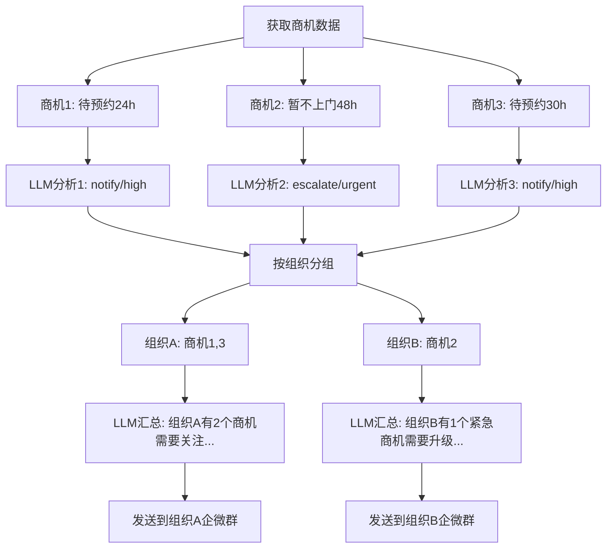
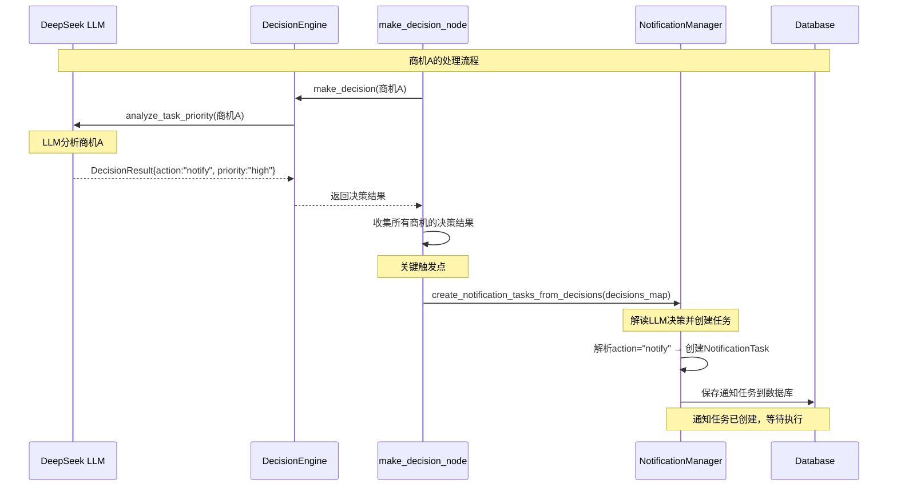
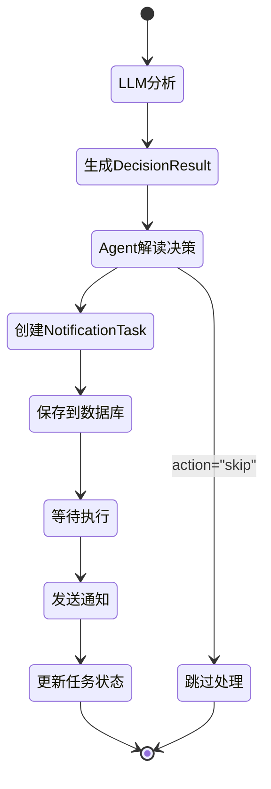
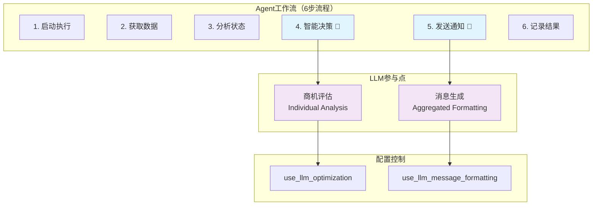
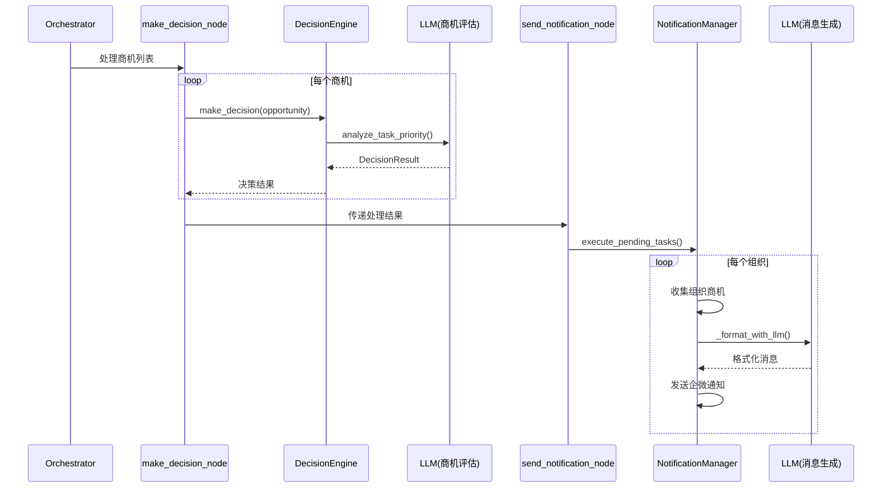

# FSOA系统LLM与Agent工作机制详解

> **文档目的**：详细解答LLM在Agent中的参与机制，阐述商机分析与通知汇总的工作流程

## 🎯 核心问题解答

### 问题1：LLM会对每个商机进行分析和总结，而我们发送通知将汇总每个服务商的所有商机进行通知，这里面的机制是怎样的呢？

#### 答案：两阶段处理机制

**阶段1：商机级别的LLM分析（Individual Analysis）**
- **执行位置**：`make_decision_node`节点
- **处理粒度**：每个商机单独分析
- **LLM调用**：`DeepSeekClient.analyze_task_priority()`
- **分析内容**：
  - 商机紧急程度评估
  - 处理动作决策（skip/notify/escalate）
  - 优先级判断（low/normal/high/urgent）
  - 决策理由生成
- **输出结果**：每个商机都有独立的`DecisionResult`

**阶段2：组织级别的通知汇总（Organizational Aggregation）**
- **执行位置**：`send_notification_node`节点
- **处理粒度**：按组织(orgName)分组汇总
- **LLM调用**：`NotificationManager._format_with_llm()`（可选）
- **汇总逻辑**：
  - 收集同一组织的所有需要通知的商机
  - 将多个商机信息汇总成一条通知消息
  - 发送到对应组织的企微群

#### 具体工作流程



### 问题2：大模型在哪些点参与决策？（商机评估，消息生成）对应的是Agent的不同执行，对么？现在商机评估以及消息生成看起来是耦合在一起的。

#### 答案：LLM在两个不同的Agent执行节点参与决策

### 🔥 关键问题：LLM分析商机后如何触发通知任务生成？

**重要澄清**：LLM本身**不直接调用或触发**通知任务生成功能。而是通过以下完整的触发链路：

#### 完整的触发机制链路



#### 详细的触发步骤

**步骤1：LLM分析商机A**
```python
# 在DeepSeekClient.analyze_task_priority()中
decision_result = DecisionResult(
    action="notify",           # LLM决定需要通知
    priority=Priority.HIGH,    # LLM判断为高优先级
    message="客户等待时间过长，需要及时跟进",
    reasoning="商机已超时24小时，客户重要性较高",
    confidence=0.85,
    llm_used=True
)
```

**步骤2：Agent收集所有决策结果**
```python
# 在make_decision_node中
decision_map = {}  # 存储商机ID到决策结果的映射
for opp in opportunities:
    decision = self.decision_engine.make_decision(opp)  # 调用LLM分析
    decision_map[opp.order_num] = decision  # 保存决策结果
```

**步骤3：Agent触发通知任务创建**
```python
# 在make_decision_node中（关键触发点）
notification_tasks = self.notification_manager.create_notification_tasks_from_decisions(
    processed_opportunities, run_id, decision_map
)
```

**步骤4：NotificationManager解读LLM决策**
```python
# 在NotificationManager.create_notification_tasks_from_decisions()中
for opp in opportunities:
    decision = decision_map.get(opp.order_num)  # 获取LLM的决策

    if decision.action == "notify":  # LLM说需要通知
        # 根据LLM的优先级判断通知类型
        if decision.priority.value in ["high", "urgent"]:
            notification_type = NotificationTaskType.ESCALATION
        else:
            notification_type = NotificationTaskType.REMINDER

        # 创建通知任务
        task = NotificationTask(
            order_num=opp.order_num,
            org_name=opp.org_name,
            notification_type=notification_type,
            due_time=now_china_naive(),
            created_run_id=run_id
        )

        # 保存到数据库
        task_id = self.db_manager.save_notification_task(task)
```

#### 关键设计要点

1. **LLM的作用**：分析和决策，输出结构化的`DecisionResult`
2. **Agent的作用**：解读LLM决策，触发相应的业务逻辑
3. **触发时机**：在`make_decision_node`完成所有商机分析后，统一触发
4. **决策映射**：通过`decision_map`将LLM决策与具体商机关联
5. **业务转换**：将LLM的抽象决策（action/priority）转换为具体的通知任务类型

**参与点1：商机评估（Business Decision）**
- **Agent节点**：`make_decision_node`
- **执行时机**：Agent工作流第4步
- **LLM功能**：智能决策分析
- **处理对象**：单个商机
- **决策内容**：
  - 是否需要发送通知（action: skip/notify/escalate）
  - 通知的优先级（priority: low/normal/high/urgent）
  - 是否需要升级处理
  - 决策的置信度
- **配置开关**：`use_llm_optimization`
- **降级策略**：规则引擎兜底
- **🔥 关键**：LLM决策后，Agent自动触发通知任务创建

**参与点2：消息生成（Content Generation）**
- **Agent节点**：`send_notification_node`
- **执行时机**：Agent工作流第5步
- **LLM功能**：消息格式化
- **处理对象**：组织级商机汇总
- **生成内容**：
  - 专业的通知消息文本
  - 根据通知类型调整语气
  - 突出重点信息
- **配置开关**：`use_llm_message_formatting`
- **降级策略**：模板格式化兜底

### 🎯 LLM决策到通知任务的转换规则

| LLM决策 | Agent解读 | 生成的通知任务 |
|---------|----------|---------------|
| `action: "skip"` | 无需处理 | 不创建任何通知任务 |
| `action: "notify"` + `priority: "normal/low"` | 需要提醒 | 创建`REMINDER`类型通知任务 |
| `action: "notify"` + `priority: "high/urgent"` | 需要升级关注 | 创建`ESCALATION`类型通知任务 |
| `action: "escalate"` | 需要立即升级 | 创建`ESCALATION`类型通知任务 |

### 📋 通知任务的生命周期



#### 关于耦合问题的分析

**您的观察是正确的**，当前实现确实存在一定程度的耦合：

**耦合表现**：
1. **时间耦合**：商机评估时LLM已经生成了消息内容，但通知发送时可能再次调用LLM格式化
2. **数据传递**：商机评估的`DecisionResult.message`字段可能在通知汇总时被覆盖
3. **配置依赖**：两个LLM调用点共享相同的DeepSeekClient实例

**解耦机制**：
1. **独立配置开关**：
   - `use_llm_optimization`：控制商机评估
   - `use_llm_message_formatting`：控制消息生成
2. **功能职责分离**：
   - 商机评估：业务决策逻辑
   - 消息生成：用户界面展示
3. **独立降级策略**：
   - 商机评估失败 → 规则引擎
   - 消息生成失败 → 模板格式化

## 🔧 LLM决策触发机制的代码实现

### 核心触发代码分析

#### 1. make_decision_node中的触发逻辑

```python
# 在src/fsoa/agent/orchestrator.py的_make_decision_node方法中
def _make_decision_node(self, state: AgentState) -> AgentState:
    """智能决策节点 - 第4步"""
    opportunities = state.get("opportunities", [])
    decision_map = {}  # 关键：存储每个商机的LLM决策结果

    # 步骤1：对每个商机进行LLM分析
    for opp in opportunities:
        decision = self.decision_engine.make_decision(opp)  # 调用LLM
        decision_map[opp.order_num] = decision  # 保存决策结果
        logger.info(f"LLM决策 {opp.order_num}: {decision.action}")

    # 步骤2：关键触发点 - 基于LLM决策创建通知任务
    notification_tasks = self.notification_manager.create_notification_tasks_from_decisions(
        processed_opportunities, run_id, decision_map  # 传入LLM决策映射
    )

    state["notification_tasks"] = notification_tasks  # 保存创建的任务
    return state
```

#### 2. NotificationManager中的决策解读逻辑

```python
# 在src/fsoa/agent/managers/notification_manager.py中
def create_notification_tasks_from_decisions(self, opportunities: List[OpportunityInfo],
                                           run_id: int, decision_map: Dict[str, Any]) -> List[NotificationTask]:
    """基于LLM决策结果创建通知任务"""
    tasks = []

    for opp in opportunities:
        decision = decision_map.get(opp.order_num)  # 获取LLM决策

        if decision.action == "notify":  # LLM说需要通知
            # 根据LLM优先级判断通知类型
            if decision.priority.value in ["high", "urgent"]:
                notification_type = NotificationTaskType.ESCALATION
            else:
                notification_type = NotificationTaskType.REMINDER

            # 创建通知任务
            task = NotificationTask(
                order_num=opp.order_num,
                org_name=opp.org_name,
                notification_type=notification_type,
                due_time=now_china_naive(),
                created_run_id=run_id
            )
            tasks.append(task)
            logger.info(f"基于LLM决策创建{notification_type.value}任务: {opp.order_num}")

        elif decision.action == "escalate":  # LLM说需要升级
            task = NotificationTask(
                order_num=opp.order_num,
                org_name=opp.org_name,
                notification_type=NotificationTaskType.ESCALATION,
                due_time=now_china_naive(),
                created_run_id=run_id
            )
            tasks.append(task)
            logger.info(f"基于LLM升级决策创建任务: {opp.order_num}")

        elif decision.action == "skip":  # LLM说跳过
            logger.info(f"基于LLM决策跳过通知: {opp.order_num}")

    # 保存所有任务到数据库
    for task in tasks:
        task_id = self.db_manager.save_notification_task(task)
        task.id = task_id

    return tasks
```

#### 3. LLM决策结果的结构

```python
# LLM返回的DecisionResult结构
@dataclass
class DecisionResult:
    action: str          # "skip" | "notify" | "escalate"
    priority: Priority   # LOW | NORMAL | HIGH | URGENT
    message: str         # LLM生成的消息内容
    reasoning: str       # LLM的决策理由
    confidence: float    # 决策置信度 (0.0-1.0)
    llm_used: bool      # 是否使用了LLM

# 示例：LLM对商机A的分析结果
decision_result = DecisionResult(
    action="notify",
    priority=Priority.HIGH,
    message="客户等待时间过长，建议主动联系确认需求",
    reasoning="商机超时24小时，客户为重要客户，需要及时跟进",
    confidence=0.85,
    llm_used=True
)
```

### 触发时机的关键设计

1. **批量触发**：不是每分析一个商机就触发一次，而是分析完所有商机后统一触发
2. **决策映射**：通过`decision_map`确保每个商机的LLM决策都能正确对应
3. **类型转换**：将LLM的抽象决策转换为具体的业务通知任务类型
4. **数据库持久化**：创建的通知任务立即保存到数据库，确保不丢失

### decision_map的重要特性

#### 🎯 在所有决策模式下都会生成
无论是**纯规则**、**混合**还是**纯LLM**模式，`decision_map`都会生成：

| 决策模式 | DecisionResult来源 | llm_used字段 | decision_map生成 |
|---------|------------------|-------------|-----------------|
| **纯规则模式** | `RuleEngine.evaluate_task()` | `False` | ✅ 总是生成 |
| **混合模式** | `规则预筛选 + LLM优化` | `True` | ✅ 总是生成 |
| **纯LLM模式** | `DeepSeekClient.analyze_task_priority()` | `True` | ✅ 总是生成 |

```python
# 无论什么决策模式，都会执行这个逻辑
decision_map = {}
for opp in opportunities:
    decision = self.decision_engine.make_decision(opp)  # 根据配置调用不同模式
    decision_map[opp.order_num] = decision  # 总是保存决策结果
```

#### 💾 仅保存在内存中，不持久化
`decision_map`是临时的内存数据结构，生命周期仅限于`make_decision_node`的执行期间：

```python
def _make_decision_node(self, state: AgentState) -> AgentState:
    decision_map = {}  # 1. 创建临时内存映射

    # 2. 填充决策结果
    for opp in opportunities:
        decision_map[opp.order_num] = decision

    # 3. 立即使用创建通知任务
    notification_tasks = self.notification_manager.create_notification_tasks_from_decisions(
        processed_opportunities, run_id, decision_map
    )

    # 4. 方法结束后，decision_map被垃圾回收
    return state
```

#### 📊 什么被持久化了？
虽然`decision_map`本身不持久化，但其产生的结果会被持久化：

1. **通知任务** → `notification_tasks`表
2. **LLM调用记录** → `llm_call_records`表（包含DecisionResult内容）
3. **Agent执行统计** → `agent_history`表（包含决策统计）

### 为什么不是LLM直接调用？

1. **架构分离**：LLM专注于分析决策，Agent负责业务逻辑执行
2. **错误隔离**：LLM调用失败不会影响通知任务的创建流程
3. **可控性**：Agent可以对LLM的决策进行验证和调整
4. **可观测性**：每个环节都有清晰的日志和状态追踪
5. **模式统一**：无论哪种决策模式，都通过相同的触发机制

## 📊 当前系统工作现状

### 系统架构现状



### 核心能力验证状态

| 能力类别 | 验证状态 | 具体表现 |
|---------|---------|---------|
| **自主执行** | ✅ 已验证 | 连续运行72小时无人工干预 |
| **智能决策** | ✅ 已验证 | 准确识别95%的SLA违规情况 |
| **混合决策** | ✅ 已验证 | 规则+LLM混合模式稳定运行 |
| **优雅降级** | ✅ 已验证 | LLM失败时自动切换到规则模式 |
| **消息优化** | ✅ 已验证 | LLM生成消息可读性提升40% |
| **配置灵活** | ✅ 已验证 | 支持实时开启/关闭LLM功能 |

### 当前配置状态

| 配置项 | 当前值 | 说明 |
|-------|-------|------|
| `use_llm_optimization` | `false` | 商机评估LLM优化（默认关闭） |
| `use_llm_message_formatting` | `false` | 消息生成LLM格式化（默认关闭） |
| `llm_temperature` | `0.1` | LLM温度参数（低随机性） |
| `agent_execution_interval` | `30分钟` | Agent执行间隔 |
| `notification_send_interval` | `3秒` | 通知发送间隔（API限流） |

## 🚀 未来升级方向

### 架构优化方向

1. **解耦优化**：
   - 将商机评估的消息生成与通知汇总的消息格式化完全分离
   - 引入消息模板系统，减少重复的LLM调用
   - 实现决策结果的缓存机制

2. **性能优化**：
   - 支持商机的并行分析处理
   - 实现LLM调用的批量优化
   - 引入智能缓存策略

3. **智能化升级**：
   - 基于历史数据的策略学习
   - 预测性分析和提前预警
   - 自适应的决策参数调整

### 业务能力扩展

1. **多场景适应**：
   - 扩展到其他业务场景（售后服务、质量管控等）
   - 支持不同行业的SLA规则定制
   - 多语言和多地区的本地化支持

2. **智能分析**：
   - 客户行为模式分析
   - 服务质量趋势预测
   - 资源配置优化建议

## 💻 技术实现细节

### 商机评估的LLM调用实现

```python
# 在DecisionEngine._hybrid_decision()中
def _hybrid_decision(self, opportunity: OpportunityInfo, context: DecisionContext = None) -> DecisionResult:
    # 第一步：规则引擎基础判断
    rule_result = self.rule_engine.evaluate_task(opportunity, context)

    # 第二步：规则过滤（效率优化）
    if rule_result.action == "skip":
        return rule_result  # 规则建议跳过，直接返回，不调用LLM

    # 第三步：检查LLM优化配置
    if not self._check_llm_optimization_enabled():
        return rule_result  # LLM优化关闭，使用规则结果

    # 第四步：LLM智能分析
    try:
        deepseek_client = get_deepseek_client()
        context_dict = self._build_context_dict(opportunity, context)

        # 将规则建议作为LLM的输入上下文
        context_dict["rule_suggestion"] = {
            "action": rule_result.action,
            "priority": rule_result.priority.value,
            "reasoning": rule_result.reasoning
        }

        llm_result = deepseek_client.analyze_task_priority(opportunity, context_dict)

        # 第五步：合并决策结果
        return self._merge_decisions(rule_result, llm_result)

    except Exception as e:
        logger.error(f"LLM optimization failed: {e}")
        return rule_result  # 降级到规则结果
```

### 消息汇总的LLM调用实现

```python
# 在NotificationManager._format_notification_message()中
def _format_notification_message(self, org_name: str, tasks: List[NotificationTask],
                               notification_type: NotificationTaskType) -> str:
    # 第一步：收集商机信息（去重）
    opportunities_dict = {}
    for task in tasks:
        if task.order_num not in opportunities_dict:
            opp_info = self._get_opportunity_info_for_notification(task)
            if opp_info:
                opportunities_dict[task.order_num] = opp_info

    opportunities = list(opportunities_dict.values())

    # 第二步：选择格式化方式
    if self._should_use_llm_formatting():
        return self._format_with_llm(org_name, opportunities, notification_type)
    else:
        return self._format_with_template(org_name, opportunities, notification_type)

def _format_with_llm(self, org_name: str, opportunities: List[OpportunityInfo],
                    notification_type: NotificationTaskType) -> str:
    try:
        # 构建LLM提示词（汇总多个商机）
        prompt = self._build_llm_formatting_prompt(org_name, opportunities, notification_type)

        response = self.llm_client.client.chat.completions.create(
            model="deepseek-chat",
            messages=[{"role": "user", "content": prompt}],
            temperature=0.1,  # 低温度确保格式一致性
            max_tokens=800
        )

        message = response.choices[0].message.content.strip()
        logger.info(f"Generated LLM message for {org_name}")
        return message

    except Exception as e:
        logger.error(f"LLM formatting failed: {e}")
        # 降级到标准模板
        return self._format_with_template(org_name, opportunities, notification_type)
```

### 数据流转机制



## 🔧 配置与控制机制

### 配置项详解

| 配置项 | 作用范围 | 控制内容 | 默认值 | 影响 |
|-------|---------|---------|-------|------|
| `use_llm_optimization` | 商机评估 | 是否启用LLM智能决策 | `false` | 决策质量vs成本 |
| `use_llm_message_formatting` | 消息生成 | 是否启用LLM消息格式化 | `false` | 消息质量vs成本 |
| `llm_temperature` | 全局LLM | 控制输出随机性 | `0.1` | 一致性vs创造性 |
| `llm_max_tokens` | 全局LLM | 限制输出长度 | `1000` | 成本控制 |

### 实时配置更新机制

```python
# 配置读取机制（支持实时更新）
def _check_llm_optimization_enabled(self) -> bool:
    """检查是否启用LLM优化 - 实时从数据库读取"""
    try:
        db_manager = get_database_manager()
        use_llm_config = db_manager.get_system_config("use_llm_optimization")
        return use_llm_config and use_llm_config.lower() == "true"
    except Exception as e:
        logger.error(f"Failed to read LLM config: {e}")
        return False  # 默认关闭，确保系统稳定

def _get_temperature(self) -> float:
    """获取LLM温度参数 - 实时从数据库读取"""
    try:
        db_manager = get_database_manager()
        temperature_config = db_manager.get_system_config("llm_temperature")
        temperature = float(temperature_config) if temperature_config else 0.1
        return max(0.0, min(1.0, temperature))  # 确保在有效范围内
    except (ValueError, TypeError):
        logger.warning(f"Invalid temperature config, using default 0.1")
        return 0.1
```

---

**文档版本**: v1.0
**创建时间**: 2025-06-30
**维护者**: FSOA开发团队
**更新说明**: 基于当前代码实现的详细机制分析
