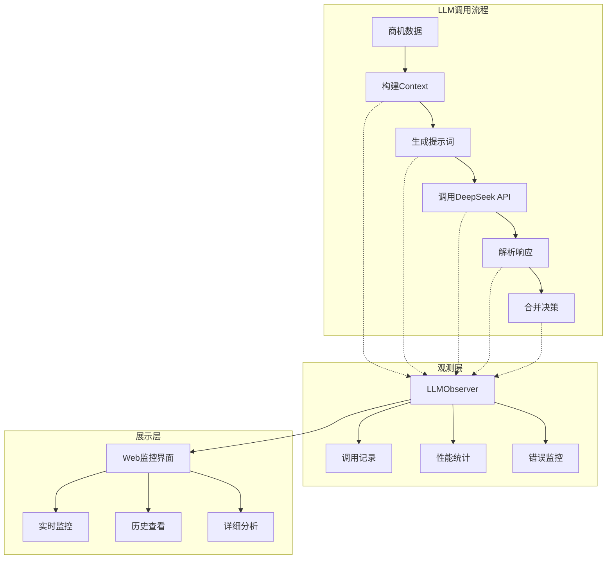

# FSOA LLM可观测性指南

## 概述

FSOA系统提供了完整的LLM可观测性解决方案，让您能够全面监控和分析LLM的工作状态。这对于PoC验证、性能优化和生产运维都至关重要。

## 🎯 解决的问题

您在PoC验证LLM功能时提出的所有观测需求：

1. **Context正确性验证** - 确保传递给LLM的上下文数据完整准确
2. **提示词内容查看** - 查看动态构建的完整提示词
3. **API调用状态监控** - 确认是否成功发送到DeepSeek
4. **LLM响应内容记录** - 查看DeepSeek的原始返回结果
5. **Token使用统计** - 监控成本和性能指标
6. **决策过程追踪** - 了解规则引擎vs LLM的决策对比
7. **错误处理监控** - 观察降级机制的工作情况

## 🏗️ 架构设计

### 核心组件



### 数据流

1. **调用开始** → 记录Context、提示词、配置参数
2. **API调用** → 监控请求发送状态
3. **响应接收** → 记录原始响应、Token使用
4. **结果解析** → 记录解析后的决策结果
5. **决策合并** → 记录规则vs LLM的决策对比

## 📊 观测功能详解

### 1. Context内容记录

**记录内容**：
- 历史通知信息（最近5条）
- 群组配置信息
- 系统配置参数
- 当前时间和业务时间判断
- 规则引擎的建议

**查看方式**：
```python
# 在LLM监控界面的"详细查看"标签页
context_data = {
    "notification_history": [...],
    "group_config": {...},
    "current_time": {...},
    "rule_suggestion": {...}
}
```

### 2. 提示词构建记录

**记录内容**：
- 完整的提示词文本
- 提示词长度统计
- 动态参数替换情况

**示例提示词**：
```
你是一个现场服务运营专家，请分析以下商机的处理优先级。

商机信息：
- 工单号: BIZ001
- 客户姓名: 重要客户A
- 负责人: 张经理
- 超时时间: 12.5小时

上下文信息：
{动态插入的上下文数据}

请基于以上信息分析并返回JSON格式的决策结果。
```

### 3. API调用状态监控

**监控指标**：
- 调用开始时间
- 响应时间（毫秒）
- 调用状态（成功/失败/超时）
- 错误类型和错误信息

**状态类型**：
- `STARTED` - 调用开始
- `SUCCESS` - 调用成功
- `FAILED` - 调用失败
- `TIMEOUT` - 调用超时
- `RATE_LIMITED` - 频率限制

### 4. LLM响应记录

**记录内容**：
- 原始响应文本
- 响应长度统计
- JSON解析结果
- 解析错误（如果有）

**响应示例**：
```json
{
    "action": "escalate",
    "priority": "high",
    "message": "重要客户需要立即升级处理",
    "reasoning": "基于客户重要性和超时情况分析",
    "confidence": 0.9
}
```

### 5. Token使用统计

**统计指标**：
- 总Token使用量
- 提示词Token数
- 完成Token数
- 单次调用Token成本
- 累计Token成本

### 6. 决策过程追踪

**对比记录**：
```python
{
    "rule_suggestion": {
        "action": "notify",
        "priority": "normal",
        "reasoning": "基于超时规则",
        "confidence": 1.0
    },
    "llm_decision": {
        "action": "escalate",
        "priority": "high", 
        "reasoning": "基于客户重要性分析",
        "confidence": 0.9
    },
    "final_decision": {
        "action": "escalate",
        "priority": "high",
        "llm_used": true
    }
}
```

## 🖥️ Web监控界面

### 访问方式

1. 启动FSOA Web界面
2. 在侧边栏选择"🤖 LLM监控"
3. 查看实时监控和历史数据

### 界面功能

#### 📊 实时监控
- **指标卡片**：总调用次数、成功率、平均响应时间、Token使用
- **最近调用**：最近5次调用的状态和结果
- **状态分布图**：成功/失败调用的分布情况

#### 📋 调用历史
- **过滤功能**：按状态、时间范围过滤
- **详细列表**：每次调用的完整信息
- **展开查看**：点击展开查看详细信息

#### 🔍 详细查看
- **Context数据**：完整的上下文信息JSON
- **提示词内容**：动态构建的完整提示词
- **LLM响应**：原始响应和解析结果
- **决策对比**：规则vs LLM的决策对比

#### ⚙️ 配置管理
- **LLM开关**：实时启用/禁用LLM优化
- **参数调整**：温度参数、最大Token等
- **连接测试**：测试DeepSeek API连接状态

## 🔧 使用示例

### 1. 查看Context是否正确

```python
# 在Web界面的"详细查看"页面
# 选择一次LLM调用记录
# 展开"Context数据"部分
# 验证以下内容：

✅ notification_history: 包含历史通知记录
✅ group_config: 包含群组配置信息  
✅ current_time: 包含当前时间和业务时间判断
✅ rule_suggestion: 包含规则引擎的建议
```

### 2. 检查提示词构建

```python
# 在"详细查看"页面
# 展开"提示词内容"部分
# 验证提示词包含：

✅ 商机基本信息（工单号、客户、负责人等）
✅ 业务上下文（超时情况、历史通知等）
✅ 明确的任务指令
✅ 期望的输出格式（JSON）
```

### 3. 监控API调用状态

```python
# 在"实时监控"页面查看：

✅ 调用状态：success/failed
✅ 响应时间：< 5秒为正常
✅ Token使用：监控成本
✅ 错误信息：如果调用失败
```

### 4. 分析LLM决策质量

```python
# 在"详细查看"页面的"决策对比"部分：

✅ 规则建议 vs LLM建议
✅ 最终采用的决策
✅ LLM的置信度
✅ 决策理由分析
```

## 📈 性能指标

### 关键指标

| 指标 | 正常范围 | 说明 |
|------|---------|------|
| **成功率** | > 95% | API调用成功率 |
| **响应时间** | < 5秒 | 平均API响应时间 |
| **Token使用** | 监控趋势 | 控制成本 |
| **降级率** | < 5% | LLM失败降级到规则的比例 |

### 告警阈值

- 成功率 < 90% → 检查API配置和网络
- 响应时间 > 10秒 → 检查API性能
- 连续失败 > 3次 → 检查API密钥和配额

## 🚨 故障排查

### 常见问题

1. **Context数据缺失**
   - 检查DecisionContext的构建逻辑
   - 验证NotificationTask数据完整性

2. **提示词格式错误**
   - 检查动态参数替换
   - 验证模板格式正确性

3. **API调用失败**
   - 检查DeepSeek API密钥
   - 验证网络连接
   - 检查API配额

4. **响应解析失败**
   - 检查LLM返回格式
   - 验证JSON解析逻辑
   - 查看原始响应内容

### 调试步骤

1. **查看实时监控** → 确认调用状态
2. **检查调用历史** → 分析失败模式
3. **查看详细信息** → 定位具体问题
4. **测试API连接** → 验证基础连通性

## 🎯 最佳实践

### PoC验证建议

1. **启用详细日志**：在测试期间启用DEBUG级别日志
2. **小批量测试**：先用少量数据验证功能正确性
3. **对比验证**：对比LLM决策vs规则决策的差异
4. **成本监控**：密切关注Token使用和API成本

### 生产运维建议

1. **设置告警**：配置关键指标的告警阈值
2. **定期检查**：每日检查LLM调用统计和错误日志
3. **性能优化**：根据响应时间调整超时参数
4. **成本控制**：设置Token使用上限和成本预算

---

**文档版本**: v1.0  
**最后更新**: 2025-06-30  
**适用版本**: FSOA v0.3.1+
